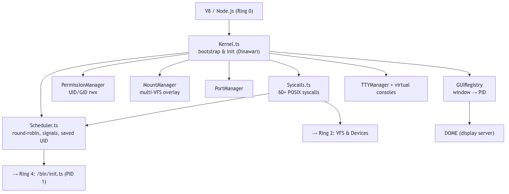
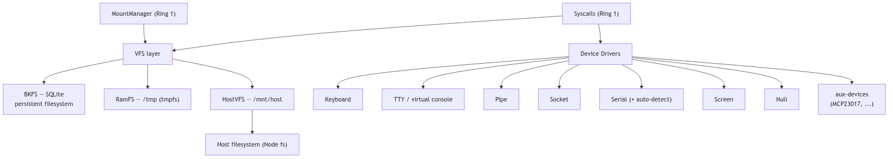
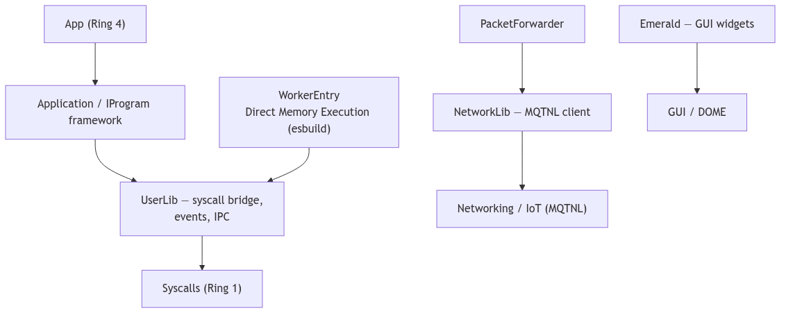
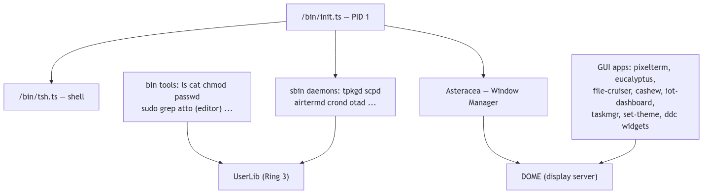
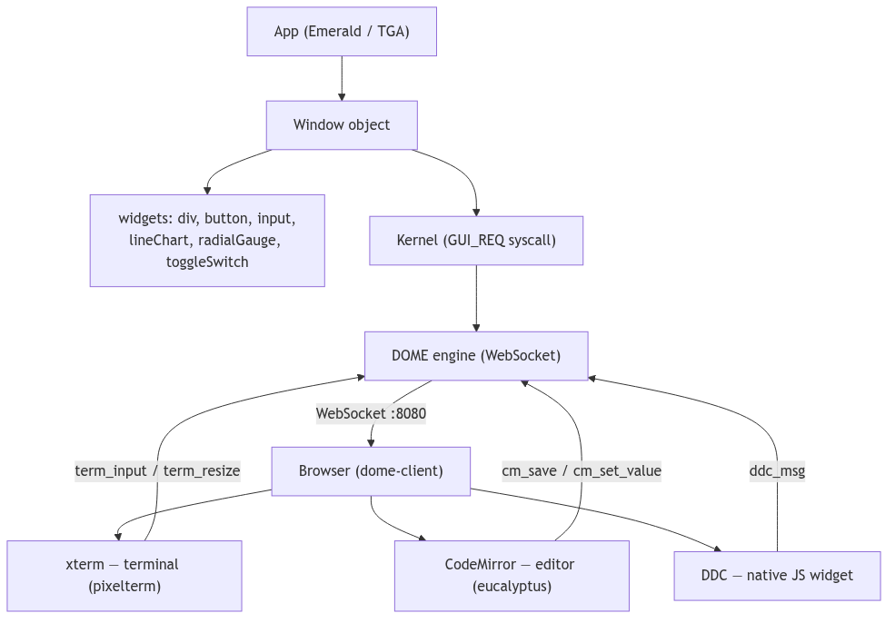
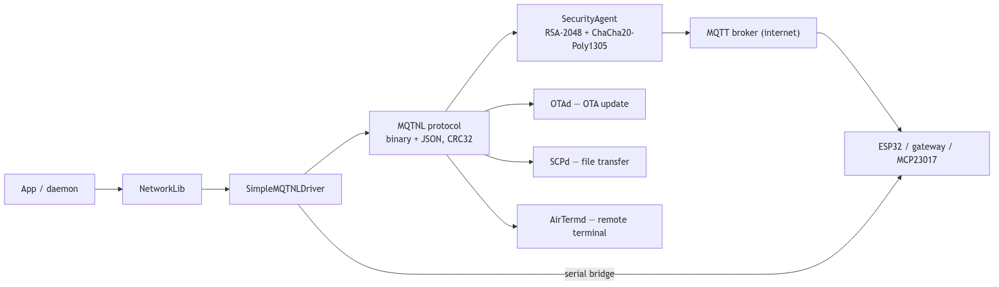
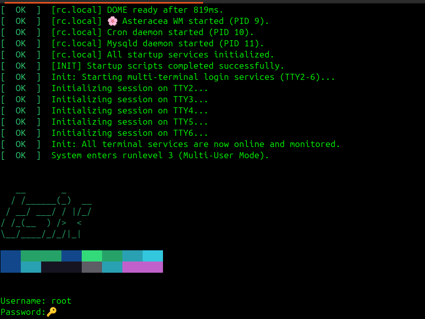
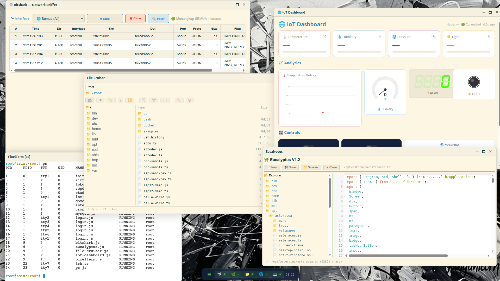

# TSIX

<p align="center">
  
  
  
  
</p>

**TSIX** is an **operating system simulator** built entirely in TypeScript on top of Node.js/V8 — complete with a custom kernel, syscall dispatcher, permission model (UID/GID), POSIX-like filesystem, signal handling, and device abstraction (HAL). It is **not a VM that emulates a CPU**; it applies OS-level architecture as an educational and experimental project, and follows **Unix fidelity** as its design north star (see [Philosophy](#philosophy)).

Its flagship use case is a complete **IoT stack** — the MQTNL protocol (MQTT-based), OTA firmware updates, real-time dashboards, and encrypted remote terminal access — all reachable with nothing more than an internet connection and a free MQTT broker. No VPS, no static public IP, no paid cloud service required.

**Where IoT fits (and where it doesn't):** the IoT stack is **not** part of the kernel. TSIX's core — kernel, VFS, drivers (rings 1–2) — is completely generic: it has no idea what MQTT, OTA, or ESP32 are. The IoT stack is simply **one application running on top of the platform**, exactly like the window manager, the file browser, or the shell. That separation *is* the design's strength: one neutral, Unix-faithful core powers IoT, a desktop environment, and a command line at the same time.

TSIX keeps evolving, so expect rough edges and breaking changes between versions.

<p align="center">
  
  <br>
  <em>Ring 1 — Kernel Core (Syscalls, Scheduler, Permission, Mount, GUI Registry).</em>
</p>

<p align="center">
  
  <br>
  <em>Ring 2 — HAL &amp; File System (BKFS, RamFS, HostVFS, device drivers).</em>
</p>

<p align="center">
  
  <br>
  <em>Ring 3 — User Libraries (UserLib, NetworkLib, Emerald, WorkerEntry).</em>
</p>

<p align="center">
  
  <br>
  <em>Ring 4 — Applications (init, shell, daemons, Asteracea WM, GUI apps).</em>
</p>

<p align="center">
  
  <br>
  <em>GUI / Display Pipeline (Emerald → kernel → DOME → browser).</em>
</p>

<p align="center">
  
  <br>
  <em>Networking &amp; IoT Stack (MQTNL → E2E → MQTT → OTA/SCP/AirTerm/ESP32).</em>
</p>

<p align="center">
  
  <br>
  <em>TSIX console — TTY login &amp; shell.</em>
</p>

<p align="center">
  
  <br>
  <em>Asteracea Window Manager — desktop environment (taskbar, launcher, apps).</em>
</p>

### Why TSIX exists

This project started in 2021 as a way to remotely manage home automation — lights controlled/monitored by a Raspberry Pi, MCP23017, and relays — while living between two cities and only being home on weekends. Renting a VPS with a static public IP just to check on the lights wasn't worth it. What began as a small utility (originally called **NOS**) grew, over several years, into TSIX: a full operating-system-style platform with an IoT stack as its most complete, most battle-tested application.

---

## Key Features

### Kernel

| Feature                | Detail                                                                                                     |
| ---------------------- | ---------------------------------------------------------------------------------------------------------- |
| **Syscall Dispatcher** | 60+ POSIX-inspired syscalls (OPEN, READ, WRITE, EXEC, WAITPID, SIGNAL, CHMOD...)                           |
| **Scheduler**          | Preemptive round-robin, process states, wait queue, signal handling (SIGKILL, SIGTERM, SIGINT, SIGSTOP...) |
| **Permission Manager** | UID/GID, rwx bits, root bypass, SetUID & Saved UID (suid) support                                          |
| **Mount Manager**      | Multi-VFS overlay, bind mount, union mount, nested mount points                                            |
| **Process Tree**       | Parent-child links, orphan auto-reparent to init, zombie prevention                                        |
| **IPC**                | Built-in `SEND_MSG` syscall + UUID-based identity messaging                                                |

### Filesystem (VFS)

| Feature               | Detail                                                                          |
| --------------------- | ------------------------------------------------------------------------------- |
| **BKFS (SQLite VFS)** | Persistent filesystem in a single `.db` file, path traversal via parent_id tree |
| **RAM VFS**           | In-memory tree for the root filesystem (tmpfs-like)                             |
| **HostVFS**           | Bridge to the host filesystem (`/mnt/host`) via Node.js `fs`                    |
| **Chunked I/O**       | `readChunk`/`writeChunk` for progress-aware file operations                     |
| **Unix Permissions**  | Owner/group/others, mode rwx, SetUID bit                                        |

### Networking

| Feature            | Detail                                                                   |
| ------------------ | ------------------------------------------------------------------------ |
| **MQTNL Protocol** | Binary + JSON encoding, CRC32 validation, magic bytes, version handshake |
| **E2E Encryption** | RSA-2048 handshake + ChaCha20-Poly1305 session encryption                |
| **OTA Updates**    | Over-the-air firmware update via MQTNL protocol                          |
| **SCP**            | Secure file transfer with encryption + password authentication           |

### GUI (Emerald + DOME)

| Feature             | Detail                                                                   |
| ------------------- | ------------------------------------------------------------------------ |
| **DOME Engine**     | WebSocket-based display server — renders UI in the browser               |
| **Emerald Widgets** | Screen, Window, button, div, input, lineChart, radialGauge, toggleSwitch |
| **Modal Dialogs**   | alert(), confirm(), question() — built-in                                |
| **Window Manager**  | Asteracea WM with taskbar, Z-index, focus management                     |

### Security

- **Process Isolation** — Each application runs in a separate Worker Thread
- **Sandbox** — Node.js host APIs are restricted in User-Land
- **Permission Model** — Unix rwx for files & devices
- **Root Privileges** — UID 0 bypasses all checks
- **Saved UID** — the login manager (WM) can re-elevate to root to switch users (restore `setuid(0)` via `pcb.suid`)
- **PID 1 Protection** — init cannot be killed directly

---

## Quick Start

### Prerequisites

- Node.js 18+
- npm

### Fresh Install

A fresh TSIX image is built with the `install` script. It creates a brand new database (`.db`) from the bundled root filesystem (`src/mirror` + `src/common`), asks for a few configuration values interactively, and writes them into `src/sysconfig.json`.

```bash
git clone https://github.com/yourusername/tsix.git
cd tsix
npm install
npm run install
```

The installer will ask you for:

- Hostname (interface addresses are derived from it: `<hostname>`, `<hostname>_2`)
- Default login user
- MQTT broker address
- Default MQTT port
- Kernel verbose mode (y/n)
- New database path
- (Optional) root password

> [!NOTE] **Default credentials**
>
> - **User:** `root` — **Password:** `root` (default; bcrypt hash bundled in `src/mirror/etc/shadow`).
> - Change the password by answering the **root-password prompt** during `npm run install`, or run `passwd` inside TSIX.
> - This is a **documented development default**, not a secret. For production or public exposure, always set your own password (don't use the default).

After installation, `src/sysconfig.json` points to the new database and the system is ready to boot:

```bash
npm start
```

### Install Options

```bash
npm run install                              # interactive, db path from sysconfig
npm run install -- --path data/tsix.db       # install to a specific database file
npm run install -- --path data/tsix.db --force   # overwrite an existing db (auto-backup)
npm run install -- --defaults                # non-interactive, use all defaults
npm run install -- --no-config               # skip writing src/sysconfig.json
```

### Safe Mode

If the system fails to boot (e.g. a bad daemon in `rc.local`), start it with
the startup scripts disabled:

```bash
npm start -- --safe-mode
```

Safe mode skips `/etc/rc.local` (startup daemons) so you can log in and fix
the problem.

### Utility Scripts

```bash
npm run vfs:bootstrap        # bulk-sync src/mirror into the configured database
npm run bkfs:create          # create an empty database (path from sysconfig)
node scripts/clean_bloat.js  # truncate syslog + vacuum the database
```

All scripts resolve the default database path from `kernel.database` in `src/sysconfig.json` (shared via `scripts/lib/db-path.ts`), so they stay in sync with the path chosen at install time.

### GUI Mode

```bash
# Terminal 1 — Start DOME Engine
dome

# Open browser -> http://localhost:8080

# Terminal 2 (via TSIX shell) — Launch apps
asteracea           # Window Manager
file-cruiser        # File Manager GUI
eucalyptus          # Text Editor
```

---

## Architecture

```
Ring 0  -> Host OS / V8 Engine (reserved)
Ring 1  -> Kernel Core (Syscalls, Scheduler, Permission Manager)
Ring 2  -> Drivers & File System (HAL, BKFS, Device Drivers)
Ring 3  -> User Libraries (UserLib, FsLib, NetLib, StdLib)
Ring 4  -> Applications (/bin — shell, file-cruiser, tools)
```

> **IoT is not part of the kernel.** The IoT stack runs as a regular
> application in **Ring 4**, on top of the generic rings 1–3 — the kernel has
> no concept of MQTT, OTA, or ESP32. That neutrality is the point: one core
> runs IoT, a desktop environment, and a shell side by side.

### Data Flow

```
Application (Worker Thread)
    | postMessage (IPC)
    v
Syscall Dispatcher (Main Thread)
    | routing
    v
BKFS / Device Drivers / Scheduler
    | return
    v
Syscall Dispatcher
    | postMessage (IPC)
    v
Application
```

### Boot Sequence

```
bootstrap.sh -> main.ts -> Kernel.boot()
  -> Mount BKFS (SQLite VFS) root filesystem
  -> Process /etc/fstab.json (mount /tmp as ramfs, etc.)
  -> Init TTYs (virtual consoles)
  -> Register Devices (keyboard, TTY, null, network)
  -> Init Serial Auto-Detection
  -> Load Device Configs + HAL drivers
  -> Pre-compile framework libraries into memory cache
  -> Ensure default auth & groups (/etc/passwd, /etc/shadow, users, sudo)
  -> Spawn PID 1 (/bin/init)
  -> init spawns login on TTYs + system daemons
  -> System Ready
```

---

## Project Structure

```
tsix/
├── src/
│   ├── common/        — Shared types (SyscallCode, GUITypes, IPCTypes)
│   ├── kernel/        — Kernel Core (Ring 1)
│   │   ├── Syscalls.ts        — 60+ syscall dispatcher
│   │   ├── Scheduler.ts       — Process manager (create, kill, waitpid)
│   │   ├── PermissionManager.ts — Unix rwx permission check
│   │   ├── MountManager.ts    — Multi-VFS overlay
│   │   ├── PortManager.ts     — TCP/UDP port allocation
│   │   ├── GUIRegistry.ts     — Window -> PID mapping
│   │   └── devices/           — Hardware drivers (TTY, Keyboard, Pipe, Socket...)
│   ├── vfs/           — Filesystem backends (BKFS, RamFS, HostVFS)
│   ├── mirror/        — Userland (Ring 4) — FHS layout (synced to VFS root)
│   │   ├── bin/       — 80+ command-line tools (ls, cat, tsh, sudo...)
│   │   ├── sbin/      — Daemons (tpkgd, scpd, airtermd, crond...)
│   │   ├── usr/       — User binaries (local/bin)
│   │   ├── opt/       — GUI apps (asteracea WM, dome, eucalyptus, file-cruiser...)
│   │   ├── lib/       — Libraries (Emerald, UserLib, Application)
│   │   ├── etc/       — Config (passwd, shadow, group, profile, fstab)
│   │   └── home/, root/, mnt/, var/ — User homes, mounts, logs
│   └── userland/      — Worker entry point
├── wiki/              — Full documentation
├── scripts/           — Build, install & utility scripts
└── platformio/        — ESP32 firmware examples
```

---

## Status

> Note: TSIX is an educational/experimental project. "Working" only means the component passes its test suite and boots in the reference environment — it is **not** production-ready. APIs and behavior may change without notice.

| Component                                                | Status      | Tests       |
| -------------------------------------------------------- | ----------- | ----------- |
| Kernel (syscalls, scheduler, perms, mount, devices, TTY) | Working     | 354/359     |
| VFS (BKFS, HostVFS)                                      | Working     | 150/150     |
| Common Utilities & Protocols (MQTNL)                     | Working     | 140/143     |
| GUI library (Emerald)                                    | Working     | 1/1         |
| **TOTAL**                                                | **Working** | **645/653** |

> [!NOTE] **7 test failures are pre-existing / environment-related** — 5 in `Syscalls` (e.g. `SCREEN_INFO` requires device setup), 2 in `Logger` (timestamp format). Two test files (`SecurityAgent`, `F1-UtilityScripts`) fail to load. Not related to feature changes.

---

## Use Cases

| Area              | Capability                                                         |
| :---------------- | :----------------------------------------------------------------- |
| **IoT Gateway**   | MQTNL protocol, OTA updates, ESP32 integration, Serial devices     |
| **Cloud Desktop** | DOME display server, Asteracea WM, PixelTerm, File Cruiser         |
| **Edge Platform** | TPKG package manager, crond scheduler, process isolation           |
| **Secure Tunnel** | AirTerm (remote terminal), SCP (file transfer) with E2E encryption |
| **Dashboard**     | IoT dashboard with real-time charts via DOME                       |
| **Sandbox**       | Isolated script execution in Worker Threads                        |

---

## Philosophy

TSIX is inspired by the **UNIX philosophy**:

1. **Everything is a File** — Keyboard, display, socket, pipe, I2C device — everything is a file
2. **Distributed by Design** — Built-in IPC via SEND_MSG + identity-based messaging
3. **Small, Sharp Tools** — 80+ utilities that combine via pipes & redirection
4. **Security via Simplicity** — UID/GID permission model, process isolation, root privileges
5. **Unix Fidelity** — Emulating Unix/Linux behavior as closely as possible (semantics over mechanism); deviations are permitted only when constrained by the V8 runtime, and must be explicitly documented (see [see Four Core Principles](wiki/course/01-philosophy-big-picture.md))

---

## Documentation

Official, structured documentation lives in [`wiki/course/`](wiki/course/README.md):

| Page                                             | Description                                        |
| :----------------------------------------------- | :------------------------------------------------- |
| [Course — Overview](wiki/course/README.md)       | Recommended entry point: module index & navigation |
| [Course — Table of Contents](wiki/course/toc.md) | Detailed roadmap with code references              |
| [Course — Format](wiki/course/format.md)         | Documentation style & conventions                  |

The loose files under [`wiki/`](wiki/) are internal working notes (author + AI) and are not part of the official documentation.

---

## Authors

| Name                                             | Role                               |
| :----------------------------------------------- | :--------------------------------- |
| **Andriansah** (andriansah [at] yahoo [dot] com) | Lead Architect & Platform Composer |
| **AI coding assistants**                         | Technical Implementation Partner   |

---

## Acknowledgments

The TSIX DOME browser client (GUI) builds on these open-source libraries:

| Library                                                               | Version | Purpose                        |  License   |
| --------------------------------------------------------------------- | :-----: | ------------------------------ | :--------: |
| [xterm.js](https://xtermjs.org/)                                      |  5.3.0  | Terminal emulator (PixelTerm)  |    MIT     |
| [CodeMirror](https://codemirror.net/)                                 | 5.65.16 | Text editor (Eucalyptus)       |    MIT     |
| [Fabric.js](http://fabricjs.com/)                                     |  5.3.1  | Canvas rendering (DDC widgets) |    MIT     |
| [Lightweight Charts](https://www.tradingview.com/lightweight-charts/) |  5.2.0  | Real-time charts (dashboard)   | Apache-2.0 |
| [Tabulator](https://www.tabulator.info/) |  6.3.0  |            Data Grid           |    MIT     |

---

## License

MIT License — see the `LICENSE` file for details.

---

<p align="center">
  <i>"Everything is a File, and everyone has their place."</i>
</p>
