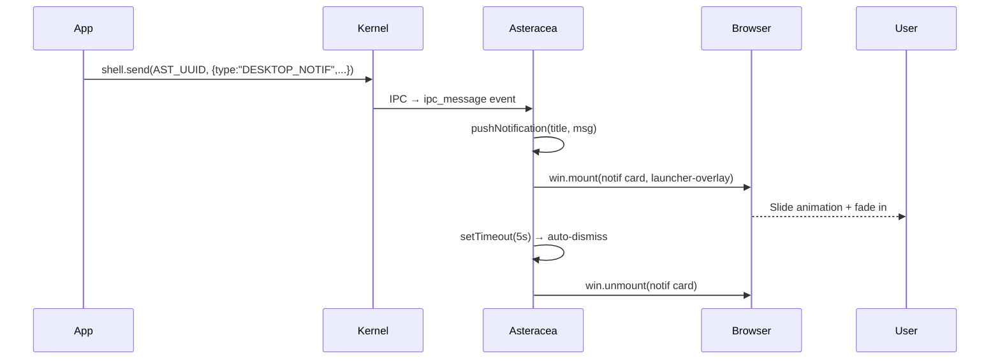

# Asteracea — TSIX Desktop Window Manager

**RFC-TSIX-003** | **Version 1.0** | **2026-07-16**

---

## Daftar Isi

1. [Apa Itu Asteracea?](#1-apa-itu-asteracea)
2. [Arsitektur & Alur Data](#2-arsitektur--alur-data)
3. [Komponen UI](#3-komponen-ui)
4. [Lifecycle](#4-lifecycle)
5. [Taskbar System](#5-taskbar-system)
6. [IPC Message Bus](#6-ipc-message-bus)
7. [Queue System (MessageBus)](#7-queue-system-messagebus)
8. [App State Manager](#8-app-state-manager)
9. [Launcher & Fuzzy Search](#9-launcher--fuzzy-search)
10. [Desktop Context Menu (DCM)](#10-desktop-context-menu-dcm)
11. [Wallpaper System](#11-wallpaper-system)
12. [Configuration](#12-configuration)
13. [Key Patterns](#13-key-patterns)
14. [Referensi](#14-referensi)

---

## 1. Apa Itu Asteracea?

**Asteracea** adalah **Window Manager** (WM) untuk TSIX Desktop Environment. Berjalan sebagai aplikasi PixelSpace mandiri yang me-launch, mengontrol, dan mengelola lifecycle aplikasi GUI lain.

> Dinamai dari **Asteracea** (famili tanaman aster/daisy) — setiap aplikasi adalah "bunga" yang mekar di desktop.

### Karakteristik Utama

| Aspek | Deskripsi |
|-------|-----------|
| **Lokasi** | `/bin/asteracea.ts` |
| **Mode** | Fullscreen, frameless |
| **Model** | Queue-based IPC (`MessageBus`) |
| **Proto** | PixelSpace Protocol via DOME |
| **Privilege** | Ring 4 (sandboxed worker) |
| **Auto-start** | `/etc/rc.local.ts` (setelah DOME) |

### Filosofi Arsitektur: Queue-Based

Berbeda dengan WM tradisional yang blocking/synchronous, Asteracea menggunakan **message queue** untuk semua komunikasi IPC:

```
App A ──(shell.send)──► Kernel ──(ipc_message)──► MessageBus Queue ──► handlers
App B ──(GUI_REQ)─────► DOME  ──(ipc_message)──► MessageBus Queue ──► handlers
Browser ──(click)─────► DOME  ──(shell.send)────► MessageBus Queue ──► handlers
```

Semua event masuk ke antrian FIFO dan diproses satu per satu. Ini mencegah race condition dan starvation.

---

## 2. Arsitektur & Alur Data

### High-Level Architecture

```
┌────────────────────────────────────────────────────┐
│                    BROWSER                          │
│  dome-client.html — Presentation Engine            │
│  ┌──────────┐ ┌──────────┐ ┌──────────┐           │
│  │ Desktop  │ │ Launcher │ │ Taskbar  │           │
│  │ (overlay)│ │ (overlay) │ │ (window) │           │
│  └────┬─────┘ └────┬─────┘ └────┬─────┘           │
│       └────────────┴────────────┘                  │
└──────────────────────┬─────────────────────────────┘
                       │ WebSocket :8080
┌──────────────────────▼─────────────────────────────┐
│                    DOME                              │
│  Display Server — Window Registry, Relay, Replay    │
│  windowStates: Map<wid, state[]>                    │
└──────────────────────┬─────────────────────────────┘
                       │ GUI_REQ syscall (61)
┌──────────────────────▼─────────────────────────────┐
│                  KERNEL                              │
│  GUIRegistry — auth pid↔wid                         │
└──────────────────────┬─────────────────────────────┘
                       │ postMessage
┌──────────────────────▼─────────────────────────────┐
│              ASTERACEA WORKER                       │
│                                                     │
│  ┌──────────────┐  ┌──────────────┐                 │
│  │  MessageBus  │  │ AppState     │                 │
│  │  (Queue)     │  │ Manager      │                 │
│  └──────┬───────┘  └──────┬───────┘                 │
│         │                 │                         │
│  ┌──────▼─────────────────▼───────┐                 │
│  │  UI Layer (Emerald Window)     │                 │
│  │  Login → Desktop → Launcher    │                 │
│  │  → Taskbar → DCM → Wallpaper   │                 │
│  └────────────────────────────────┘                 │
└─────────────────────────────────────────────────────┘
```

### Alur Launch App

```
User klik pinned/launcher app
         │
         ▼
Asteracea: openApp()
         │
         ├─► cek AppState: already running?
         │       YES → toggle minimize/restore, return
         │       NO  → continue
         │
         ├─► shell.exec(`/bin/${app.command}.ts`, params)
         │       → dapat proc.pid
         │
         ├─► AppState.add(appId, pid, entry)
         │       → dapat inst (taskbarId: tb-${appId}-${pid})
         │
         ├─► Mount taskbar button (atau show badge for pinned)
         │
         ├─► Child app: Constructor → CREATE_WINDOW
         │       → DOME register wid
         │       → Child emit: GUI_WINDOW_CREATED via IPC
         │
         ├─► Asteracea receive GUI_WINDOW_CREATED:
         │       → AppState.setWid(appId, wid)
         │       → updateProps(taskbarBtn, { data-wid: wid })
         │
         └─► waitpid(proc.pid) [async, non-blocking]
                 → App exit → cleanup taskbar
```

---

## 3. Komponen UI

Semua UI Asteracea dibangun dengan Emerald Widget Toolkit (`@tsix/emerald`) sebagai Virtual DOM Tree.

### 3.1 Login Screen

Layer pertama sebelum user bisa mengakses desktop.

```
┌─────────────────────────────────────┐
│         🛡️                          │
│     Asteracea Desktop               │
│   Sign in to continue               │
│                                     │
│  ┌─────────────────────────┐        │
│  │ Username                │        │
│  └─────────────────────────┘        │
│  ┌─────────────────────────┐        │
│  │ Password                │        │
│  └─────────────────────────┘        │
│                                     │
│        [ Sign In ]                  │
│                                     │
│    Invalid username or password.    │
└─────────────────────────────────────┘
```

**Fitur:**
- Auth via `/etc/passwd` + `/etc/shadow`
- Bcrypt password verification
- setuid/setgid/setgroups setelah login
- Session: USER, HOME environment variables
- chdir ke home directory

### 3.2 Desktop

Background area di bawah taskbar.

```
┌─────────────────────────────────────┐
│░░░░░░░░░░░░░░░░░░░░░░░░░░░░░░░░░░░│
│░░░░░░░░░░░░░░░░░░░░░░░░░░░░░░░░░░░│
│░░░░░░░░░ (Wallpaper) ░░░░░░░░░░░░░│
│░░░░░░░░░░░░░░░░░░░░░░░░░░░░░░░░░░░│
│░░░░░░░░░░░░░░░░░░░░░░░░░░░░░░░░░░░│
│░░░░░░░░░░░░░░░░░░░░░░░░░░░░░░░░░░░│
├─────────────────────────────────────┤
│ ☰ [📝File] [🖥️Term]       🕐14:30 │
└─────────────────────────────────────┘
```

**Fitur:**
- Gradient/radial background (default)
- Wallpaper dari file b64
- Right-click → Desktop Context Menu

### 3.3 Launcher Overlay

Panel aplikasi yang muncul saat tombol ☰ diklik, di-render di `__tsix_overlay_layer__`.

```
┌──────────────────────────────────────────────┐
│  ┌────────────────────────────────────────┐  │
│  │ 🔍  Cari aplikasi...                   │  │
│  ├────────────────────────────────────────┤  │
│  │                                        │  │
│  │  📋        🖥️      📝       🎨        │  │
│  │  Form      Term     Notepad  Layout    │  │
│  │  Demo      App      Demo     Demo      │  │
│  │                                        │  │
│  │  📡        💻      🔧       🎮        │  │
│  │  IoT       GUI      Euca-    PixelTerm │  │
│  │  Dashboard Test    lyptus              │  │
│  │                                        │  │
│  ├────────────────────────────────────────┤  │
│  │ 👤 tsix                    🚪 🔄      │  │
│  └────────────────────────────────────────┘  │
└──────────────────────────────────────────────┘
```

**Fitur:**
- Fuzzy search (filter by label/id)
- Grid layout (flex-wrap)
- Footer: user info, logout, reboot
- Mounted to overlay layer (z-index 2147483647)

### 3.4 Taskbar

Bar di bagian bawah untuk pinned apps + running apps.

```
┌──────────────────────────────────────────────┐
│ ☰  📋File  🖥️Term  🟢📝Notepad  🕐14:30  │
│    (pinned) (pinned)  (running w/ badge)     │
└──────────────────────────────────────────────┘
```

**Fitur:**
- Start button (☰) → toggle launcher
- Pinned apps (fixed, dari `.menu` file)
- Running apps (dinamis, dengan badge RI)
- Clock (update setiap 15 detik)
- Centered, glassmorphism style

### 3.5 Foreign App (Non-Launcher) Taskbar

Aplikasi yang dijalankan dari luar launcher (terminal, shell, file-cruiser) otomatis mendapat taskbar button.

**Mekanisme:**
1. Saat startup, Asteracea menulis PID-nya ke `/etc/asteracea/wm-pid`
2. Emerald `notifyParentWindowEvent()` membaca file ini dan mengirim event (`GUI_WINDOW_CREATED`, dll) ke Asteracea
3. Asteracea mengenali PID asing → panggil `registerForeignApp()`
4. Auto-create `AppEntry` sementara (icon 💻) + mount taskbar button di `tb-running`
5. Click handler minimize/restore otomatis terpasang, cleanup via `waitpid`

```
Terminal → shell.exec("/bin/myapp.ts")
    │
    ▼
App: new Window() → Emerald.notifyParentWindowEvent()
    │
    ├─► send(parentPid=Terminal, GUI_WINDOW_CREATED)  ← parent langsung
    └─► send(Asteracea, GUI_WINDOW_CREATED)             ← via /etc/asteracea/wm-pid
            │
            ▼
Asteracea: registerForeignApp(pid, wid, title)
    → AppEntry { id: "__foreign_<pid>", icon: "💻", ... }
    → mount taskbar button di tb-running
    → waitpid → cleanup saat app exit
```

### 3.6 Desktop Context Menu (DCM)

Menu yang muncul saat right-click di desktop.

```
┌──────────────────┐
│ 🔄 Refresh       │
│ 🖼️ Change Wall.. │
└──────────────────┘
```

**Fitur:**
- Refresh: reload menu files + rebuild pinned launchers
- Change Wallpaper: file browser dialog

---

## 4. Lifecycle

### 4.1 Boot Sequence

```
rc.local.ts
    │
    ├─► spawn dome.ts (daemonize)
    │       └─► HTTP + WebSocket server on :8080
    │
    └─► spawn asteracea.ts
            │
            ├─► loadMenuFromFiles(/etc/asteracea/menu/*.menu)
            │       → AppEntry[]
            │
            ├─► tulis PID ke /etc/asteracea/wm-pid
            │       → Emerald baca file ini untuk broadcast event
            │
            ├─► new Window("Asteracea Desktop", fullscreen, frameless)
            │       → CREATE_WINDOW → DOME register wid
            │
            ├─► win.mount(wm-root tree)
            │       → Desktop, Launcher, Taskbar
            │
            ├─► showLoginScreen(win)
            │       └─► Login → unmount login-overlay
            │
            ├─► mount pinned launchers to tb-pinned
            │
            ├─► buildLauncherGrid (initial grid)
            │
            ├─► start clock interval (15s)
            │
            └─► MAIN LOOP (sleep 500ms)
```

### 4.2 Login Flow

```
showLoginScreen(win)
    │
    ├─► Mount login-overlay ke window
    │
    ├─► User input username/password
    │
    ├─► Bcrypt verify via /etc/shadow
    │
    ├─► setuid/setgid/setgroups
    │
    ├─► setenv USER/HOME, chdir HOME
    │
    ├─► win.unmount("login-overlay")
    │       → DOME prune windowStates
    │
    └─► resolve (return username)
```

### 4.3 App Lifecycle

```
[LAUNCHING] → shell.exec() → dapat PID
    │
    ▼
[LAUNCHING] → Child CREATE_WINDOW → GUI_WINDOW_CREATED
    │
    ▼
[RUNNING]   → Window visible, taskbar active
    │
    ├─► MINIMIZE → GUI_WINDOW_MINIMIZED
    │       → taskbar style normal
    │
    ├─► RESTORE  → GUI_WINDOW_RESTORED
    │       → taskbar style active
    │
    ├─► CLOSE    → GUI_WINDOW_CLOSED
    │       → cleanup taskbar + badge
    │
    └─► KILL (watchdog) → PID not found
            → cleanup taskbar + badge
```

### 4.4 Watchdog

Setiap 30 detik, Asteracea cek daftar PID via `shell.ps()`. PID yang mati mendadak (tanpa `GUI_WINDOW_CLOSED`) akan dibersihkan:

- Hapus dari `AppState`
- Unmount taskbar button
- Tampilkan error popup (jika ada pending error)

---

## 5. Taskbar System

### 5.1 Pinned vs Running

| Aspek | Pinned Launcher | Running App (non-pinned) |
|-------|----------------|-------------------------|
| **Button ID** | `pl-${app.id}` (fixed) | `tb-${appId}-${pid}` (per PID) |
| **Mounted saat** | Init (setelah login) | `openApp()` dipanggil |
| **data-wid** | Di-set via `updateProps(pl-${appId}, { data-wid })` saat `GUI_WINDOW_CREATED` | Di-set via `updateProps(tb-..., { data-wid })` |
| **Badge RI** | Include dari awal (`display:none`), di-toggle visible | Di-mount bersamaan button |
| **Cleanup** | Badge hidden (`display:none`), button tetap | Button di-unmount |
| **Posisi** | Di `tb-pinned` container | Di `tb-running` container |
| **Click handler** | `pl-${app.id}` → `openApp()` | `tb-${appId}-${pid}` → toggle minimize/restore |

### 5.2 Badge RI (Running Indicator)

Badge adalah pulsing green dot yang menandakan app sedang berjalan.

```typescript
// Pinned: badge sudah include dari awal (hidden)
await win.mount(
    button({ id: "pl-eucalyptus", ... },
        span({ text: "📝" }),
        span({ text: "Eucalyptus" }),
        badge({ id: "pl-eucalyptus-badge", color: "#4caf50",
                size: 6, style: { display: "none" } }),
    ),
    "tb-pinned",
);

// Saat app running: show badge
await win.updateProps("pl-eucalyptus-badge", {
    style: {
        display: "inline-block",
        background: "#4caf50",
        boxShadow: "0 0 9px #4caf50",
        animation: "tsix-pulse 1.4s ease-in-out infinite",
    },
});

// Saat app close: hide badge
await win.updateProps("pl-eucalyptus-badge", {
    style: { display: "none" },
});
```

### 5.3 data-wid Assignment

Saat child app membuat window, DOME kirim `GUI_WINDOW_CREATED` ke Asteracea via IPC:

```typescript
// Di IPC handler:
if (payload.type === "GUI_WINDOW_CREATED" && payload.pid) {
    const inst = appState.getByPid(payload.pid);
    if (inst) {
        appState.setWid(inst.appId, payload.wid);
        // Pinned: pakai pl-${appId}
        // Running: pakai tb-${appId}-${pid}
        const targetId = inst.entry.pinnedLauncher
            ? `pl-${inst.appId}`
            : inst.taskbarId;
        await win.updateProps(targetId, { 'data-wid': payload.wid });
    }
}
```

### 5.4 Minimize / Restore via DOME

Browser-side DOME engine (`dome-client.html`) handle animasi minimize/restore:

```javascript
function getTaskbarBtnTarget(wid) {
    const btn = document.querySelector('[data-wid="' + wid + '"]');
    if (!btn) return null;
    const br = btn.getBoundingClientRect();
    return {
        left: (br.left + br.width / 2 - 60) + 'px',
        top: (br.top + br.height / 2 - 14) + 'px',
    };
}
```

- **Minimize**: Animate window ke posisi TB button
- **Restore**: Fresh lookup TB position, animate dari sana ke saved position
- **Fresh lookup**: Penting karena taskbar bisa berubah (app lain buka/tutup) antara minimize dan restore

---

## 6. IPC Message Bus

Asteracea menggunakan **MessageBus** class sebagai antrian event IPC terpusat.

### Queue Architecture

```typescript
class MessageBus {
    private queue: IPCMessage[] = [];
    private processing = false;
    private handlers: Map<string, (msg: IPCMessage) => Promise<void>> = new Map();

    async push(msg: IPCMessage): Promise<void> {
        this.queue.push(msg);
        if (!this.processing) await this.processQueue();
    }

    private async processQueue(): Promise<void> {
        this.processing = true;
        while (this.queue.length > 0) {
            const msg = this.queue.shift()!;
            const handler = this.handlers.get(msg.type);
            if (handler) {
                try { await handler(msg); }
                catch (e) { /* log */ }
            }
        }
        this.processing = false;
    }

    on(type: string, handler: (msg: IPCMessage) => Promise<void>): void {
        this.handlers.set(type, handler);
    }
}
```

### Kenapa Queue?

| Tanpa Queue | Dengan Queue |
|-------------|-------------|
| Event bisa ke-skip saat handler sibuk | Event antri FIFO, semua diproses |
| Callback bersarang → callback hell | Handler terpisah per type |
| Race condition antar event | Sequential processing |
| Susah debug urutan event | Urutan terjamin |

### IPC Event Types

| Event | Source | Trigger | Aksi Asteracea |
|-------|--------|---------|---------------|
| `GUI_WINDOW_CREATED` | Child/foreign app | Window constructor | Track wid, set data-wid; foreign → auto-create TB |
| `GUI_WINDOW_MINIMIZED` | Child/foreign app | `minimize()` | Update taskbar style |
| `GUI_WINDOW_RESTORED` | Child/foreign app | `restore()` | Update taskbar style |
| `GUI_WINDOW_CLOSED` | Child/foreign app | `close()` | Cleanup taskbar + badge |
| `GUI_WINDOW_ERROR` | DOME/Kernel | Runtime error | Show error popup |
| `contextmenu_desktop` | Browser | Right-click desktop | Show DCM |

---

## 7. App State Manager

**AppStateManager** adalah single source of truth untuk semua aplikasi yang sedang berjalan.

### State Machine

```
         ┌──────────┐
         │LAUNCHING │ ← shell.exec() baru dipanggil
         └────┬─────┘
              │ GUI_WINDOW_CREATED
              ▼
         ┌──────────┐
         │ RUNNING  │ ← Window visible, normal
         └────┬─────┘
              │
    ┌─────────┴─────────┐
    │                   │
    ▼                   ▼
┌──────────┐     ┌──────────┐
│MINIMIZED │     │  ERROR   │ → showError popup
└──────────┘     └──────────┘
    │                   │
    │ restore           │ close/kill
    ▼                   ▼
┌──────────┐     ┌──────────┐
│ RUNNING  │     │  CLOSED  │ → cleanup taskbar
└──────────┘     └──────────┘
```

### Data Structures

```typescript
interface AppInstance {
    appId: string;        // "eucalyptus", "file-cruiser", ...
    pid: number;          // Process ID dari shell.exec()
    wid: string;          // Window ID (dari DOME)
    entry: AppEntry;      // App metadata (icon, label, command)
    state: AppState;      // LAUNCHING | RUNNING | MINIMIZED | ERROR | CLOSED
    taskbarId: string;    // "tb-${appId}-${pid}" atau "pl-${appId}" untuk pinned
    error?: string;       // Pending error message
    createdAt: number;    // Timestamp
}
```

### Lookup Maps

```typescript
class AppStateManager {
    private apps: Map<string, AppInstance>;    // appId → instance
    private byPid: Map<number, string>;         // pid → appId
    private byWid: Map<string, string>;         // wid → appId
}
```

Tiga lookup maps untuk akses cepat dari berbagai sudut:
- Dari **appId**: `getByAppId(appId)` — cek existing app
- Dari **pid**: `getByPid(pid)` — terima IPC dari child
- Dari **wid**: `getByWid(wid)` — terima event window lifecycle

---

## 8. Launcher & Fuzzy Search

### Fuzzy Matching

```typescript
function fuzzyMatch(query: string, target: string): boolean {
    if (!query) return true;
    let qi = 0;
    const q = query.toLowerCase();
    const t = target.toLowerCase();
    for (let ti = 0; ti < t.length && qi < q.length; ti++) {
        if (t[ti] === q[qi]) qi++;
    }
    return qi === q.length;
}
```

Cocokkan query dengan label ATAU id. Contoh: "file" cocok dengan "File Cruiser" dan "file-cruiser".

### Launcher Grid

Grid items di-mount via `setContent("launcher-grid", ...rows)`. Setiap item adalah div dengan `onClickId`.

```typescript
// Di buildLauncherGrid:
await win.setContent("launcher-grid",
    ...filtered.map(app => div({
        id: `lg-${app.id}`,
        style: { display: "flex", flexDirection: "column",
                 alignItems: "center", padding: "14px 10px",
                 borderRadius: "14px", cursor: "pointer",
                 width: "96px" },
    },
        span({ text: app.icon, style: { fontSize: "28px" } }),
        span({ text: app.label, style: { color: "#ccc", fontSize: "10px" } }),
    )),
);

// Bind click (WAJIB setelah setContent!)
for (const app of filtered) {
    win.onClick(`lg-${app.id}`, async () => {
        await openApp(win, app, ...);
    });
}
```

---

## 9. Desktop Context Menu (DCM)

### Trigger

DCM muncul saat user right-click di desktop area:

```
Browser: right-click → contextmenu event
    → socket.send({ wid, targetId: "__window__",
                    eventType: "contextmenu_desktop",
                    value: JSON.stringify({ x: e.clientX, y: e.clientY }) })
    → DOME → shell.send(asteraceaPid, { ... })
    → Asteracea IPC handler: showDesktopContextMenu(win, x, y, ...)
```

### Menu Items

```
┌──────────────────┐
│ 🔄 Refresh       │ → refreshMenus()
│ 🖼️ Change Wall.. │ → showWallpaperDialog()
└──────────────────┘
```

### Implementation

DCM di-mount ke `"launcher-overlay"` dengan backdrop transparan. Klik di backdrop → dismiss.

```typescript
async function showDesktopContextMenu(win, x, y) {
    await win.mount(
        div({ id: mid, style: { position: "fixed", inset: "0", zIndex: "9999999999" } },
            div({ id: mid + "_bg", onClickId: mid + "_bg" }), // backdrop
            div({ id: mid + "_menu", style: { left: x, top: y, ... } },
                div({ id: mid + "_refresh", ... }, span({ text: "🔄" }), span({ text: "Refresh" })),
                div({ id: mid + "_wallpaper", ... }, span({ text: "🖼️" }), span({ text: "Change Wallpaper" })),
            ),
        ),
        "launcher-overlay", // mount to overlay layer
    );
}
```

---

## 10. Wallpaper System

### Dialog

`showWallpaperDialog()` membuka file browser untuk memilih gambar:

1. Browse VFS untuk file `.jpg/.jpeg/.png/.gif`
2. Preview gambar (via base64 data URI)
3. Apply: simpan b64 file + update `wallpaper.json`

### Apply Wallpaper

```typescript
async function applyWallpaper(win, wp) {
    const b64 = await fs.readFile(wp.file);
    const uri = `url(data:${wp.mime};base64,${b64})`;
    await win.updateProps("desktop", {
        style: { ...S.desktop,
                 background: `${uri} center/cover no-repeat, #0a0f1f` }
    });
}
```

Wallpaper disimpan di `/etc/asteracea/wallpaper/` sebagai file `.b64`.

---

## 11. Desktop Notification System

Asteracea punya sistem notifikasi desktop built-in — semua aplikasi (GUI/non-GUI) bisa mengirim notifikasi via IPC.

### 11.1 Kirim Notifikasi

#### Dari aplikasi GUI (pakai helper Emerald)

```typescript
// Panggil langsung dari Screen — paling simpel!
await app.notifyDesktop("🔥 Alert", "Temperature above threshold!");
```

> Helper `Screen.notifyDesktop()` otomatis resolve UUID Asteracea (`3ec3ffe9-e0a6-411f-b7e3-c9ff0b00556c`).

#### Dari aplikasi non-GUI (pakai shell.send langsung)

```typescript
import { shell } from "@tsix/Application";

const AST_UUID = "3ec3ffe9-e0a6-411f-b7e3-c9ff0b00556c";
await shell.send(AST_UUID, {
    type: "DESKTOP_NOTIF",
    title: "⏰ Cron Job",
    message: "Task completed!",
    timestamp: Date.now(),
});
```

### 11.2 Cara Kerja



### 11.3 Feature List

| Fitur | Detail |
|-------|--------|
| **Cascade Layout** | Flexbox container (`display:flex; flex-direction:column; gap:8px`) |
| **8 Posisi** | `ne`, `nw`, `se`, `sw`, `n`, `s`, `e`, `w` — dikonfigurasi di `prefs.json` |
| **Animasi** | Slide dari atas/bawah (0.3s) + fade in/out |
| **Durasi** | Configurable via `prefs.json` → `notifications.duration` (ms) |
| **Log** | `desktop-notif.log` dengan auto-rotation (`maxLog` entries) |
| **Taskbar Badge** | Bulat merah + angka unread di taskbar |
| **History Overlay** | Klik badge → modal daftar notif terbaru (20 items) |
| **Mark as Read** | Tombol ✓ per notif — kurangi unread count |
| **Read More** | Pesan >120 karakter dipotong + "🔍 Tap to read more" → alert lengkap |
| **Auto-Close** | Overlay history auto-close saat unread=0 |
| **Desktop Dismiss** | Klik desktop kosong → overlay history di-unmount |
| **Identity** | UUID hardcoded (`3ec3ffe9-e0a6-411f-b7e3-c9ff0b00556c`) — kayak CORBA GUID |

### 11.4 Konfigurasi

Lokasi: `/etc/asteracea/prefs.json`

```json
{
    "notifications": {
        "duration": 5000,
        "maxLog": 100,
        "position": "ne"
    }
}
```

| Field | Default | Description |
|-------|---------|-------------|
| `duration` | `5000` | Durasi tampil notif (ms) |
| `maxLog` | `100` | Max entries di `desktop-notif.log` |
| `position` | `"ne"` | Posisi: `ne/nw/se/sw/n/s/e/w` |

### 11.5 Log Format

`/etc/asteracea/desktop-notif.log`:
```
[2026-07-21T12:30:45.678Z] 🔥 Alert: Temperature above threshold!
[2026-07-21T12:30:46.123Z] ✅ Done: File berhasil disalin.
```

Auto-rotate: saat entries > `maxLog`, entry terlama dihapus.

---

## 12. Configuration

### Menu Files

Lokasi: `/etc/asteracea/menu/*.menu`

Format:
```
# Comments start with #
name=Eucalyptus Text Editor
icon=📝
command=eucalyptus
params=--debug
pinned_launcher=true
```

| Field | Required | Description |
|-------|----------|-------------|
| `name` | ✅ | Display name (label) |
| `icon` | ❌ | Emoji/icon string |
| `command` | ✅ | Command (tanpa `.ts`, tanpa `/bin/`) |
| `params` | ❌ | Space-separated arguments |
| `pinned_launcher` | ❌ | `true` = pin ke taskbar |

### Wallpaper Config

Lokasi: `/etc/asteracea/wallpaper.json`

```json
{
    "type": "image",
    "mime": "image/jpeg",
    "value": "/etc/asteracea/wallpaper/1712345678_wallpaper.b64"
}
```

### Credentials

- `/etc/passwd` — User database
- `/etc/shadow` — Bcrypt password hashes
- `/etc/group` — Group memberships

---

## 12. Key Patterns

### 12.1 Launch App with Already-Running Check

```typescript
async function openApp(win, app, bus, appState, pendingErrors) {
    // Already running? Toggle minimize/restore
    const existing = appState.getByAppId(app.id);
    if (existing) {
        if (existing.state === 'MINIMIZED') {
            appState.transitionTo(existing.appId, 'RUNNING');
            await shell.send(existing.pid, {
                type: "GUI_EVENT", wid: existing.wid,
                targetId: "__window__", eventType: "restore_window",
            });
        }
        return; // Already running + visible → no-op
    }

    // Launch new
    const proc = await shell.exec(`/bin/${app.command}.ts`, app.params);
    const inst = appState.add(app.id, proc.pid, app);

    // Mount/update taskbar button
    if (inst.entry.pinnedLauncher) {
        // Show badge on existing pinned button
        await win.updateProps(`pl-${app.id}-badge`, { style: { display: "inline-block", ... } });
    } else {
        // Create new taskbar button in tb-running
        await win.mount(button({ id: inst.taskbarId, ... }), "tb-running");
    }

    // Click handler: minimize/restore toggle
    win.onClick(inst.taskbarId, async () => {
        // toggle logic...
    });
}
```

### 12.2 Error Handling — Show Error dengan Auto-ID

```typescript
async function showError(win, title, msg) {
    const eid = `__err_${Date.now()}_${Math.random().toString(36).slice(2, 6)}`;
    await win.mount(
        div({ id: eid, style: { position: "fixed", inset: "0", zIndex: "9999999999", ... } },
            div({ style: { background: "#16213e", border: "2px solid #f44336", ... } },
                span({ text: "❌", style: { fontSize: "40px", ... } }),
                h2({ text: title, style: { color: "#f44336", ... } }),
                paragraph({ text: msg, style: { color: "#ccc", ... } }),
                button({ id: `${eid}-ok`, text: "OK" }),
            ),
        ),
        "launcher-overlay",
    );
    win.onClick(`${eid}-ok`, async () => { await win.unmount(eid); });
}
```

Setiap error popup punya ID unik (`eid`), jadi gak ada konflik mount/unmount.

### 12.3 Logout Flow

```typescript
// 1. Tutup launcher
await toggleLauncher(win, false);
// 2. Close semua running apps
await closeAllRunningApps(win, appState);
// 3. Sembunyikan WM root
await win.updateProps("wm-root", { style: { display: "none" } });
// 4. Tampilkan login screen
const newUser = await showLoginScreen(win);
// 5. Update user info
await win.updateProps("launcher-user", { text: newUser });
// 6. Tampilkan WM root kembali
await win.updateProps("wm-root", { style: { display: "block" } });
```

### 12.4 Watchdog — Deteksi Process Death

```typescript
const watchdogInterval = setInterval(async () => {
    const allProcs = await shell.ps() || [];
    const livePids = new Set(allProcs.map(p => p.pid));

    for (const [appId, inst] of appState.getAllRunning()) {
        if (!livePids.has(inst.pid)) {
            // Process died unexpectedly
            appState.removeByAppId(appId);
            await win.unmount(inst.taskbarId);
            // Show error if pending
        }
    }
}, 30000); // every 30 seconds
```

---

## 13. Referensi

### File Terkait

| File | Peran |
|------|-------|
| `src/mirror/bin/asteracea.ts` | Asteracea WM utama (~950 baris) |
| `src/mirror/lib/emerald.ts` | Emerald Widget Toolkit |
| `src/mirror/bin/dome.ts` | DOME Display Server |
| `src/mirror/bin/dome-client.html` | DOME Browser Engine (file terpisah) |
| `src/common/GUITypes.ts` | PixelSpace Protocol interfaces |
| `src/mirror/etc/asteracea/menu/*.menu` | App menu definitions |
| `/etc/asteracea/wm-pid` | PID file untuk broadcast event ke Asteracea |

### IPC Protocol

- `shell.send(pid, payload)` — Kirim IPC ke process lain
- `lib.onEvent("ipc_message", handler)` — Terima IPC
- `lib.onEvent("gui_request", handler)` — Terima GUI_REQ dari DOME
- `win.mount(node, parentId?)` — Mount node ke window
- `win.updateProps(targetId, props)` — Update element properties (batched)
- `win.unmount(targetId)` — Unmount node

### Emerald Broadcast ke Asteracea

Setiap `Window` di Emerald mengirim event lifecycle ke **dua** tujuan:
1. **Parent PID** (langsung) — untuk backward compatibility
2. **Asteracea WM** — via pembacaan `/etc/asteracea/wm-pid` (dengan deduplikasi)

Ini memungkinkan aplikasi yang dijalankan dari terminal tetap mendapat taskbar button.

### registerForeignApp()

Fungsi di Asteracea yang menangani aplikasi dari luar launcher:
- Buat `AppEntry` sementara dengan ID `__foreign_<pid>`
- Mount taskbar button 💻 dengan minimize/restore handler
- Pasang `waitpid` async → cleanup otomatis saat app exit
- Counter `_foreignAppCounter` untuk ID unik

### DOME Pruning

Saat node di-unmount, DOME panggil `pruneWindowState(wid, targetId)`:
- Hapus MOUNT_NODE yang `targetId === targetId` atau `node.id === targetId`
- Hapus UPDATE_PROPS yang `targetId === targetId`
- Browser-side: MOUNT_NODE dengan `targetId` yang tidak ditemukan → **discard** (bukan fallback ke `win.content`)

---

*"Your pixels, your space." 🎨*
