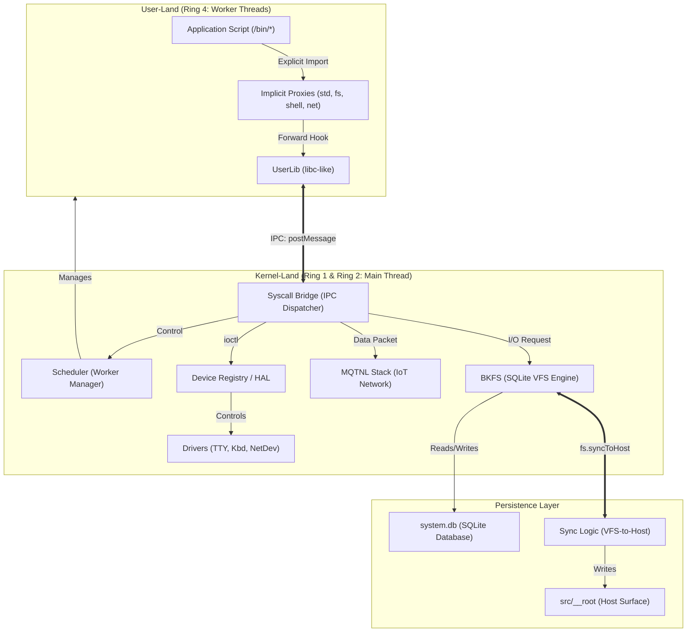
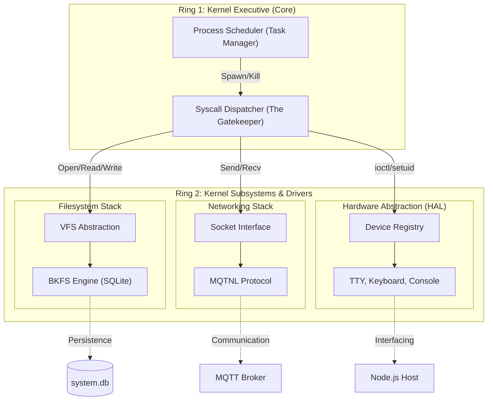
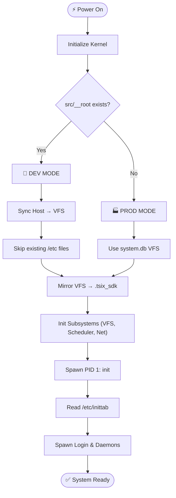
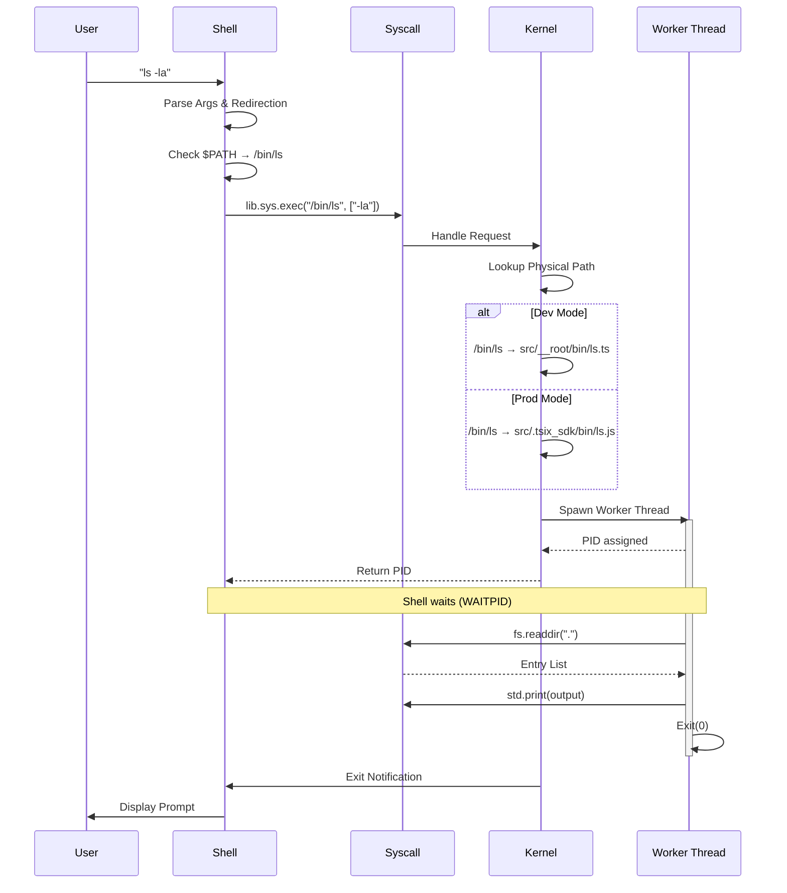

# 🏗️ Arsitektur Sistem TSIX

TSIX adalah **IoT Application Platform** yang dibangun dengan mengadopsi **arsitektur UNIX yang telah mature dan teruji selama puluhan tahun** — termasuk konsep process isolation, permission model UID/GID, filesystem POSIX, signal handling, device abstraction (HAL), dan syscall-based communication. Seluruh arsitektur ini diimplementasikan dalam **TypeScript** di atas runtime Node.js.

Platform ini menggunakan arsitektur modular yang memisahkan eksekusi aplikasi di thread terpisah (**Workers**) dengan kernel platform yang berjalan di **thread utama (Main Thread)**.

---

## Gambaran Umum



---

## Lapisan Arsitektur

### Ring 4 — User-Land (Worker Threads)

Semua aplikasi berjalan di dalam **Node.js Worker Thread** yang terisolasi sepenuhnya. Aplikasi mengakses fungsi sistem melalui **proxy singletons** (`std`, `fs`, `shell`, `net`) tanpa akses langsung ke kernel.

| Komponen | Deskripsi |
|----------|-----------|
| `Application Script` | File `.ts` di `/bin/` — program yang ditulis developer |
| `Proxies` | Singleton objects yang menjembatani ke UserLib |
| `UserLib` | Library inti (setara `libc` di Linux) — penghubung ke kernel via IPC |

### Ring 1 & Ring 2 — Kernel-Land (Main Thread)

Inti dari platform. Mengelola semua resource dan menerima permintaan dari User-Land melalui IPC — seperti halnya kernel pada sistem operasi tradisional.

| Komponen | File | Deskripsi |
|----------|------|-----------|
| **Syscall Dispatcher** | `Syscalls.ts` | Gateway tunggal — memproses semua permintaan dari User-Land |
| **Scheduler** | `Scheduler.ts` | Mengelola siklus hidup proses (spawn, kill, waitpid, signal) |
| **BKFS Engine** | `BKFS.ts` | Filesystem engine berbasis SQLite |
| **MQTNL Stack** | `SimpleMQTNLDriver.ts` | Network stack untuk komunikasi IoT via MQTT |
| **HAL / Device Registry** | `IDevice.ts` + drivers | Abstraction layer untuk semua hardware virtual |

### Persistence Layer

| Komponen | Deskripsi |
|----------|-----------|
| `system.db` | Satu-satunya sumber kebenaran (source of truth) bagi VFS |
| `src/__root/` | Mirror file di host filesystem — editable via VS Code |
| `Sync Logic` | Sinkronisasi antara VFS ↔ Host filesystem |

---

## Internal Kernel: Ring 1 (Core) & Ring 2 (Subsystems)

Kernel-Land sendiri dibagi menjadi dua sub-layer berdasarkan tanggung jawab:



### Ring 1 — Executive Core

- **Syscall Dispatcher**: Gatekeeper — memvalidasi semua permintaan dari aplikasi sebelum dieksekusi
- **Process Scheduler**: Mengatur kapan Worker boleh berjalan dan kapan harus dihentikan (round-robin preemptive)

### Ring 2 — Subsystems & Drivers

- **BKFS Engine**: Me-map struktur file Unix ke dalam tabel SQLite
- **MQTNL Stack**: Menangani paket data IoT, enkripsi, dan handshake antar-perangkat
- **HAL & Drivers**: Menerjemahkan perintah virtual TSIX menjadi I/O nyata

---

## 🎯 Kenapa Kernel, Driver, dan FS Disatukan dalam Satu Thread?

Salah satu keputusan arsitektural paling fundamental di TSIX adalah **menyatukan Kernel Core (Ring 1), Driver, dan Filesystem (Ring 2) dalam satu thread utama (Main Thread)**. Berikut analisis lengkapnya.

### ❓ Alternatif: Microkernel Murni

Dalam arsitektur **microkernel murni** (seperti Minix, QNX, seL4), driver dan filesystem dijalankan sebagai **proses terpisah di thread/process sendiri**. Komunikasi terjadi via IPC message passing:

```
Aplikasi → [IPC] → Kernel → [IPC] → FS Worker → [IPC] → Kernel → [IPC] → Aplikasi
```

### 🔬 Mengapa TSIX Tidak Mengadopsi Microkernel Murni?

#### 1. 🏎️ Overhead IPC Berlapis

Setiap komunikasi antar Worker Thread di Node.js menggunakan **`postMessage`** yang melakukan **structured clone** (serialize → deserialize). Jika FS dan driver dipisah ke thread sendiri, satu operasi file sederhana jadi:

| Skenario | Jumlah IPC | Dampak |
|:---------|:----------:|:-------|
| **Satu thread** (TSIX) | 1x (Aplikasi → Kernel) | ✅ Function call langsung setelah deserialize |
| **Thread terpisah** | 3-4x (Apl → Kernel → FS → Kernel → Apl) | ❌ Serialize/deserialize berulang |

Untuk perangkat **IoT/embedded** dengan resource terbatas, overhead ini signifikan — apalagi untuk operasi berat seperti baca file besar atau streaming data.

#### 2. 🧬 Keterbatasan Node.js Worker Threads

Berbeda dengan proses di OS klasik yang bisa *shared memory* via pointers (MMU), Worker Threads di Node.js:

- ✅ **Tidak bisa shared memory** — semua data lewat clone
- ❌ Setiap `postMessage` = alokasi memori baru + copy data
- ❌ Makin besar data, makin besar overhead-nya

Di C (Linux kernel), microkernel murni bisa kirim pointer ke buffer tanpa copy data. Di Node.js, ini **tidak mungkin dilakukan**.

#### 3. 🎯 Target Platform: Embedded / IoT

TSIX dirancang untuk perangkat dengan **CPU terbatas dan RAM kecil**. Setiap Worker Thread tambahan berarti:

- ❌ Tambahan memory untuk heap Worker (~4-8MB per Worker)
- ❌ Context switching overhead
- ❌ Kompleksitas sinkronisasi tambahan

#### 4. ✅ Isolasi yang Tepat Sudah Ada

TSIX sudah memisahkan **aplikasi (Ring 4)** ke Worker Threads terpisah. Ini memberikan **90% manfaat isolasi dengan 10% biaya**:

| Lapisan | Thread | Jika Crash |
|:--------|:------:|:-----------|
| Kernel + Driver + FS | **Main Thread** ⚠️ | Sistem mati (tapi jarang crash) |
| Aplikasi User | **Worker Thread** ✅ | Hanya proses itu yang mati |

Statistik menunjukkan bahwa di sistem operasi tradisional, yang paling sering crash adalah **aplikasi user**, bukan kernel/driver. TSIX mengadopsi prinsip yang sama — isolasi di Ring 4 sudah memberikan perlindungan maksimal.

### 🆚 Perbandingan Lengkap

| Aspek | Satu Thread (TSIX) | Microkernel Murni |
|:------|:------------------:|:-----------------:|
| **Performa syscall** | ✅ Tinggi (langsung) | ❌ Ada latency IPC |
| **Isolasi driver/FS** | ❌ Satu thread | ✅ Thread terpisah |
| **Isolasi aplikasi** | ✅ Worker Thread | ✅ Process/Thread |
| **Kompleksitas kode** | ✅ Sederhana | ❌ Kompleks (sinkronisasi) |
| **Memory usage** | ✅ Minimal | ❌ Tambahan tiap Worker |
| **Shared memory** | ✅ Via JS closure/var | ❌ Via IPC (harus clone) |
| **Cocok untuk IoT** | ✅ Ya | ⚠️ Tergantung implementasi |

### 🔮 Catatan untuk Masa Depan

Meski saat ini disatukan, arsitektur TSIX yang **layered (Ring 1 / Ring 2)** sudah mempersiapkan kemungkinan pemisahan di masa depan:

```typescript
// Pola yang bisa digunakan jika ingin memisahkan:
class Kernel {
    async syscall(call: Syscall) {
        switch (call.target) {
            case 'fs':  return this.fsWorker.send(call);  // IPC ke FS Worker
            case 'net': return this.netWorker.send(call); // IPC ke Net Worker
            default:    return this.handleLocal(call);    // Kernel handle sendiri
        }
    }
}
```

Pemisahan layer via **Ring** memastikan bahwa kode sudah diorganisir dengan baik — jika suatu saat performa Node.js Worker membaik atau target hardware berubah, pemisahan bisa dilakukan tanpa refactor total.

### 💡 Kesimpulan

> **"Satu thread untuk kernel, driver, dan FS adalah pilihan pragmatis yang mengoptimalkan performa di atas segalanya, tanpa mengorbankan isolasi di tempat yang paling penting: aplikasi user."**

Keputusan ini sesuai dengan filosofi TSIX sebagai platform aplikasi berbasis Node.js untuk **embedded/IoT** — di mana resource terbatas, performa adalah prioritas, dan aplikasi user adalah sumber ketidakstabilan utama.

---

## Boot Process



### Development Mode vs Production Mode

| Aspek | Dev Mode | Prod Mode |
|-------|----------|-----------|
| **Deteksi** | `src/__root/` ada | `src/__root/` tidak ada |
| **Sumber file** | Host filesystem → VFS sync | Murni dari `system.db` |
| **Edit kode** | Via VS Code di host | Hanya via VFS / tpkg |
| **Protected files** | `/etc/passwd`, `/etc/shadow` skip jika sudah ada | Semua dari DB |
| **Deployment** | Untuk development | Untuk perangkat IoT |

### SDK Mirroring

Node.js membutuhkan file fisik untuk `require()`. Di Production Mode, file hanya ada di SQLite. Maka kernel melakukan **SDK Mirroring**:

1. Kernel mengekstrak `/lib`, `/bin`, `/common` dari VFS ke `src/.tsix_sdk/`
2. Node.js dapat resolve module via path alias (`@tsix/*`, `@bin/*`)
3. Proses ini otomatis — developer tidak perlu intervensi

---

## Command Execution Flow

Bagaimana perintah `ls -la` diproses dari ketik sampai output:



**Langkah-langkah:**

1. **Parse** — Shell memisahkan command, arguments, redirection, dan pipe
2. **Resolve** — Shell mencari binary di `$PATH` (default: `/bin`)
3. **EXEC Syscall** — Shell meminta kernel untuk menjalankan program
4. **Worker Spawn** — Kernel membuat Worker Thread baru dengan PCB
5. **Execution** — Program berjalan, memanggil syscall (fs, std, net)
6. **Cleanup** — Kernel membersihkan PCB dan memberitahu parent process

---

## Direktori Proyek

### Struktur Host (Development)

```
tsix/
├── src/
│   ├── main.ts              # Entry point utama
│   ├── sysconfig.json       # Konfigurasi kernel, network, shell
│   ├── kernel/              # Kernel core (Ring 1)
│   │   ├── Kernel.ts        # Kernel class utama
│   │   ├── Scheduler.ts     # Process scheduler
│   │   ├── Syscalls.ts      # Syscall dispatcher (56KB+)
│   │   ├── PermissionManager.ts
│   │   ├── PortManager.ts
│   │   ├── MountManager.ts
│   │   ├── devices/         # Hardware drivers
│   │   │   ├── IDevice.ts
│   │   │   ├── KeyboardDevice.ts
│   │   │   ├── TTYDevice.ts
│   │   │   ├── ScreenDevice.ts
│   │   │   ├── SimpleMQTNLDriver.ts
│   │   │   ├── SerialDevice.ts
│   │   │   ├── NullDevice.ts
│   │   │   ├── PipeDevice.ts
│   │   │   └── aux-devices/     # Plugin devices
│   │   └── tty/
│   ├── __root/              # Userland filesystem (dev mode)
│   │   ├── bin/             # 80+ system binaries
│   │   ├── lib/             # Shared libraries (UserLib, NetworkLib)
│   │   ├── etc/             # System config (passwd, shadow, motd)
│   │   ├── home/            # User home directories
│   │   └── root/            # Root user home
│   ├── common/              # Shared types & utilities
│   │   ├── Config.ts
│   │   ├── Logger.ts
│   │   ├── SyscallCode.ts
│   │   ├── SecurityAgent.ts
│   │   └── PathResolver.ts
│   ├── userland/            # Worker entry point
│   │   └── WorkerEntry.ts
│   ├── vfs/                 # Virtual File System
│   │   ├── BKFS.ts          # SQLite VFS engine
│   │   ├── VFS.ts           # VFS abstraction
│   │   ├── HostVFS.ts       # Host filesystem bridge
│   │   └── IVFS.ts          # VFS interface
│   └── .tsix_sdk/           # Auto-generated runtime cache
├── docs/                    # Documentation
├── system.db                # SQLite database (VFS source of truth)
├── package.json
├── tsconfig.json
├── bootstrap.sh / .bat      # Boot scripts
└── scripts/                 # Build & sync scripts
```

### Struktur VFS (Virtual / Runtime)

```
/
├── bin/       # Essential command binaries
├── boot/      # Boot loader files (reserved)
├── dev/       # Device nodes (tty1, null, random, smqtnl0)
├── etc/       # System configuration (passwd, shadow, hostname)
├── home/      # User home directories
├── lib/       # Shared library files (UserLib)
├── mnt/       # Mount points
├── root/      # Root user home directory
├── tmp/       # Temporary files (cleared on reboot)
└── var/       # Variable files (/var/log, /var/run)
```

---

**Halaman selanjutnya:** [💾 Virtual File System (BKFS)](Virtual-File-System.md)
