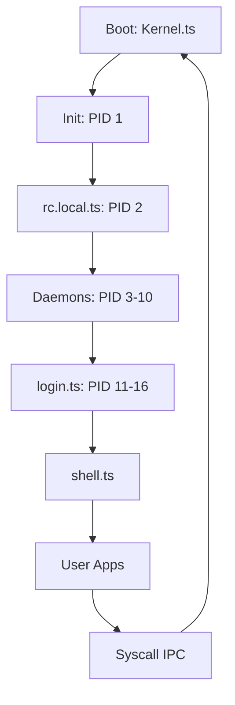
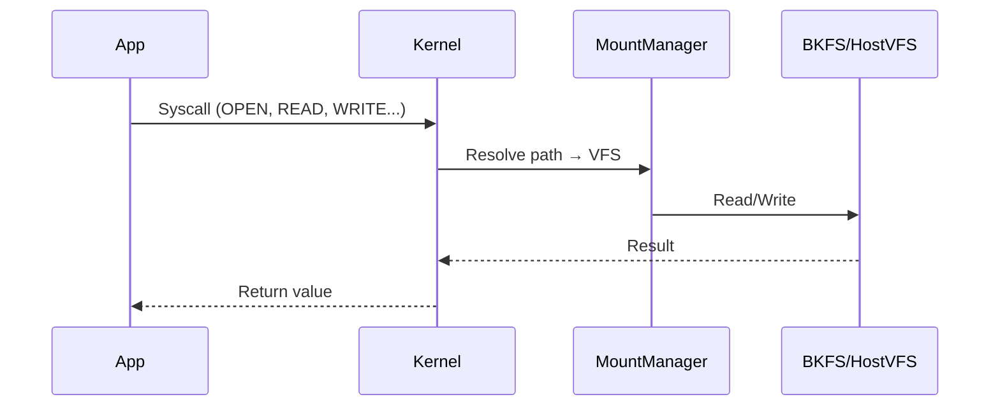

# 🌿 TSIX — Antigonon leptopus

<p align="center">
  
  
  
  
</p>

```text
   __       _
  / /______(_)  __
 / __/ ___/ / |/_/
/ /_(__  ) />  <
\__/____/_/_/|_|
```

**TSIX** adalah **IoT Application Platform** modern yang dibangun dengan **TypeScript**, dirancang dengan mengadopsi **arsitektur dan konsep UNIX yang telah mature dan teruji selama puluhan tahun** — seperti process isolation, permission model (UID/GID), filesystem POSIX, signal handling, dan device abstraction (HAL). Bukan emulator atau OS simulator — TSIX adalah platform runtime yang menerapkan **OS-level architecture** di atas Node.js untuk memberikan fondasi yang kokoh, stabil, dan scalable bagi aplikasi IoT dan edge computing.

---

## 📋 Quick Navigation

| Section                | Link                                                     |
| ---------------------- | -------------------------------------------------------- |
| 🏁 **Getting Started** | [Memulai.md](Memulai.md)                                 |
| 🏗️ **Architecture**    | [Arsitektur-Sistem.md](Arsitektur-Sistem.md)             |
| ⚙️ **Kernel**          | [Kernel-dan-Scheduler.md](Kernel-dan-Scheduler.md)       |
| 💾 **Filesystem**      | [Virtual-File-System.md](Virtual-File-System.md)         |
| 🌐 **Networking**      | [Networking-MQTNL.md](Networking-MQTNL.md)               |
| 🔧 **Commands**        | [Perintah-Sistem.md](Perintah-Sistem.md)                 |
| 📦 **Package Manager** | [Package-Manager-TPKG.md](Package-Manager-TPKG.md)       |
| 🔐 **Security**        | [Keamanan-dan-Sandboxing.md](Keamanan-dan-Sandboxing.md) |
| 🖥️ **GUI Toolkit**     | [emerald-in-a-nutshell.md](emerald-in-a-nutshell.md)     |
| 🥜 **Cashew Framework** | [cashew-in-a-nutshell.md](cashew-in-a-nutshell.md)       |
| �️ **DDC (Native JS)**  | [ddc-in-a-nutshell.md](ddc-in-a-nutshell.md)             |
| �📖 **Developer Guide** | [Panduan-Developer.md](Panduan-Developer.md)             |

---

## 🎯 Philosophy

TSIX dibangun di atas pilar **UNIX philosophy** yang telah teruji selama lebih dari 50 tahun — bukan untuk bersaing dengan Linux, melainkan untuk membuktikan bahwa konsep-konsep arsitektur OS yang matang dan mapan bisa diimplementasikan di ekosistem modern JavaScript/TypeScript.

### 🏛️ Prinsip Arsitektur UNIX yang Diadopsi

**1. Everything is a File**  
Warisan UNIX yang paling fundamental. Keyboard, layar, socket jaringan, pipe, hingga device I2C — semuanya adalah file. Tiga konsep dasar (InputStream, OutputStream, File) menyatukan semua interaksi I/O, persis seperti yang telah dilakukan UNIX selama puluhan tahun.

VFS TSIX menyediakan **multiple backends** untuk abstraksi filesystem:

- **RAM VFS** — In-memory tree (root filesystem, seperti tmpfs)
- **BKFS** — SQLite-backed persistent VFS (analog ext4, tapi di database)
- **HostVFS** — Bridge ke host filesystem (`/mnt/host`, seperti 9p atau NFS)
- **Mount Manager** — Overlay multi-VFS, bind mount, union mount

**2. Distributed by Design**  
IPC built-in via `SEND_MSG` syscall + identity-based messaging. Proses bisa komunikasi lintas worker tanpa shared memory — mirip konsep **message passing** di UNIX System V IPC. Setiap aplikasi bisa kirim/terima pesan menggunakan **UUID identity**.

```typescript
// Contoh: IPC antar aplikasi
await shell.send(targetWid, { type: "CHAT_MSG", text: "Halo!" });
```

**3. Small, Sharp Tools**  
Mengikuti filosofi UNIX: satu program melakukan satu hal dengan baik. TSIX memiliki 80+ utilitas — `ls`, `cat`, `grep`, `find`, `awk`, `wc`, `head`, `tail` — yang bisa dikombinasikan via pipe dan redirection, sebagaimana UNIX telah mengajarkan selama beberapa dekade.

**4. Security via Simplicity**  
Permission model UID/GID dengan rwx bits (persis seperti UNIX), process isolation via Worker Threads (mirip kernel/userspace separation), dan root (UID 0) sebagai privileged user — semua konsep yang telah terbukti ketangguhannya sejak era 1970-an.

---

## 🏛️ Architecture Overview

TSIX mengadopsi arsitektur **security rings** (protection rings) yang telah menjadi standar di dunia UNIX/Linux selama puluhan tahun — namun disesuaikan untuk eksekusi di atas Node.js. Alih-alih menggunakan hak akses hardware CPU (Ring 0-3), TSIX memisahkan kode berdasarkan **tingkat tanggung jawab dan risiko**, dengan Node.js sendiri sebagai "hypervisor" yang mengelola eksekusi.

### Ring Architecture

```
Ring 1 — Kernel Core
├── Syscall Dispatcher     — 60+ syscalls
├── Preemptive Scheduler   — Round-robin + signals
├── Mount Manager          — Multi-VFS overlay
├── Permission Manager     — UID/GID + capabilities
├── Port Manager           — TCP/UDP port allocation
├── GUI Registry           — Window → PID mapping
└── Executable Registry    — PATH resolution + shebang

Ring 4 — Userland (/bin)
├── tsh.ts                — Bourne-style shell
├── iot-listener.js        — IoT gateway (UDP → IPC)
├── dome.js                — DOME Engine (WebSocket → Browser)
├── asteracea.js           — Window Manager
├── file-cruiser.js        — File Manager GUI
├── pixelterm.js           — Terminal emulator
├── crond.js               — Cron scheduler
└── 80+ commands           — ls, cat, grep, ping, tail, find...
```

### Execution Model



### Data Flow



---

## ✨ Key Features

### Kernel

| Feature                | Details                                                                                |
| ---------------------- | -------------------------------------------------------------------------------------- |
| **Syscall Dispatcher** | 60+ POSIX-inspired syscalls (OPEN, READ, WRITE, FORK, EXEC, WAITPID, SIGNAL, CHMOD...) |
| **Scheduler**          | Preemptive round-robin, process states (RUNNING/WAITING/ZOMBIE/EXITED), wait queue     |
| **Permission Manager** | UID/GID, rwx bits, root bypass, capabilities (CAP_SETUID, CAP_NET_BIND, CAP_KILL...)   |
| **Mount Manager**      | Mount/unmount multiple VFS backends, nested mount points, longest-prefix resolution    |
| **Port Manager**       | TCP/UDP port binding, privileged port enforcement, SO_REUSEADDR, ephemeral allocation  |
| **GUI Registry**       | Window → PID mapping, event forwarding (click/input/keydown) to worker                 |
| **Process Tree**       | Parent-child links, zombie detection, auto-reparent to init on parent exit             |

### Filesystem (VFS)

| Feature               | Details                                                                               |
| --------------------- | ------------------------------------------------------------------------------------- |
| **RAM VFS**           | In-memory tree, mkdir/touch/ls/stat/unlink/rmdir, path traversal blocking             |
| **BKFS (SQLite VFS)** | Persistent filesystem in single `.db` file, content stored as TEXT, auto-sync         |
| **HostVFS**           | Bridge to real host filesystem (`/mnt/host`), uses Node.js `fs` module                |
| **Chunked I/O**       | `readChunk`/`writeChunk` with offset → progress-aware file operations                 |
| **SYNC_FROM_HOST**    | Import files from host to VFS (with security check — path must be under project root) |

### Networking

| Feature                   | Details                                                                     |
| ------------------------- | --------------------------------------------------------------------------- |
| **MQTNL Protocol**        | Binary + JSON encoding, CRC32 validation, magic bytes, version handshake    |
| **UDP/TCP**               | Socket creation, bind, connect, send/recv (in-memory simulation)            |
| **End-to-End Encryption** | RSA-2048 handshake → ChaCha20-Poly1305 session encryption                   |
| **Identity System**       | UUID-based process identity, `registerIdentity()` → `shell.send(uuid, msg)` |
| **OTA Updates**           | Over-the-air firmware update via MQTNL protocol                             |

### GUI (Emerald + DOME)

| Feature               | Details                                                                                             |
| --------------------- | --------------------------------------------------------------------------------------------------- |
| **DOME Engine**       | WebSocket-based display server, forward GUIAction to browser                                        |
| **Emerald Widgets**   | `sensorCard`, `lineChart`, `radialGauge`, `sevenSegment`, `indicatorLamp`, `toggleSwitch`, `slider` |
| **Connected Widgets** | `ConnectedToggle`, `ConnectedSensorCard`, `ConnectedRelayCard`, `ConnectedLineChart` — self-wiring  |
| **Screen/Window**     | Window lifecycle (mount, update, setContent, close), event handling (click, input, keydown)         |
| **Modal Dialogs**     | alert(), confirm(), question() — built-in                                                           |
| **File Dialogs**      | openFileDialog, saveFileDialog — built-in                                                           |
| **Resize Handles**    | 8-point edge resize (4 corners + 4 edges)                                                           |
| **Frameless Windows** | Custom titlebar, minimize/maximize/restore animation                                                |
| **IPC Chat**          | Multi-window chat via `shell.send(wid, msg)`                                                        |

### Devices

| Device              | Description                                                                       |
| ------------------- | --------------------------------------------------------------------------------- |
| **TTY**             | 6 virtual terminals, raw/cooked mode, ANSI escape, CLEAR_SCREEN, TIOCGWINSZ       |
| **Pipe**            | FIFO buffer, multiple readers/writers, reference counting, EPIPE on closed reader |
| **Socket**          | TCP/UDP sockets, bind/listen/connect/accept, packet send/recv                     |
| **Null**            | `/dev/null` (discard), `/dev/zero` (null bytes), `/dev/random` (entropy)          |
| **Keyboard/Screen** | Virtual input/output devices                                                      |
| **Serial**          | I2C-like device with configurable baud rate                                       |
| **MCP23017**        | GPIO extender (I2C), auto-registration                                            |
| **MySQL** *(eksperimental)* | Database device (POC) — integrasi eksternal via HAL, bukan pola utama akses DB (lihat kurikulum `DbLib`) |
| **SimpleMQTNL**     | MQTT-like network layer device                                                    |

---

## 🚀 Getting Started

### Prerequisites

- Node.js 18+
- npm

### Quick Start

```bash
git clone https://github.com/yourusername/tsix.git
cd tsix
npm install
npm run bootstrap    # Build + setup initial filesystem
npm run start        # Start TSIX shell
```

### Bootstrap Steps

```bash
# Build TypeScript sources
npm run build

# Initialize VFS + mount host folders
npm run init

# Start kernel
npm run kernel
```

### GUI Mode

```bash
# Start DOME Engine (terminal 1)
dome

# Open browser → http://localhost:8080

# Launch apps in TSIX shell
asteracea                   # Window Manager
file-cruiser               # File Manager
iot-dashboard <pid>        # IoT Dashboard
gui-chat                    # IPC Chat
```

---

## 📐 Project Structure

```text
tsix/
├── src/
│   ├── common/        — Shared types — [🔗 Wiki](SyscallCode, GUITypes, IPCTypes)
│   ├── kernel/        — Kernel — [🔗 Wiki](Kernel-dan-Scheduler.md)
│   ├── vfs/           — Filesystem backends — [🔗 Wiki](Virtual-File-System.md)
│   ├── mirror/        — Userland (Ring 4)
│   │   ├── bin/       — 80+ Applications — [🔗 Wiki](Perintah-Sistem.md)
│   │   ├── lib/       — Libraries (Emerald, UserLib) — [🔗 Wiki](emerald-in-a-nutshell.md)
│   │   └── etc/       — System config
│   └── tests/         — Unit tests — [🔗 Report](../unit-test-plan.md)
├── docs/              — Documentation
│   ├── wiki/          — 📍 You are here
│   ├── archive/       — Archived docs
│   ├── diagram/       — Architecture diagrams
├── platformio/        — ESP32 firmware — [🔗 Wiki](mqtnl-ota.md)
└── scripts/           — Build scripts
```

---

## 📊 Status

| Component                               | Status             | Tests         |
| --------------------------------------- | ------------------ | ------------- |
| Kernel (Ring 1)                         | ✅ Stable          | 240/285       |
| VFS (BKFS, HostVFS, RAM)                | ✅ Stable          | 140/140       |
| Devices (TTY, Pipe, Socket...)          | ✅ Stable          | 128/128       |
| Common (PathResolver, SecurityAgent...) | ✅ Stable          | 85/85         |
| Protocols (MQTNL JSON/Binary)           | ✅ Stable          | 60/60         |
| Utility Scripts                         | ✅ Stable          | 25/25         |
| **TOTAL**                               | **✅ 718 passing** | **723 tests** |

> Detail lengkap: [unit-test-plan.md](../unit-test-plan.md)

---

## 📚 Complete Wiki

| Page                                                                 | Description                                            |
| -------------------------------------------------------------------- | ------------------------------------------------------ |
| [Memulai.md](Memulai.md)                                             | Instalasi, konfigurasi, dan menjalankan TSIX           |
| [Arsitektur-Sistem.md](Arsitektur-Sistem.md)                         | Ring 1/2 architecture, boot process, execution flow    |
| [Kernel-dan-Scheduler.md](Kernel-dan-Scheduler.md)                   | Kernel internals, process management, syscalls         |
| [Virtual-File-System.md](Virtual-File-System.md)                     | BKFS SQLite-backed VFS, permission model, mount system |
| [Networking-MQTNL.md](Networking-MQTNL.md)                           | MQTT Network Layer, remote access, IoT connectivity    |
| [Perintah-Sistem.md](Perintah-Sistem.md)                             | Daftar lengkap 80+ user-land commands                  |
| [Package-Manager-TPKG.md](Package-Manager-TPKG.md)                   | Package management, repository, dan update system      |
| [Keamanan-dan-Sandboxing.md](Keamanan-dan-Sandboxing.md)             | Multi-layer security, worker isolation, permission     |
| [Panduan-Developer.md](Panduan-Developer.md)                         | Cara membuat aplikasi & device driver baru             |
| [emerald-in-a-nutshell.md](emerald-in-a-nutshell.md)                 | Emerald GUI Toolkit reference                          |
| [cashew-in-a-nutshell.md](cashew-in-a-nutshell.md)                   | Cashew Delphi-style GUI Framework                      |
| [ASTERACEA_WM.md](ASTERACEA_WM.md)                                   | Window Manager architecture                            |
| [PIXELSPACE_DEVELOPER_GUIDE.md](PIXELSPACE_DEVELOPER_GUIDE.md)       | PixelSpace Display Protocol                            |
| [DEVELOPER_GUIDE_DEVICES.md](DEVELOPER_GUIDE_DEVICES.md)             | Panduan membuat device driver                          |
| [DEVELOPER_GUIDE_SCRIPTING-V2.md](DEVELOPER_GUIDE_SCRIPTING-V2.md)   | Scripting guide v2                                     |
| [RC_LOCAL.md](RC_LOCAL.md)                                           | rc.local boot script spec                              |
| [SPEC_AIRTERM_V2.md](SPEC_AIRTERM_V2.md)                             | AirTerm specification                                  |
| [mqtnl-ota.md](mqtnl-ota.md)                                         | OTA update protocol                                    |
| [mqtnl_binary_ota.md](mqtnl_binary_ota.md)                           | Binary OTA format                                      |
| [mcp23017-registration.md](mcp23017-registration.md)                 | MCP23017 GPIO extender                                 |
| [identity_guid_ipc_walkthrough.md](identity_guid_ipc_walkthrough.md) | Identity & IPC walkthrough                             |
| [boot_sequence.md](boot_sequence.md)                                 | Boot sequence details                                  |
| [ARCHITECTURE_RINGS.md](ARCHITECTURE_RINGS.md)                       | Architecture rings detail                              |

---

## 👥 Authors

| Name                                  | Role                                |
| ------------------------------------- | ----------------------------------- |
| **Andriansah** (andriansah@yahoo.com) | Lead Architect & Platform Composer  |
| **GitHub Copilot**                    | AI Technical Implementation Partner |

> TSIX dibangun sebagai proyek hobby untuk menerapkan konsep arsitektur UNIX yang matang ke dalam ekosistem JavaScript/TypeScript modern — membuktikan bahwa prinsip-prinsip yang telah bertahan puluhan tahun tetap relevan di era apapun.

---

## 📄 License

MIT License — lihat file `LICENSE` untuk detail.

---

_Everything is a File, and everyone has their place._
