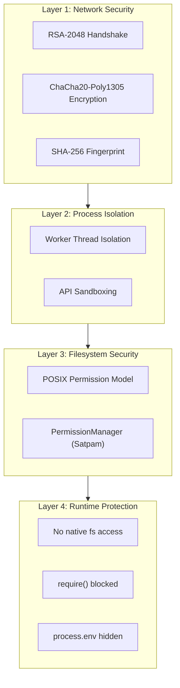
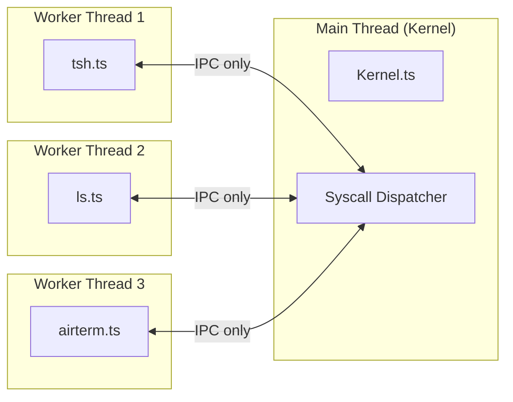
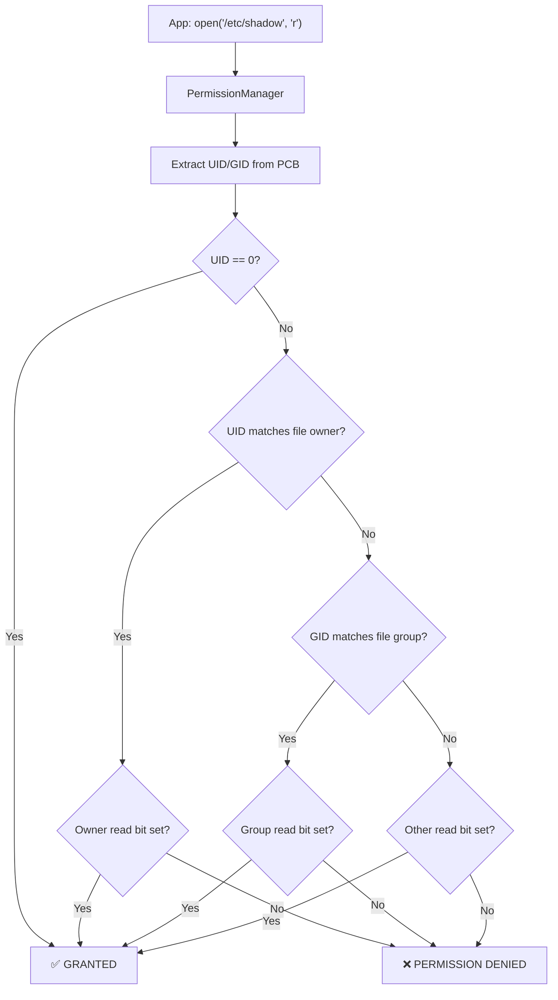

# 🔐 Keamanan & Sandboxing

TSIX dibangun dengan arsitektur keamanan berlapis (defense-in-depth) untuk memastikan akses remote yang aman dan isolasi aplikasi yang ketat.

---

## Overview Security Layers



---

## Layer 1: Cryptographic Stack (MQTNL)

TSIX **tidak mempercayai** MQTT broker. Semua data dilindungi end-to-end encryption.

| Mekanisme | Algoritma | Fungsi |
|-----------|-----------|--------|
| **Identity Verification** | RSA-2048 | Setiap node punya key pair unik untuk membuktikan identitas |
| **Session Encryption** | ChaCha20-Poly1305 | AEAD cipher untuk semua transfer data (high-speed) |
| **MITM Protection** | SHA-256 Fingerprint | Verifikasi host authenticity |
| **Visual Verification** | ANSI Color Pattern | Identitas visual unik per-node — verifikasi sekilas pandang |

### Key Management

```bash
# Generate key pair baru
ssh-keygen

# Keys disimpan di:
# /etc/keys/id_rsa        (Private key)
# /etc/keys/id_rsa.pub    (Public key)
```

---

## Layer 2: Process Isolation

### Worker Thread Architecture

Setiap aplikasi berjalan di **Worker Thread terpisah** dari kernel:



**Jaminan:**
- Aplikasi crash **tidak** menumbangkan kernel
- Satu aplikasi **tidak bisa** mengakses memori aplikasi lain
- Communication **hanya** via IPC (postMessage)

### API Sandboxing (`WorkerEntry.ts`)

Sebelum aplikasi berjalan, `WorkerEntry.ts` melakukan **"operasi penyisiran"** yang memblokir akses berbahaya:

| Blocked API | Alasan |
|-------------|--------|
| `require('fs')` | Mencegah akses ke host filesystem |
| `require('http')` | Mencegah koneksi network langsung |
| `require('child_process')` | Mencegah spawn proses host |
| `process.env` | Menyembunyikan environment variable host |
| `process.exit()` | Mencegah crash yang tidak terkontrol |
| `global.require` | Memblokir semua native module loading |

**Yang diperbolehkan:**
- `lib.fs.*` — VFS access via syscall
- `lib.std.*` — Terminal I/O via syscall
- `lib.shell.*` — Process management via syscall
- `lib.net.*` — MQTNL networking via syscall

---

## Layer 3: Filesystem Security

### POSIX Permission Model

Setiap file dan device memiliki metadata keamanan:

```
-rw-r--r-- root root   /etc/passwd
-rw------- root root   /etc/shadow
-rwxr-xr-x root root   /bin/ls
-rw-rw---- root users  /dev/randomdevice
drwx------ user1 user1  /home/user1
```

### PermissionManager

"Satpam" yang memvalidasi setiap akses:



### Sensitive File Protection

| File | Permission | Keterangan |
|------|-----------|------------|
| `/etc/shadow` | `0600` | Hanya root yang bisa baca (password hashes) |
| `/etc/passwd` | `0644` | Readable semua, writable root only |
| `/etc/keys/*` | `0600` | Private keys — root only |

---

## Layer 4: Runtime Protection

### FAQ Keamanan

**Q: Bisa nggak script di dalam TSIX menghapus file di host (Windows/Linux)?**

**A: TIDAK BISA.** Karena:

1. **VFS Confinement** — Semua syscall (`open`, `read`, `ls`) hanya melihat dunia di dalam BKFS (SQLite). Kernel tidak menyediakan jalur ke module `fs` asli Node.js
2. **Worker Isolation** — Setiap app di thread terpisah
3. **API Masking** — `require`, `process.env`, `process.exit` diblokir
4. **Hardware Guard** — `/dev/` dikawal oleh PermissionManager

**Q: Bagaimana jika ada bug di kernel yang memungkinkan escape?**

**A:** Karena ini simulator yang berjalan di atas Node.js, worst case adalah akses ke runtime Node.js host. Untuk deployment produksi di IoT, disarankan menjalankan TSIX di dalam container (Docker) sebagai lapisan tambahan.

---

## Best Practices Keamanan

1. **Jangan jalankan sebagai root kecuali perlu** — Gunakan `sudo` untuk operasi privileged
2. **Jaga permission file sensitif** — `/etc/shadow` harus `0600`
3. **Verifikasi fingerprint** — Saat `airterm` pertama kali, bandingkan fingerprint
4. **Generate key pair sendiri** — Jangan pakai default keys
5. **Gunakan MQTT broker terpercaya** — Atau setup broker sendiri

---

**Halaman selanjutnya:** [📖 Panduan Developer](Panduan-Developer.md)
