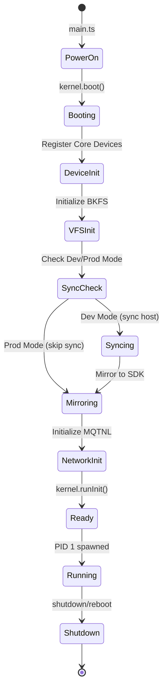
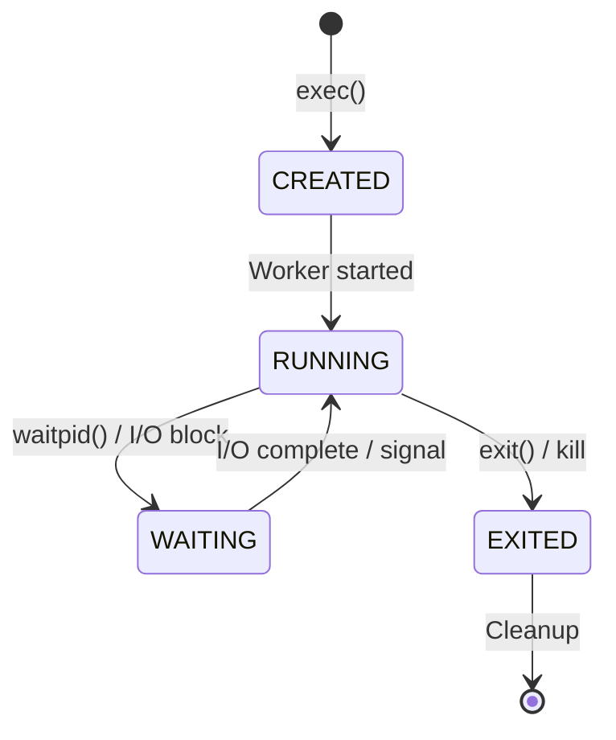
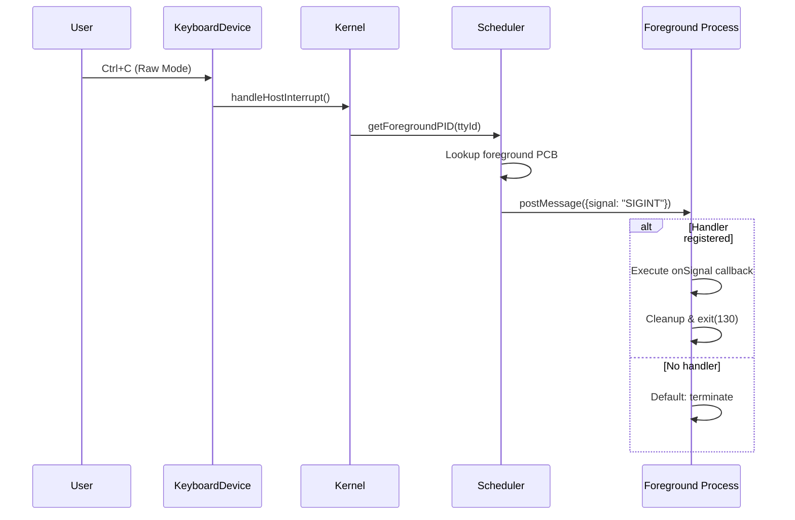

# ⚙️ Kernel & Scheduler

Kernel TSIX (**Dinawari**) adalah jantung dari sistem — sebuah class TypeScript monolithic yang berjalan di Main Thread Node.js dan mengelola seluruh resource virtual.

---

## Kernel (`Kernel.ts`)

### Tanggung Jawab Utama

| Fungsi | Deskripsi |
|--------|-----------|
| `boot()` | Inisialisasi VFS, device drivers, network, dan scheduler |
| `runInit()` | Spawn PID 1 (init process) |
| `syncFromHost()` | Dev mode: sinkronisasi `src/__root/` → VFS |
| `mirrorToSDK()` | Ekstrak VFS ke `.tsix_sdk/` agar Node.js bisa resolve |
| `loadAuxDevices()` | Auto-load plugin devices dari `aux-devices/` |
| `handleHostInterrupt()` | Forward Ctrl+C ke foreground process |

### Lifecycle



---

## Process Scheduler (`Scheduler.ts`)

Scheduler adalah **process manager**: setiap proses berjalan di **Worker Thread sendiri** (preemption & multitasking disediakan oleh OS host / Node.js), dengan dukungan penuh untuk signals dan process groups.

### Process Control Block (PCB)

Setiap proses direpresentasikan oleh PCB dengan properti berikut:

| Field | Tipe | Deskripsi |
|-------|------|-----------|
| `pid` | number | Process ID (unik) |
| `ppid` | number | Parent Process ID |
| `uid` | number | User ID yang menjalankan |
| `gid` | number | Group ID |
| `state` | string | `RUNNING`, `WAITING`, `EXITED` |
| `cwd` | string | Current Working Directory |
| `fdTable` | Map | Tabel File Descriptor |
| `env` | Map | Environment variables |
| `ttyId` | number | ID TTY yang terikat (1-6) |
| `worker` | Worker | Reference ke Worker Thread |
| `exitCode` | number | Kode keluar (setelah EXIT) |

### Process States



### Operasi Scheduler

```typescript
// Spawn proses baru
scheduler.spawn(scriptPath, args, { uid, gid, ttyId, env, cwd });

// Mendapatkan proses berdasarkan PID
scheduler.getProcess(pid);

// Mengirim signal ke proses
scheduler.sendSignal(pid, "SIGINT");    // Interrupt
scheduler.sendSignal(pid, "SIGTERM");   // Graceful terminate
scheduler.sendSignal(pid, "SIGKILL");   // Force kill

// Menunggu proses selesai
scheduler.waitpid(pid);

// Kill proses
scheduler.kill(pid);
```

---

## Signal System

TSIX mengimplementasikan sistem signal berbasis POSIX untuk komunikasi antar-proses — sebuah mekanisme yang telah teruji puluhan tahun di ekosistem UNIX/Linux:

| Signal | Kode | Trigger | Default Action |
|--------|------|---------|----------------|
| `SIGINT` | 2 | Ctrl+C | Terminate process |
| `SIGTERM` | 15 | `kill <pid>` / shutdown | Graceful terminate |
| `SIGKILL` | 9 | `kill -9 <pid>` | Force kill (unblockable) |
| `SIGCHLD` | 17 | Child exits | Notify parent |

### Signal Delivery Flow



---

## Syscall System (`Syscalls.ts`)

Syscall Dispatcher adalah **satu-satunya gateway** antara User-Land dan Kernel-Land. Semua komunikasi harus melewati IPC.

### Daftar Syscall Utama

#### Filesystem Operations

| Syscall | Deskripsi |
|---------|-----------|
| `OPEN` | Membuka file/device, mengembalikan FD |
| `READ` | Membaca data dari FD |
| `WRITE` | Menulis data ke FD |
| `CLOSE` | Menutup FD |
| `STAT` | Mendapatkan metadata file (size, permissions, owner) |
| `LS` / `READDIR` | List isi direktori |
| `MKDIR` | Membuat direktori baru |
| `UNLINK` | Menghapus file |
| `RMDIR` | Menghapus direktori |
| `RENAME` | Rename/move file |
| `CHMOD` | Mengubah permission bits |
| `CHOWN` | Mengubah owner/group |

#### Process Management

| Syscall | Deskripsi |
|---------|-----------|
| `EXEC` | Menjalankan program baru (Worker spawn) |
| `EXIT` | Keluar dari proses |
| `WAITPID` | Menunggu proses child selesai |
| `KILL` | Mengirim signal ke proses |
| `PS` | List semua proses aktif |
| `GETPID` | Mendapatkan PID sendiri |
| `GETPPID` | Mendapatkan Parent PID |
| `REEXEC` | Restart proses tanpa ganti PID |

#### Environment & Info

| Syscall | Deskripsi |
|---------|-----------|
| `GETENV` | Membaca environment variable |
| `SETENV` | Menulis environment variable |
| `CHDIR` | Pindah working directory |
| `GETCWD` | Baca current working directory |
| `WHOAMI` | Info user saat ini (UID, GID, username) |
| `UNAME` | Info sistem (kernel, distro, version) |
| `HOSTNAME` | Membaca/set hostname |

#### Device & I/O Control

| Syscall | Deskripsi |
|---------|-----------|
| `IOCTL` | Input/Output Control untuk device |
| `CHVT` | Switch virtual terminal (TTY) |
| `GET_SCREEN_INFO` | Mendapatkan ukuran terminal ($LINES, $COLS) |

#### Network

| Syscall | Deskripsi |
|---------|-----------|
| `NET_SEND` | Kirim paket via MQTNL |
| `NET_RECV` | Terima paket dari MQTNL |
| `NET_BIND` | Bind port untuk listening |
| `NET_LISTEN` | Mulai listening di port |
| `NET_CONNECT` | Koneksi ke node remote |
| `NET_ACCEPT` | Accept incoming connection |
| `NET_IFCONFIG` | Info interface network |
| `NET_PING` | Ping node lain |

---

## Init Process (PID 1)

`init` adalah proses pertama yang dijalankan kernel, bertanggung jawab sebagai parent dari semua proses lain.

### Tugas Init

1. Membaca konfigurasi dari `/etc/inittab` (konseptual)
2. Menjalankan **startup scripts** (`/etc/rc.local`)
3. Spawn **login** di setiap TTY yang dikonfigurasi
4. Spawn **daemon services** (airtermd, scpd, tpkgd)
5. Memonitor child processes — respawn jika crash

### Flow PID 1

```
init (PID 1)
├── rc.local (startup scripts)
├── login (TTY1) → shell → user commands
├── login (TTY2) → shell → user commands
├── ...
├── airtermd (Remote terminal daemon)
├── scpd (SCP daemon)
└── tpkgd (Package daemon)
```

---

## Device Drivers

### Core Devices

| Driver | File | Dev Path | Deskripsi |
|--------|------|----------|-----------|
| `KeyboardDevice` | `KeyboardDevice.ts` | `/dev/stdin` | Raw stdin input dengan Ctrl+C detection |
| `ScreenDevice` | `ScreenDevice.ts` | `/dev/fb0` | Framebuffer — info $LINES, $COLUMNS |
| `TTYDevice` | `TTYDevice.ts` | `/dev/tty1-6` | 6 virtual console terisolasi |
| `NullDevice` | `NullDevice.ts` | `/dev/null` | Pembuangan data (black hole) |
| `PipeDevice` | `PipeDevice.ts` | — | IPC pipe antar-proses |
| `SerialDevice` | `SerialDevice.ts` | `/dev/ttyUSB*` | UART/Serial port bridge |
| `SimpleMQTNLDriver` | `SimpleMQTNLDriver.ts` | `/dev/smqtnl0` | Network driver MQTT |
| `FileSystemDevice` | `FileSystemDevice.ts` | — | VFS file access bridge |
| `SocketDevice` | `SocketDevice.ts` | — | Network socket abstraction |

### Auxiliary Devices (Plugin System)

Kernel otomatis memuat device dari folder `src/kernel/devices/aux-devices/` saat boot:

1. Kernel scan folder `aux-devices/`
2. Setiap file yang implements `IDevice` otomatis didaftarkan
3. Muncul di `/dev/` — siap dipakai tanpa edit kernel

> [!TIP]
> Untuk menambah device baru, cukup buat file di `aux-devices/`. Tidak perlu menyentuh `Kernel.ts` atau `Syscalls.ts`. Lihat [📖 Panduan Developer](Panduan-Developer.md) untuk detail.

---

**Halaman selanjutnya:** [🌐 Networking (MQTNL)](Networking-MQTNL.md)
