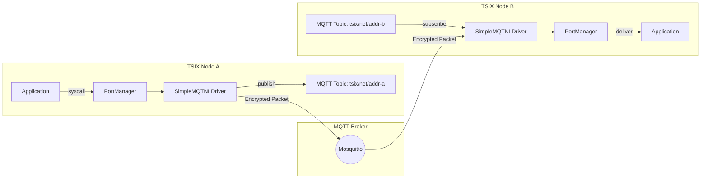
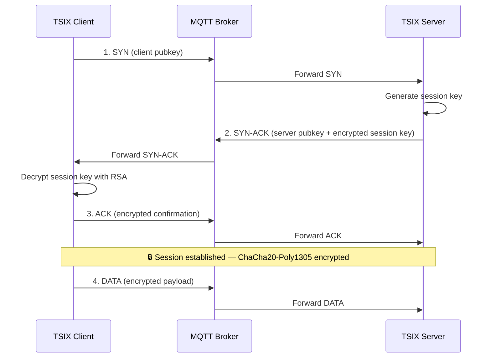

# 🌐 Networking (MQTNL)

**MQTNL (MQTT Network Layer)** adalah stack jaringan proprietari TSIX yang memperkaya protokol MQTT dengan konsep networking tradisional.

---

## Konsep Dasar

MQTNL **bukan** MQTT biasa — ia adalah lapisan enriched yang menambahkan:

- **Virtual Addressing** — Setiap node memiliki alamat unik (hostname-based)
- **Port-based Connections** — Seperti TCP/IP, aplikasi mengikat ke port tertentu
- **Socket-Like API** — `NetSocket` high-level (`open`, `sendTo`, `recv`, `reply`, `close`) di atas syscall `socket()`/`bind()`/`sendto()`/`recvfrom()`
- **End-to-End Encryption** — RSA handshake + ChaCha20-Poly1305

### Kenapa MQTT?

| Alasan             | Detail                                                         |
| ------------------ | -------------------------------------------------------------- |
| **IoT Compatible** | MQTT bisa jalan di ESP32, ESP8266, dan microcontroller lainnya |
| **Lightweight**    | Bandwidth dan memory footprint minimal                         |
| **NAT Traversal**  | Tidak perlu IP publik — broker sebagai relay                   |
| **Cross-Platform** | Desktop, Raspberry Pi, ESP32 bisa berkomunikasi seamless       |
| **Event-Driven**   | Pub/Sub model cocok untuk sensor data & command broadcasting   |

---

## Zero Infrastructure Advantage

> **Game-changer**: Setiap TSIX node bisa diakses remote dari mana saja, kapan saja — **tanpa IP publik, tanpa VPS, tanpa cloud**.

```
┌─────────────┐                    ┌─────────────┐
│  TSIX Node A │                    │  TSIX Node B │
│  (Rumah)     │                    │  (Kantor)    │
│  NAT/4G      │◄──── MQTT ────►   │  NAT/WiFi    │
└──────┬───────┘     Broker        └──────┬───────┘
       │         (test.mosquitto.org)      │
       │                                   │
  airterm ◄──── encrypted tunnel ────► airtermd
```

Cukup arahkan ke MQTT broker (bahkan yang gratis), dan node-node TSIX langsung membentuk **global mesh network**.

---

## Arsitektur Network Stack



### Komponen

| Komponen            | File                   | Deskripsi                                                                      |
| ------------------- | ---------------------- | ------------------------------------------------------------------------------ |
| `SimpleMQTNLDriver` | `SimpleMQTNLDriver.ts` | Driver utama — publish/subscribe MQTT topics + factory registry agent enkripsi |
| `PortManager`       | `PortManager.ts`       | Mengelola port binding & routing paket ke proses                               |
| `SecurityAgent`     | `SecurityAgent.ts`     | Agent enkripsi default "chacha20" (RSA, ChaCha20, fingerprints)                |
| `ISecurityAgent`    | `ISecurityAgent.ts`    | Kontrak agent enkripsi (pluggable — bisa diganti agent kustom)                 |
| `AesGcmAgent`       | `AesGcmAgent.ts`       | Contoh agent kustom AES-256-GCM                                                |
| `NetSocket`         | `NetworkLib.ts`        | API high-level ala Cashew (open → event → close)                               |
| `PacketForwarder`   | `PacketForwarder.ts`   | Routing & forwarding paket antar-interface                                     |

---

## Security Stack

### Handshake Flow



### Layer Enkripsi

| Layer         | Algoritma                   | Fungsi                                                                          |
| ------------- | --------------------------- | ------------------------------------------------------------------------------- |
| **Identity**  | RSA-2048                    | Verifikasi identitas node & key exchange                                        |
| **Session**   | ChaCha20-Poly1305 (default) | High-speed AEAD encryption untuk data transfer — **pluggable** via custom agent |
| **Integrity** | SHA-256                     | Fingerprint verification & MITM protection                                      |

### Custom Security Agent (Pluggable)

Lapisan **Session** bersifat pluggable. Driver tidak meng-hardcode `SecurityAgent` — ia memakai kontrak `ISecurityAgent` dan memilih agent via nama string:

```ts
// Daftarkan agent kustom (sisi kernel)
SimpleMQTNLDriver.registerAgent("aes-gcm", () => new AesGcmAgent());

// Pilih dari aplikasi (userland) — default "chacha20"
await sock.upgradeSecurity(KEY_HEX, { agent: "aes-gcm" });
```

Cek agent yang terdaftar: `secagent` (syscall `SECAGENT_LIST`). Agent tak dikenal → fallback ke "chacha20".

### Visual Identity

Setiap node menghasilkan **Visual Identity** — pola warna ANSI unik yang bisa diverifikasi secara visual untuk memastikan koneksi ke node yang benar.

---

## Konfigurasi Network

Konfigurasi interface di `src/sysconfig.json`:

```json
{
  "network": {
    "interfaces": [
      {
        "broker": "mqtt://192.168.0.109",
        "deviceName": "smqtnl0",
        "address": "antigonon",
        "defaultPort": 1883
      },
      {
        "broker": "mqtt://192.168.0.109",
        "deviceName": "smqtnl1",
        "address": "tsix-node-2",
        "defaultPort": 1883
      }
    ],
    "defaultDevice": "smqtnl0"
  }
}
```

---

## Perintah Networking

| Perintah                 | Deskripsi                                                                                   |
| ------------------------ | ------------------------------------------------------------------------------------------- |
| `ifconfig`               | Menampilkan status interface (IP, MAC, Rx/Tx stats)                                         |
| `ping <node>`            | Cek konektivitas ke node lain                                                               |
| `nmap`                   | Scan port terbuka di node remote                                                            |
| `nettop`                 | Monitor traffic real-time (like `htop` for network)                                         |
| `airterm <node>`         | Remote terminal ke node lain (SSH-like via MQTNL)                                           |
| `scp <src> <node>:<dst>` | Secure file copy antar-node                                                                 |
| `listen_net`             | Listen incoming packets di port tertentu                                                    |
| `forward`                | Port forwarding antar-interface                                                             |
| `secagent`               | Tampilkan daftar Security Agent yang terdaftar di kernel (`secagent` / `--list` / `--json`) |

### Contoh Penggunaan

```bash
# Cek konektivitas
ping tsix-node-2

# Remote terminal ke node lain
airterm tsix-node-2

# Copy file ke node remote
scp /root/data.txt tsix-node-2:/tmp/

# Lihat interface aktif
ifconfig

# Monitor jaringan real-time
nettop
```

---

## Use Cases Nyata

### 1. Remote Edge Management

Kelola STB atau Edge device yang tersebar di balik NAT/4G — tanpa infrastruktur.

### 2. Educational Sandbox

Pelajari konsep networking Unix (socket, bind, listen, accept) di lingkungan yang aman.

### 3. Resilient Chat-Ops

Deploy "command-center" node di area remote (kapal, stasiun riset) via satellite bandwidth minimal.

### 4. Home IoT

Kontrol perangkat rumah via ESP32 yang terhubung ke MQTT broker — akses dari mana saja.

---

**Halaman selanjutnya:** [🔧 Perintah Sistem](Perintah-Sistem.md)
