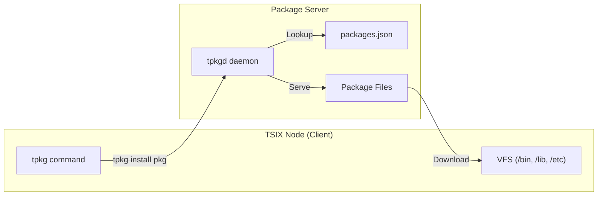

# 📦 Package Manager (TPKG)

TPKG adalah package manager bawaan TSIX untuk menginstall, update, dan mengelola software packages.

---

## Arsitektur



---

## Perintah TPKG

### Install Package

```bash
tpkg install <package-name>
```

Download dan install package dari repository ke VFS:
- Binaries → `/bin/`
- Libraries → `/lib/`
- Config → `/etc/`

### Update Package

```bash
tpkg update
```

Check dan download update untuk semua package yang terinstall.

### List Packages

```bash
tpkg list
```

Tampilkan semua package yang tersedia di repository.

### Setup Repository

```bash
tpkg-setup
```

Konfigurasi repository URL untuk package manager.

---

## Package Format

Packages didefinisikan dalam format JSON manifest:

```json
{
    "name": "hello-pkg",
    "version": "1.0.0",
    "description": "Hello World Package",
    "files": {
        "/bin/hello-pkg": "hello-pkg.ts"
    },
    "dependencies": []
}
```

### Struktur Package

| Field | Deskripsi |
|-------|-----------|
| `name` | Nama unik package |
| `version` | Versi semver |
| `description` | Deskripsi singkat |
| `files` | Mapping VFS path → source file |
| `dependencies` | Daftar dependency package |

---

## Update System

TPKG mendukung mekanisme update otomatis:

1. `tpkg update` mendownload file update ke `/tmp/system-updates/`
2. `apply-update` menerapkan update ke VFS dan host
3. Opsional: `onAfterDownload` script otomatis dijalankan setelah download
4. Reboot jika diperlukan

```bash
# Check & download updates
tpkg update

# Apply pending updates
apply-update

# Reboot setelah update
reboot
```

---

## TPKGD (Package Daemon)

`tpkgd` adalah daemon server-side yang melayani package repository:

- Berjalan sebagai background daemon
- Serve manifest `packages.json` dan file package
- Diakses oleh client melalui MQTNL network

---

**Halaman selanjutnya:** [🔐 Keamanan & Sandboxing](Keamanan-dan-Sandboxing.md)
