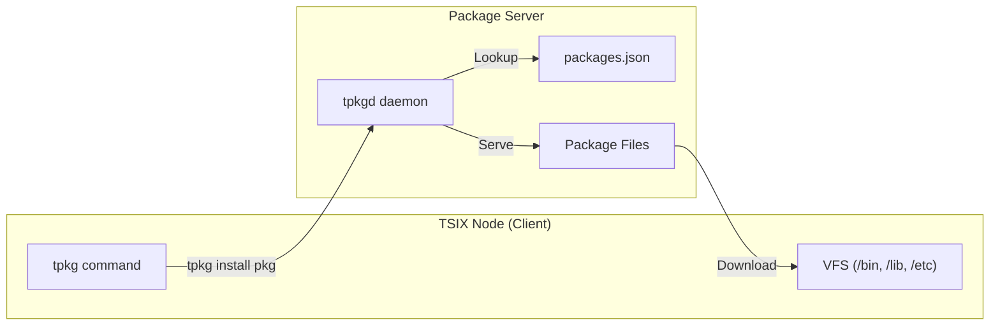
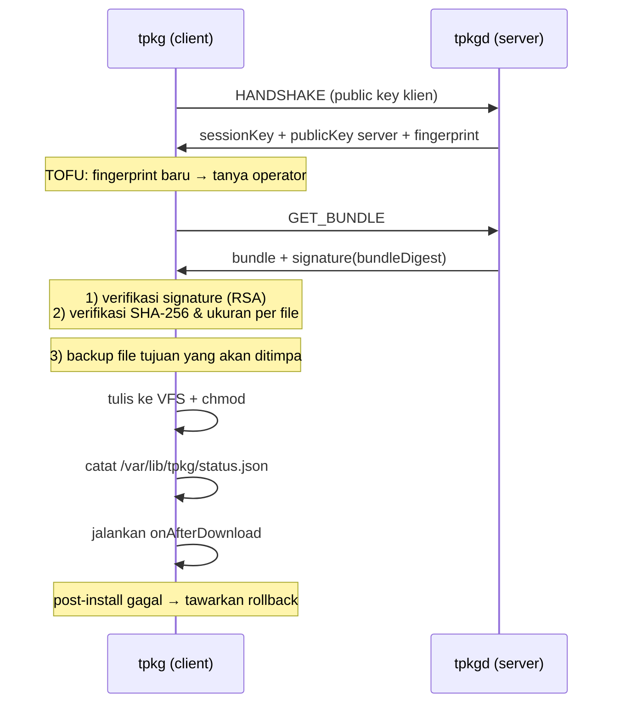

# 📦 Package Manager (TPKG)

TPKG adalah package manager bawaan TSIX untuk menginstall, update, dan mengelola software packages.

---

## Arsitektur



---

## Perintah TPKG

| Perintah | Fungsi |
|----------|--------|
| `tpkg update [host[:port]]` | Ambil katalog paket dari server → simpan ke `/var/cache/tpkg/repo.json` |
| `tpkg list` | Tampilkan paket yang tersedia di katalog lokal |
| `tpkg info <pkg> [--from <host[:port]>]` | Detail satu paket (versi, ukuran, daftar file) |
| `tpkg install <pkg> [--from <host[:port]>]` | Ambil → verifikasi → backup → tulis → post-install |
| `tpkg download <pkg> [--from <host[:port]>]` | Ambil & verifikasi TANPA menulis ke VFS |
| `tpkg verify <pkg> [--from <host[:port]>]` | Periksa signature paket dari server |
| `tpkg rollback <pkg>` | Pulihkan backup terbaru paket tersebut |
| `tpkg metrics` | Statistik client (jumlah install/download/rollback) |
| `tpkg --set-repo <host[:port]>` | Simpan repository default |

Semua perintah (kecuali `list`, `info`, `--set-repo`) **butuh root** — kalau tidak,
tpkg menolak dengan pesan `requires root privileges`.

```bash
# Set repository sekali, lalu perintah lain tidak perlu --from lagi
tpkg --set-repo pkgserver.local:8090

# Ambil katalog, lihat isi, install
tpkg update
tpkg list
sudo tpkg install hello-world

# Cek dulu tanpa menyentuh VFS
sudo tpkg download hello-world
sudo tpkg verify hello-world

# Kalau hasil instalasi bermasalah
sudo tpkg rollback hello-world
```

### Port repository

Format alamat adalah `host[:port]`. Tanpa port, dipakai `80` (tidak lagi
di-hardcode seperti versi lama — port benar-benar dikirim ke jaringan).

---

## Alur Instalasi (aman-by-default)



Empat lapis pengamanan sebelum satu byte pun ditulis:

1. **Session terenkripsi** — handshake RSA + session key ChaCha20.
2. **Trust on first use (TOFU)** — fingerprint server baru harus disetujui operator;
   fingerprint yang berubah → peringatan (indikasi MITM/server diganti).
3. **Signature paket** — server menandatangani digest bundle (`path+size+sha256`,
   bukan konten penuh) dengan kunci identitas sistem `/etc/keys/rsa`.
4. **Integritas per file** — ukuran dan SHA-256 tiap file diperiksa **sebelum**
   file itu ditulis. Hash dihitung atas byte latin1 (1 char = 1 byte), sama persis
   dengan yang ditulis ke VFS — bukan utf8.

Kalau salah satu gagal, instalasi dibatalkan dan pesannya menyebut file mana yang
bermasalah.

---

## Package Format

Packages didefinisikan dalam `packages.json` di node server:

```json
{
    "version": "1.0",
    "packages": [
        {
            "name": "hello-world",
            "version": "1.0.0",
            "description": "Sample package for TPKG testing",
            "author": "Antigravity",
            "needReboot": false,
            "onAfterDownload": "/opt/test/hello-pkg.ts",
            "items": [
                {
                    "src": "/opt/test/hello-pkg.ts",
                    "dst": "/opt/test/hello-pkg.ts",
                    "isExecutable": true
                },
                {
                    "src": "/etc/pkg-demo.conf",
                    "dst": "/root/bucket/pkg-demo.conf"
                }
            ]
        }
    ]
}
```

### Field paket

| Field | Deskripsi |
|-------|-----------|
| `name` | Nama unik package |
| `version` | Versi semver |
| `description` | Deskripsi singkat |
| `author` | Opsional, informasi |
| `needReboot` | `true` → operator diminta reboot setelah install |
| `onAfterDownload` | Skrip yang dijalankan setelah instalasi berhasil |
| `undoScript` | Opsional, dijalankan saat rollback |
| `minVersion` | Versi TSIX minimum (informasi, belum ditegakkan) |
| `items[]` | Daftar file yang dikirim |

### Field item

| Field | Deskripsi |
|-------|-----------|
| `src` | Path sumber di sisi server |
| `dst` | Path tujuan di sisi klien |
| `permissions` | Mode chmod eksplisit (mis. `493` = `0o755`). Menang atas `isExecutable` |
| `isExecutable` | `true` → chmod `0o755` |

Urutan penentuan mode: `permissions` → `isExecutable` → path di bawah `/bin/`
(kompatibilitas repo lama) → mode bawaan VFS (`0o644`).

> ⚠️ **Catatan penting:** file executable di luar `/bin/` **wajib** memakai
> `isExecutable: true` atau `permissions`. Tanpa itu file ditulis `0o644` dan
> skrip post-install gagal dengan error 126 (*Permission denied*).

### Batas ukuran

`tpkgd` menolak paket yang melebihi `--max-bundle` (default **4 MB**) dengan pesan
jelas, bukan crash/OOM. Bundle dikirim dalam satu pesan MQTNL sehingga manifest
dengan file raksasa (ratusan MB) tidak akan tertangani — pecah paketnya atau
gunakan `host` mount untuk file besar. Paket TSIX pada umumnya ≤ 188 KB.

---

## Update System

TPKG mendukung mekanisme update otomatis:

1. `tpkg update` mendownload katalog paket ke `/var/cache/tpkg/repo.json`
2. `tpkg download <pkg>` mengambil file update ke `/var/cache/tpkg/bundles/<pkg>/<versi>/`
3. `apply-update` menerapkan update ke VFS dan host
4. Opsional: `onAfterDownload` dijalankan otomatis setelah instalasi penuh
5. Reboot bila `needReboot: true`

```bash
tpkg update                # katalog
sudo tpkg download system-update
apply-update
reboot
```

---

## Backup & Rollback

Sebelum menimpa file, tpkg membackup isi lama ke disk:

```
/var/lib/tpkg/backup/<pkg>/<timestamp>/<0001.bin, 0002.bin, ...>
/var/lib/tpkg/backup/<pkg>/<timestamp>/index.json
```

`index.json` mencatat per file: path tujuan, apakah file sudah ada sebelumnya,
nama file backup, mode, dan skrip undo paket. Status versi terpasang ada di
`/var/lib/tpkg/status.json`.

- Gagal menulis backup → instalasi **dibatalkan** (tidak lanjut menimpa file).
- Backup lama dipangkas otomatis (`pruneBackups`, simpan N terbaru per paket).
- `tpkg rollback <pkg>` memulihkan backup terbaru, lalu menjalankan `undoScript`
  kalau ada. Paket yang belum pernah diinstall akan ditolak.

---

## TPKGD (Package Daemon)

`tpkgd` adalah daemon server-side yang melayani package repository.

```bash
tpkgd [--port <n>] [--repo <path>] [--max-bundle <bytes>] [--help]
```

| Opsi | Default | Keterangan |
|------|---------|------------|
| `--port` | `80` | Port UDP/MQTNL yang didengarkan |
| `--repo` | `/etc/tpkg/packages.json` | Manifest paket |
| `--max-bundle` | `4194304` (4 MB) | Batas total bundle yang dilayani |

Perilaku:

- Bind socket + pin framing MQTNL (JSON) supaya protokol tidak tertukar peer lain,
  lalu daemonize.
- Melayani `LIST` (katalog), `INFO <pkg>` (detail), `GET_BUNDLE <pkg>` (file + signature).
- Saran nama paket ala "did you mean" (Levenshtein) kalau paket tidak ada.
- Rate limit per pengirim (120 permintaan/menit) → permintaan berlebih ditolak
  `RATE_LIMITED`, bukan diam-diam.
- Session punya TTL 10 menit; sweep dijalankan saat idle (throttle 30 detik) sehingga
  daemon tidak menahan state mati.
- `tpkgd --help` mencetak opsi yang tersedia; `--port` tidak valid ditolak dengan
  pesan jelas **sebelum** bind.

---

## Troubleshooting

| Gejala | Penyebab & solusi |
|--------|-------------------|
| `requires root privileges` | Jalankan dengan `sudo` |
| `tidak merespons handshake` | Server mati / port salah. Cek `--from host:port` dan `tpkgd --port` |
| `Package '<x>' not found in catalog` | Jalankan `tpkg update` dulu, atau server belum punya paket itu |
| Post-install error **126** | File tidak executable → tambahkan `isExecutable: true` |
| `melebihi batas` saat bundle | Paket > `--max-bundle` → naikkan batas atau pecah paket |
| Fingerprint berubah | Server di-reinstall/kunci diganti, atau MITM. Verifikasi dulu |
| `RATE_LIMITED` | Terlalu banyak permintaan dari satu pengirim, tunggu 1 menit |

---

Changelog: [`changelogs/tpkg.md`](changelogs/tpkg.md) (2026-09-22).

---

**Halaman selanjutnya:** [🔐 Keamanan & Sandboxing](Keamanan-dan-Sandboxing.md)
