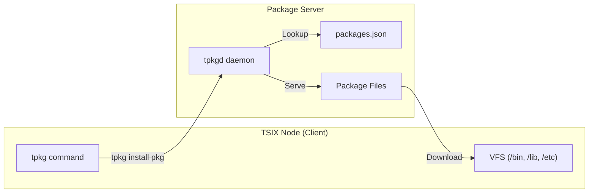
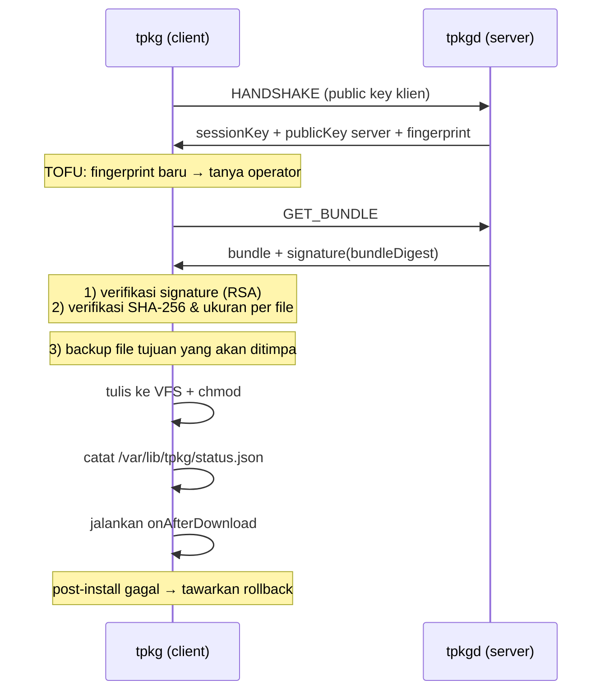
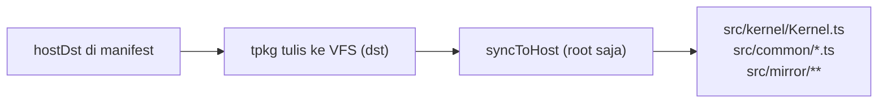

# 📦 Package Manager (TPKG)

TPKG adalah package manager bawaan TSIX untuk menginstall, update, dan mengelola software packages.

Selain paket aplikasi biasa, tpkg juga bisa **meng-upgrade engine TSIX** (kernel +
seluruh komponen sistem) ke node lain — lihat [Paket Engine](#paket-engine-system-update).

---

## Arsitektur



---

## Perintah TPKG

| Perintah                                     | Fungsi                                                                  |
| -------------------------------------------- | ----------------------------------------------------------------------- |
| `tpkg update [host[:port]]`                  | Ambil katalog paket dari server → simpan ke `/var/cache/tpkg/repo.json` |
| `tpkg list`                                  | Tampilkan paket yang tersedia di katalog lokal                          |
| `tpkg info <pkg> [--from <host[:port]>]`     | Detail satu paket (versi, ukuran, daftar file)                          |
| `tpkg install <pkg> [--from <host[:port]>]`  | Ambil → verifikasi → backup → tulis → post-install                      |
| `tpkg download <pkg> [--from <host[:port]>]` | Ambil & verifikasi TANPA menulis ke VFS                                 |
| `tpkg verify <pkg> [--from <host[:port]>]`   | Periksa signature paket dari server                                     |
| `tpkg rollback <pkg>`                        | Pulihkan backup terbaru paket tersebut                                  |
| `tpkg metrics`                               | Statistik client (jumlah install/download/rollback)                     |
| `tpkg --set-repo <host[:port]>`              | Simpan repository default                                               |

Semua perintah yang **mengubah sistem** — `update`, `install`, `download`,
`rollback` — **wajib root** (`sudo`). Yang boleh tanpa root: `list`, `info`,
`verify`, `metrics`, `--set-repo`.

Itu bukan sekadar sopan santun: paket **engine** (`system-update`) menulis ke HOST FS
(kernel & komponennya), dan syscall `SYNC_TO_HOST` di kernel sendiri juga menolak
non-root. Jadi tanpa root, paket itu pasti gagal separuh jalan — lebih baik ditolak
di depan dengan pesan jelas.

`tpkgd` juga wajib root: ia memakai kunci identitas privat `/etc/keys/rsa` dan
menyajikan file sistem (termasuk kernel) ke node lain.

```bash
# Set repository sekali, lalu perintah lain tidak perlu --from lagi
tpkg --set-repo pkgserver.local:8090

# Ambil katalog, lihat isi, install
tpkg update
tpkg list
sudo tpkg install hello-world

# Cek dulu tanpa menyentuh VFS
sudo tpkg download hello-world
sudo tpkg verify hello-world

# Kalau hasil instalasi bermasalah
sudo tpkg rollback hello-world
```

### Port repository

Format alamat adalah `host[:port]`. Tanpa port, dipakai `80` (tidak lagi
di-hardcode seperti versi lama — port benar-benar dikirim ke jaringan).

---

## Alur Instalasi (aman-by-default)



Empat lapis pengamanan sebelum satu byte pun ditulis:

1. **Session terenkripsi** — handshake RSA + session key ChaCha20.
2. **Trust on first use (TOFU)** — fingerprint server baru harus disetujui operator;
   fingerprint yang berubah → peringatan (indikasi MITM/server diganti).
3. **Signature paket** — server menandatangani digest bundle (`path+size+sha256`,
   bukan konten penuh) dengan kunci identitas sistem `/etc/keys/rsa`.
4. **Integritas per file** — ukuran dan SHA-256 tiap file diperiksa **sebelum**
   file itu ditulis. Hash dihitung atas byte latin1 (1 char = 1 byte), sama persis
   dengan yang ditulis ke VFS — bukan utf8.

Kalau salah satu gagal, instalasi dibatalkan dan pesannya menyebut file mana yang
bermasalah.

---

## Package Format

Packages didefinisikan dalam `packages.json` di node server:

```json
{
    "version": "1.0",
    "packages": [
        {
            "name": "hello-world",
            "version": "1.0.0",
            "description": "Sample package for TPKG testing",
            "author": "Antigravity",
            "needReboot": false,
            "onAfterDownload": "/opt/test/hello-pkg.ts",
            "items": [
                {
                    "src": "/opt/test/hello-pkg.ts",
                    "dst": "/opt/test/hello-pkg.ts",
                    "isExecutable": true
                },
                {
                    "src": "/etc/pkg-demo.conf",
                    "dst": "/root/bucket/pkg-demo.conf"
                }
            ]
        }
    ]
}
```

### Field paket

| Field             | Deskripsi                                        |
| ----------------- | ------------------------------------------------ |
| `name`            | Nama unik package                                |
| `version`         | Versi semver                                     |
| `description`     | Deskripsi singkat                                |
| `author`          | Opsional, informasi                              |
| `needReboot`      | `true` → operator diminta reboot setelah install |
| `onAfterDownload` | Skrip yang dijalankan setelah instalasi berhasil |
| `undoScript`      | Opsional, dijalankan saat rollback               |
| `minVersion`      | Versi TSIX minimum (informasi, belum ditegakkan) |
| `items[]`         | Daftar file yang dikirim                         |

### Field item

| Field          | Deskripsi                                                                                                                                   |
| -------------- | ------------------------------------------------------------------------------------------------------------------------------------------- |
| `src`          | Path sumber di sisi server (path VFS, atau `/hostsrc/...` untuk file host — lihat [Paket Engine](#paket-engine-system-update))              |
| `dst`          | Path tujuan di sisi klien (absolut)                                                                                                         |
| `hostDst`      | **Opsional.** Tujuan tambahan di HOST, relatif root proyek (mis. `src/kernel/Kernel.ts`). File ber-`hostDst` ditulis ke VFS **dan** ke host |
| `permissions`  | Mode chmod eksplisit (mis. `493` = `0o755`). Menang atas `isExecutable`                                                                     |
| `isExecutable` | `true` → chmod `0o755`                                                                                                                      |

Urutan penentuan mode: `permissions` → SetUID (`/bin/login|passwd|sudo` → `0o4755`)
→ `isExecutable` → direktori eksekusi (`/bin`, `/usr/bin`, `/opt` → `0o755`;
`/sbin` → `0o744`) → mode bawaan VFS (`0o644`). Aturan ini **sama persis** dengan
`scripts/vfs-bootstrap.ts`, jadi hasil `tpkg install` identik dengan hasil bootstrap.

> ⚠️ **Catatan penting:** file executable di luar direktori eksekusi **wajib** memakai
> `isExecutable: true` atau `permissions`. Tanpa itu file ditulis `0o644` dan
> skrip post-install gagal dengan error 126 (_Permission denied_).
>
> File **data** di dalam direktori eksekusi (mis. `/opt/esp-ota/activation-keys.txt`)
> sengaja **tidak** ikut di-chmod `0o755` — hanya `.ts`/`.js` yang diperlakukan
> sebagai program.

### Batas ukuran

`tpkgd` menolak paket yang melebihi `--max-bundle` (default **4 MB**) dengan pesan
jelas, bukan crash/OOM. Bundle dikirim dalam satu pesan MQTNL sehingga manifest
dengan file raksasa (ratusan MB) tidak akan tertangani — pecah paketnya atau
gunakan `host` mount untuk file besar. Paket aplikasi TSIX pada umumnya ≤ 188 KB;
paket engine penuh (lihat di bawah) ≈ 1,9 MB.

---

## Update System

1. `tpkg update` mengambil katalog paket ke `/var/cache/tpkg/repo.json`
2. `tpkg download <pkg>` mengambil file update ke `/var/cache/tpkg/bundles/<pkg>/<versi>/`
3. `tpkg install <pkg>` menulis ke VFS (+ host untuk paket engine) lalu menjalankan
   `onAfterDownload`
4. Reboot bila `needReboot: true`

```bash
sudo tpkg update                 # katalog
sudo tpkg download system-update # opsional: ambil & verifikasi lebih dulu
sudo tpkg install system-update  # pasang
reboot
```

---

## Paket Engine (`system-update`)

`system-update` adalah paket yang **meng-upgrade engine TSIX**: kernel, bootloader
worker, seluruh userland sistem, library, dan config boot. Ini paket yang dipakai
untuk memperbarui node TSIX jarak jauh.

### Isi paket

| Bagian                                          | Jumlah    | Cara ditulis                            |
| ----------------------------------------------- | --------- | --------------------------------------- |
| `/bin`, `/sbin`, `/usr/bin`, `/lib`, `/etc`     | ~134 file | langsung ke VFS (BKFS)                  |
| `/lib/common/*` (framework `@common`)           | 12 file   | VFS + host `src/common/*`               |
| `src/kernel/**` + `src/userland/WorkerEntry.ts` | 38 file   | **host saja** — kernel tidak ada di VFS |

Total ±176 file / ±1,9 MB. Daftar ini **di-generate**, bukan ditulis tangan:

```bash
npm run tpkg:manifest          # tulis ulang paket system-update di packages.json
npm run tpkg:manifest -- --dry # cuma lihat ringkasan
```

Versi paket diambil dari `src/kernel/Kernel.ts`, jadi tidak pernah lagi beda dengan
versi engine yang sebenarnya berjalan (dulu: paket `1.7.4` vs kernel `0.3.0.x`).

### Kenapa ada `hostDst`

Kernel dan bootloader worker hidup di **host filesystem**, bukan di VFS — paket
biasa tidak bisa menyentuhnya. Field `hostDst` menandai file yang harus keluar dari
VFS. Alurnya:



Tujuannya **dua**: mengubah sistem yang berjalan (VFS) **dan** menjaga repo di disk
tetap sinkron. Kalau repo tertinggal, `npm run vfs:bootstrap` berikutnya akan
menurunkan versi sistem secara diam-diam.

Di sisi server, file host dibaca lewat mount read-only `/hostsrc` → `src`
(lihat `src/mirror/etc/fstab.conf`, mode `0o700` — hanya root).

### Pengaman

- **Wajib root** (`sudo`) — gerbang di CLI, dan kernel juga menolak `SYNC_TO_HOST`
  dari non-root.
- Daftar file host **ditampilkan lebih dulu** dan harus dikonfirmasi
  (`Lanjutkan tulis ke host? [y/N]`, default **tidak**).
- `hostDst` divalidasi di **server dan klien** (`isSafeHostDst`): harus relatif,
  tanpa `..`, tanpa path absolut. Nilai yang tidak aman → paket ditolak.
- `hostDst` **ikut ditandatangani** (masuk `bundleDigest`), jadi pihak ketiga tidak
  bisa membelokkan file engine ke path lain walau signature tetap valid.
- Backup mencakup **kedua sisi**: file VFS **dan** file host. `tpkg rollback` karena
  itu bisa mengembalikan kernel yang sudah tertimpa.
- File host yang benar-benar baru tidak bisa dihapus otomatis (VFS tidak punya
  syscall untuk itu) → dilaporkan ke operator, bukan gagal diam-diam.

### Sidecar `.js` dibangun ulang setelah instalasi

Yang dieksekusi bukan `.ts`, tapi sidecar `.js`:
`tsh` mencari command lewat PATH dengan urutan `.js` **sebelum** `.ts`, dan
`sysconfig.json` menyebut `bootEntry: "init.js"`. Tanpa langkah ini,
`/bin/init.js` & `/bin/ls.js` tetap versi lama dan update seolah tidak terjadi.

Karena itu paket ini memakai `onAfterDownload: /sbin/apply-update.ts`, yang:

1. membangun ulang seluruh sidecar `.js` di `/bin`, `/sbin`, `/usr/bin`;
2. membangun ulang sidecar host `src/userland/WorkerEntry.js` (dimuat langsung Node);
3. menegakkan mode eksekusi + SetUID (`login`, `passwd`, `sudo`).

### Yang SENGAJA tidak ikut

Data milik node tidak boleh disebar ke node lain:

| Tidak dikirim                                  | Alasan                                                                     |
| ---------------------------------------------- | -------------------------------------------------------------------------- |
| `/etc/passwd`, `/etc/shadow`, `/etc/group`     | Akun server akan menggantikan akun node tujuan                             |
| `/etc/tpkg/trusted_repos`, `/etc/tpkg/keys/**` | Kepercayaan (TOFU) & kunci per node                                        |
| `/etc/tsd/**`                                  | Trust + manifest tsd (legacy, per node)                                    |
| `/etc/fstab.conf`, `/etc/crontab`              | Mount & jadwal tugas per node                                              |
| `/etc/<app>/*.json` (lantana, telechat, dst.)  | Pengaturan operator; engine update tidak boleh mengembalikannya ke default |

Yang tetap dikirim dari `/etc` hanya: `profile`, `rc.local`, `motd`, `motd.json`,
`fstab.md`, `tpkg/packages.json`.

> Kalau operator pernah mengubah `profile`/`rc.local`, paket ini akan menimpanya —
> `sudo tpkg rollback system-update` mengembalikannya (keduanya ikut dibackup).

---

## Backup & Rollback

Sebelum menimpa file, tpkg membackup isi lama ke disk:

```
/var/lib/tpkg/backup/<pkg>/<timestamp>/<0001.bin, 0002.bin, ...>
/var/lib/tpkg/backup/<pkg>/<timestamp>/index.json
```

`index.json` mencatat per file: path tujuan, apakah file sudah ada sebelumnya,
nama file backup, mode, dan skrip undo paket. Status versi terpasang ada di
`/var/lib/tpkg/status.json`.

- Gagal menulis backup → instalasi **dibatalkan** (tidak lanjut menimpa file).
- Backup lama dipangkas otomatis (`pruneBackups`, simpan N terbaru per paket).
- `tpkg rollback <pkg>` memulihkan backup terbaru, lalu menjalankan `undoScript`
  kalau ada. Paket yang belum pernah diinstall akan ditolak.

---

## TPKGD (Package Daemon)

`tpkgd` adalah daemon server-side yang melayani package repository.

```bash
tpkgd [--port <n>] [--repo <path>] [--max-bundle <bytes>] [--help]
```

| Opsi           | Default                   | Keterangan                       |
| -------------- | ------------------------- | -------------------------------- |
| `--port`       | `80`                      | Port UDP/MQTNL yang didengarkan  |
| `--repo`       | `/etc/tpkg/packages.json` | Manifest paket                   |
| `--max-bundle` | `4194304` (4 MB)          | Batas total bundle yang dilayani |

Perilaku:

- Bind socket + pin framing MQTNL (JSON) supaya protokol tidak tertukar peer lain,
  lalu daemonize.
- Melayani `LIST` (katalog), `INFO <pkg>` (detail), `GET_BUNDLE <pkg>` (file + signature).
- Saran nama paket ala "did you mean" (Levenshtein) kalau paket tidak ada.
- Rate limit per pengirim (120 permintaan/menit) → permintaan berlebih ditolak
  `RATE_LIMITED`, bukan diam-diam.
- Session punya TTL 10 menit; sweep dijalankan saat idle (throttle 30 detik) sehingga
  daemon tidak menahan state mati.
- `tpkgd --help` mencetak opsi yang tersedia; `--port` tidak valid ditolak dengan
  pesan jelas **sebelum** bind.

---

## Troubleshooting

| Gejala                                     | Penyebab & solusi                                                                                                      |
| ------------------------------------------ | ---------------------------------------------------------------------------------------------------------------------- |
| `requires root privileges`                 | Jalankan dengan `sudo`                                                                                                 |
| `tidak merespons handshake`                | Server mati / port salah. Cek `--from host:port` dan `tpkgd --port`                                                    |
| `Package '<x>' not found in catalog`       | Jalankan `tpkg update` dulu, atau server belum punya paket itu                                                         |
| Post-install error **126**                 | File tidak executable → tambahkan `isExecutable: true`                                                                 |
| `melebihi batas` saat bundle               | Paket > `--max-bundle` → naikkan batas atau pecah paket                                                                |
| Fingerprint berubah                        | Server di-reinstall/kunci diganti, atau MITM. Verifikasi dulu                                                          |
| `RATE_LIMITED`                             | Terlalu banyak permintaan dari satu pengirim, tunggu 1 menit                                                           |
| `requires root privileges`                 | Jalankan dengan `sudo` — paket engine menulis ke host FS                                                               |
| Update engine tidak berefek setelah reboot | Sidecar `.js` belum dibangun ulang → pastikan `/sbin/apply-update.ts` jalan (dijalankan otomatis sebagai post-install) |
| `hostDst tidak aman`                       | Manifest salah: `hostDst` harus relatif, tanpa `..`/absolut                                                            |
| Backup host gagal                          | `syncFromHost` butuh root & file host harus bisa dibaca                                                                |
| `Local module scan failed: File not found: /common/...` | Bug loader lama (sudah dibetulkan 2026-09-22): resolver modul relatif menembus root VFS. Pastikan sidecar `src/userland/VfsModuleResolver.js` sudah di-rebuild |

---

Changelog: [`changelogs/tpkg.md`](changelogs/tpkg.md) (2026-09-22).

---

**Halaman selanjutnya:** [🔐 Keamanan & Sandboxing](Keamanan-dan-Sandboxing.md)
