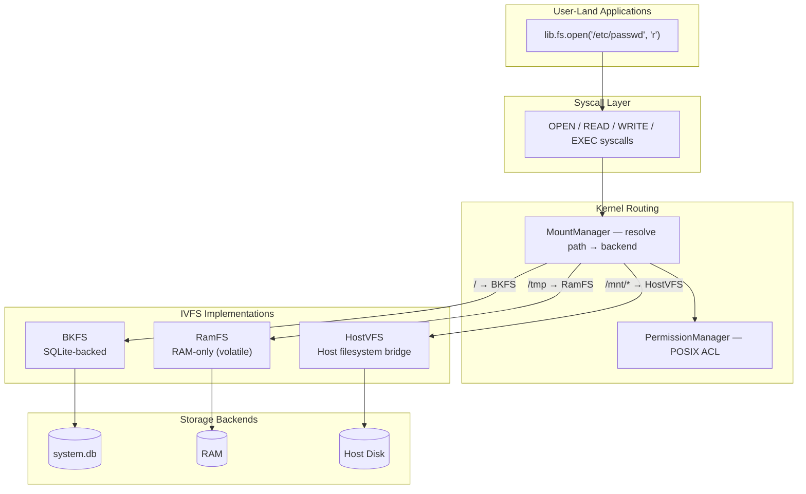
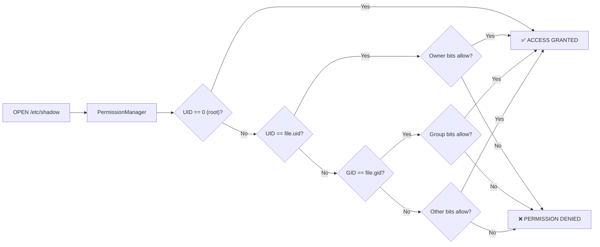

# 💾 Virtual File System (VFS)

TSIX menggunakan arsitektur **Virtual File System (VFS)** berlapis — mendukung multiple backend filesystem yang bekerja secara transparan di bawah satu interface `IVFS`:

| Backend | File | Storage | Persistence | Use Case |
|---------|------|---------|-------------|----------|
| **BKFS** | `BKFS.ts` | SQLite (`system.db`) | ✅ Persistent | Root filesystem `/` |
| **HostVFS** | `HostVFS.ts` | Host physical disk | ✅ Persistent | Mount folder host (`/mnt/shared`) |
| **RamFS** | `RamFS.ts` | RAM (volatile) | ❌ Volatile | File sementara (`/tmp`, `/run`) |

---

## Filosofi: "Everything is a File"

Mengikuti tradisi Unix/Linux, TSIX menerapkan konsep *"everything is a file"*:

| Path | Tipe | Deskripsi |
|------|------|-----------|
| `/dev/tty1` | Device | Virtual console terminal 1 |
| `/dev/null` | Device | Black hole — menerima semua data, menghasilkan kosong |
| `/dev/random` | Device | Pembangkit angka acak |
| `/dev/smqtnl0` | Device | Network interface MQTNL |
| `/dev/stdin` | Device | Standard input (alias ke TTY aktif) |
| `/dev/stdout` | Device | Standard output (alias ke TTY aktif) |
| `/dev/stderr` | Device | Standard error |
| `/etc/passwd` | File | Daftar user system |
| `/bin/ls` | File | Binary command `ls` |

---

## Arsitektur VFS



### Komponen VFS

| File | Tanggung Jawab |
|------|----------------|
| `IVFS.ts` | Interface kontrak — semua filesystem wajib implementasi ini |
| `VFS.ts` | `VirtualFileSystem` — implementasi in-memory tree (digunakan internal oleh RamFS) |
| `BKFS.ts` | Engine SQLite — root filesystem persisten di `system.db` |
| `HostVFS.ts` | Bridge — akses langsung ke folder host fisik |
| `RamFS.ts` | RAM-only storage — file hilang saat restart, tanpa batas ukuran |

---

## BKFS: SQLite-Backed Storage

Setiap file dan direktori dalam VFS disimpan di tabel `vnodes` dalam database SQLite:

### Skema Tabel `vnodes`

| Kolom | Tipe | Deskripsi |
|-------|------|-----------|
| `id` | INTEGER PRIMARY KEY | Unik ID vnode |
| `parent_id` | INTEGER | Reference ke parent directory |
| `name` | TEXT | Nama file/direktori |
| `is_dir` | BOOLEAN | Apakah ini direktori? |
| `content` | BLOB | Isi file (binary) |
| `uid` | INTEGER | Owner user ID |
| `gid` | INTEGER | Owner group ID |
| `mode` | INTEGER | Permission bits (octal) |
| `size` | INTEGER | Ukuran file dalam bytes |
| `created_at` | TIMESTAMP | Waktu pembuatan |
| `modified_at` | TIMESTAMP | Waktu modifikasi terakhir |

### Operasi Dasar BKFS

```typescript
// Contoh internal — bagaimana BKFS menyimpan file
bkfs.writeFile("/etc/hostname", "antigonon");     // INSERT/UPDATE vnodes
bkfs.readFile("/etc/hostname");                    // SELECT content FROM vnodes
bkfs.mkdir("/home/newuser");                       // INSERT vnode (is_dir=true)
bkfs.readdir("/bin");                              // SELECT * WHERE parent_id=...
bkfs.stat("/etc/passwd");                          // SELECT metadata FROM vnodes
```

---

## Permission Model (POSIX-Style)

TSIX menerapkan model permission yang mengikuti standar POSIX:

### Format Permission

```
rwxrwxrwx
│││││││││
│││││││└┘─ Other (world)
│││││└┘─── Group
│││└┘───── Owner
```

### Contoh Permission

| OCtal | Symbolic | Deskripsi |
|-------|----------|-----------|
| `0755` | `rwxr-xr-x` | Owner full access, group+other read & execute |
| `0644` | `rw-r--r--` | Owner read/write, group+other read only |
| `0600` | `rw-------` | Owner only (sensitive files) |
| `0700` | `rwx------` | Owner only with execute |

### Permission Enforcement



### Mengubah Permission via CLI

```bash
# Mengubah owner
chown user1 /home/user1/myfile.txt

# Mengubah group owner
chown :users /dev/randomdevice

# Mengubah permission bits
chmod 755 /bin/myapp
chmod 600 /etc/shadow

# Menggunakan sudo untuk operasi privileged
sudo chown root /etc/passwd
```

---

## Mount System

TSIX mendukung mounting multiple filesystem backend melalui `MountManager`. Konfigurasi mount didefinisikan di `/etc/fstab.json`:

```json
[
  { "vfsPath": "/tmp",        "hostPath": "RAM",           "type": "ramfs" },
  { "vfsPath": "/mnt/shared", "hostPath": "shared",        "type": "host"  },
  { "vfsPath": "/mnt/sbak",   "hostPath": "systembak.db",  "type": "bkfs"  }
]
```

### CLI Commands

```bash
# Melihat mount yang aktif
mount

# Mount RamFS (RAM-only, volatile)
mount /mnt/ramdisk --ramfs

# Mount filesystem BKFS tambahan
mount /mnt/external /path/to/other.db --bkfs

# Mount folder host
mount /mnt/host ./real-folder

# Mount read-only
mount /mnt/archive ./archive.db --bkfs --ro

# Unmount
umount /mnt/ramdisk

# Melihat block devices
lsblk

# Cek penggunaan disk (termasuk RAM untuk ramfs)
df
df -h    # Human-readable
```

Contoh output:

```
root@antigonon:/# lsblk
MOUNTPOINT           TYPE       SOURCE                    OPTS
-----------------------------------------------------------------
/mnt/shared          host       shared                    rw
/mnt/sbak            bkfs       systembak.db              rw
/tmp                 ramfs      RAM                       rw
/                    bkfs       system.db                 rw

root@antigonon:/# df -h
Filesystem          Disk     Data  Files   Dirs Mounted on
------------------------------------------------------------
shared              HOST     4.0M     13      0 /mnt/shared
systembak.db        7.0M     2.2M      4      0 /mnt/sbak
RAM                  RAM        0B      0      1 /tmp
system.db          22.1M    10.0M    436     60 /
```

---

## RamFS: RAM-Only Filesystem

RamFS menyimpan seluruh data di **RAM** — murni volatile, tanpa persistence ke disk.

### Karakteristik

| Properti | Nilai |
|----------|-------|
| Storage | RAM (volatile) |
| Batas ukuran | Tidak ada (grows dynamically) |
| Persistence | ❌ Hilang saat proses restart |
| Swap backing | ❌ Tidak ada (beda dengan tmpfs) |
| Cocok untuk | `/tmp`, `/run`, `/dev/shm` |

### Perbedaan dengan BKFS

| | BKFS | RamFS |
|---|---|---|
| Backend | SQLite | In-memory tree |
| Survive restart | ✅ | ❌ |
| Akses disk | Ya (I/O) | Tidak (pure memory) |
| Kecepatan | Cepat | Sangat cepat |
| Cocok untuk | Data permanen | Temporary / cache |

### Konfigurasi fstab

```json
{ "vfsPath": "/tmp", "hostPath": "RAM", "type": "ramfs" }
```

> **Catatan:** `hostPath` untuk ramfs tidak merujuk ke file fisik — hanya digunakan sebagai label identifier (muncul di kolom SOURCE pada `lsblk` dan Filesystem pada `df`).

### Penggunaan

```bash
# /tmp otomatis di-mount sebagai ramfs saat boot (via fstab)
cd /tmp
echo "data sementara" > cache.txt
cat cache.txt        # → data sementara

# Setelah restart — semua file di /tmp hilang
```

---

## Sinkronisasi VFS ↔ Host

### Development Mode (Host → VFS)

Saat boot di dev mode, kernel melakukan sync satu arah:

1. Scan semua file di `src/__root/`
2. Bandingkan dengan VFS di `system.db`
3. Insert/update file yang baru atau berubah
4. **Skip** file sensitif di `/etc/` yang sudah ada (proteksi konfigurasi)

### Runtime (VFS → Host)

Syscall `SYNC_TO_HOST` memungkinkan sinkronisasi balik (root-only):

```bash
# Dari dalam TSIX shell
vfs-pull    # Tarik perubahan VFS ke host filesystem
```

---

## File Descriptor System

Setiap proses memiliki tabel File Descriptor (FD) sendiri:

| FD | Default Device | Deskripsi |
|----|----------------|-----------|
| 0 | `/dev/stdin` | Standard Input |
| 1 | `/dev/stdout` | Standard Output |
| 2 | `/dev/stderr` | Standard Error |
| 3+ | — | File/device yang dibuka oleh program |

```typescript
// Lifecycle File Descriptor
const fd = await lib.fs.open("/etc/motd", "r");    // Buka → dapat FD
const content = await lib.fs.read(fd);              // Baca pakai FD
await lib.fs.close(fd);                             // Tutup FD (wajib!)
```

> [!WARNING]
> Selalu tutup file descriptor setelah selesai dipakai. FD yang bocor akan menjadi "zombie" sehingga resource tidak terbebaskan sampai proses mati.

---

**Halaman selanjutnya:** [⚙️ Kernel & Scheduler](Kernel-dan-Scheduler.md)
