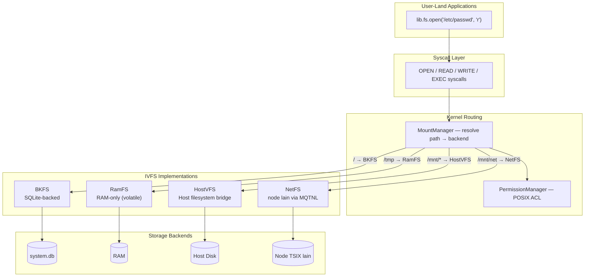
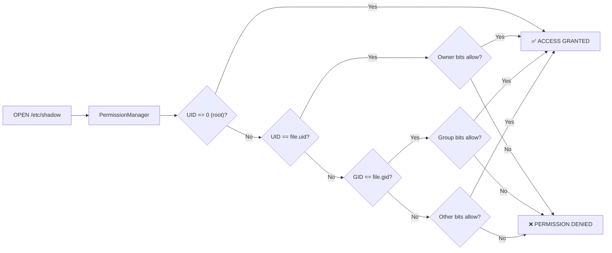

# 💾 Virtual File System (VFS)

TSIX menggunakan arsitektur **Virtual File System (VFS)** berlapis — mendukung multiple backend filesystem yang bekerja secara transparan di bawah satu interface `IVFS`:

| Backend | File | Storage | Persistence | Use Case |
|---------|------|---------|-------------|----------|
| **BKFS** | `BKFS.ts` | SQLite (`system.db`) | ✅ Persistent | Root filesystem `/` |
| **HostVFS** | `HostVFS.ts` | Host physical disk | ✅ Persistent | Mount folder host (`/mnt/shared`) |
| **RamFS** | `RamFS.ts` | RAM (volatile) | ❌ Volatile | File sementara (`/tmp`, `/run`) |
| **NetFS** | `NetFS.ts` | Node TSIX lain (MQTNL) | ✅ Persistent (remote) | Mount filesystem node lain (`/mnt/net`) — [detail](netfs.md) |

> **Duabelas method, satu kontrak.** Semua method `IVFS` bertipe
> `MaybePromise<T>`: driver lokal menjawab sinkron, driver jaringan (NetFS)
> menjawab lewat Promise. Pemakai di kernel selalu `await`, jadi keduanya
> transparan — lihat [netfs.md](netfs.md).

---

## Filosofi: "Everything is a File"

Mengikuti tradisi Unix/Linux, TSIX menerapkan konsep *"everything is a file"*:

| Path | Tipe | Deskripsi |
|------|------|-----------|
| `/dev/tty1` | Device | Virtual console terminal 1 |
| `/dev/null` | Device | Black hole — menerima semua data, menghasilkan kosong |
| `/dev/random` | Device | Pembangkit angka acak |
| `/dev/smqtnl0` | Device | Network interface MQTNL |
| `/dev/stdin` | Device | Standard input (alias ke TTY aktif) |
| `/dev/stdout` | Device | Standard output (alias ke TTY aktif) |
| `/dev/stderr` | Device | Standard error |
| `/etc/passwd` | File | Daftar user system |
| `/bin/ls` | File | Binary command `ls` |

---

## Arsitektur VFS



### Komponen VFS

| File | Tanggung Jawab |
|------|----------------|
| `IVFS.ts` | Interface kontrak — semua filesystem wajib implementasi ini |
| `VFS.ts` | `VirtualFileSystem` — implementasi in-memory tree (digunakan internal oleh RamFS) |
| `BKFS.ts` | Engine SQLite — root filesystem persisten di `system.db` |
| `HostVFS.ts` | Bridge — akses langsung ke folder host fisik |
| `RamFS.ts` | RAM-only storage — file hilang saat restart, tanpa batas ukuran |

---

## BKFS: SQLite-Backed Storage

Setiap file dan direktori dalam VFS disimpan di tabel `vnodes` dalam database SQLite:

### Skema Tabel `vnodes`

| Kolom | Tipe | Deskripsi |
|-------|------|-----------|
| `id` | INTEGER PRIMARY KEY | Unik ID vnode |
| `parent_id` | INTEGER | Reference ke parent directory |
| `name` | TEXT | Nama file/direktori |
| `type` | TEXT | `'FILE'` atau `'DIRECTORY'` |
| `content` | BLOB | Isi file KECIL (≤ 64 KiB). `NULL` kalau isinya ada di tabel `blocks` |
| `uid` | INTEGER | Owner user ID |
| `gid` | INTEGER | Owner group ID |
| `mode` | INTEGER | Permission bits (octal) |
| `size` | INTEGER | Ukuran file dalam byte (sumber kebenaran, bukan panjang blok) |
| `created_at` | TIMESTAMP | Waktu pembuatan |
| `modified_at` | TIMESTAMP | Waktu modifikasi terakhir |

### Tabel `blocks` (isi file besar)

| Kolom | Tipe | Deskripsi |
|-------|------|-----------|
| `vnode_id` | INTEGER | Pemilik file (FK → `vnodes.id`, `ON DELETE CASCADE`) |
| `seq` | INTEGER | Nomor blok (0-based); PK gabungan `(vnode_id, seq)`, `WITHOUT ROWID` |
| `data` | BLOB | Isi blok (≤ 128 KiB) |

### Strategi penyimpanan: inline vs blok

| Ukuran isi | Tempat | Biaya satu operasi tulis |
|---|---|---|
| ≤ 64 KiB (`BKFS_INLINE_MAX_BYTES`) | kolom `content` | satu baris — jalur tercepat |
| > 64 KiB | tabel `blocks` (128 KiB per blok) | **sebanding ukuran potongan**, bukan ukuran file |

Kenapa dua bentuk: mayoritas file sistem (skrip `/bin`, `/lib`, config `/etc`) kecil dan
paling cepat dibaca sebagai satu baris — itu juga jalur yang dipakai
`Kernel.rebuildVFSCache()` saat pre-compile `/lib`. Tapi menaruh file BESAR di satu baris
membuat setiap potongan tulis harus menulis ulang seluruh baris: **O(n) per potongan,
O(n²) per file**.

Terukur (8 MB ditulis dalam 66 potongan @124 KiB, chunk NetFS):

| Varian | Waktu | Hasil |
|---|---|---|
| `content TEXT` + journal `DELETE` + `content \|\| ?` (lama) | 6.370 ms | baseline |
| `journal_mode=WAL`, masih `content \|\| ?` | 6.822 ms | **0,9×** — WAL saja tidak menolong |
| **WAL + tabel blok** | **583 ms** | **10,9×** |

Perhatikan baris kedua: penyebab lambatnya BUKAN fsync journal, melainkan SQLite
membangun ulang string seukuran file tiap potongan (kerja CPU + memori). Karena itu
perbaikannya harus **struktural** (blok), bukan sekadar ganti mode journal.

#### Aturan: `content` ATAU `blocks` — tidak pernah keduanya

Baris dengan `content` terisi = file inline (itu yang dibaca `read()`); baris dengan
`content` NULL = file memakai blok.

Aturan itu dulu hanya “diingat” pemanggil: `clearBlocks()` dipanggil manual di setiap
jalur tulis, dan **satu jalur yang lupa sudah cukup merusak baris secara diam-diam**.
Kasus nyata di database asli: `/var/log/syslog` punya `content` 17 KB *dan* blok sisa
2,6 MB (`seq` 0, 1, 19 — bolong). Isinya tidak salah (yang dibaca `content`), tapi
260 KB jadi sampah tak terlihat — dan `readChunk()` menjawab berbeda dari `read()`
untuk file yang sama.

Sekarang aturannya **struktural**, bukan hafalan:

| Penjaga | Perilaku |
|---|---|
| `writeInline()` | satu-satunya jalur yang menulis `content` — blok SELALU dibuang lebih dulu |
| `writeToBlocks()` | selalu men-NULL-kan `content` sebelum menulis blok |
| `repairStorage()` | dipanggil otomatis setiap DB dibuka: buang blok yatim & basi (idempoten) |
| `readChunk()` | memilih sumber dari `content` (sama seperti `read()`), bukan dari jumlah blok |

### Jaminan operasional (PRAGMA)

| PRAGMA | Nilai | Alasan |
|---|---|---|
| `journal_mode` | `WAL` | commit milidetik, pembaca tidak memblokir penulis, recovery otomatis |
| `synchronous` | `NORMAL` (bisa `FULL`) | aman dari korupsi; `FULL` = fsync tiap commit |
| `foreign_keys` | `ON` | skema sudah mendeklarasikan FK, tapi SQLite tidak menegakkannya tanpa ini |
| `busy_timeout` | 5000 ms | tunggu penulis lain, jangan gagal `SQLITE_BUSY` |
| `cache_size` / `mmap_size` | 8 MiB / 64 MiB | baca berurutan lebih murah |

Kalau `journal_mode` tidak bisa WAL (mis. share jaringan), BKFS **mencatat peringatan**
alih-alih diam-diam jatuh ke perilaku lambat.

### Atomisitas: `batch()`

```typescript
// Seluruh image sistem dalam SATU transaksi.
bkfs.batch(() => {
    syncDir("src/mirror", "/");
    syncDir("src/common", "/lib/common");
});
```

Bootstrap/install memakai ini. Kalau proses mati di tengah, hasilnya **tidak ada** —
bukan image setengah jadi yang tampak normal (mis. sebagian `/bin` hilang). Di sisi lain,
ribuan `touch()` tanpa transaksi berarti ribuan `fsync`.

### API bantu operasional

| Method | Fungsi |
|---|---|
| `batch(fn)` | Jalankan operasi dalam satu transaksi atomik (nesting = SAVEPOINT) |
| `checkpoint()` | Pindahkan WAL ke file utama → `system.db` kembali self-contained |
| `close()` | `checkpoint()` lalu tutup koneksi (idempotent) |
| `checkIntegrity(quick?)` | `quick_check`/`integrity_check`; return `"ok"` atau pesan masalah |
| `compact()` | `VACUUM` — ciutkan file setelah banyak penghapusan |
| `storageKind(path)` | `"inline"` \| `"blocks"` \| `"missing"` (diagnostik) |
| `countBlocks(path)` | Jumlah blok sebuah file |
| `storageHealth()` | Ringkasan kesehatan: inline/ber-blok/warisan TEXT, blok yatim & basi, file bolong |
| `repairStorage()` | Buang blok yatim/basi (otomatis saat DB dibuka; aman & idempoten) |

**Saat shutdown, storage ditutup otomatis.** `Kernel.closeFilesystems()` →
`MountManager.closeAll()` menutup root (`/`) dan semua mount (termasuk BKFS sekunder
seperti `/mnt/sbak`), dipanggil dari `main.ts` sebelum `process.exit()` plus jaring
pengaman `process.on("exit")` (idempotent).

Tanpa itu — karena root memakai `journal_mode=WAL` — setelah shutdown masih ada
`system.db-wal` (transaksi terakhir yang belum ter-checkpoint) dan `system.db-shm`,
sehingga **`system.db` sendirian tidak lengkap** bila disalin sebagai backup atau
dikirim ke node lain. Setelah `close()`, SQLite membuang sidecar-nya dan image kembali
menjadi satu file.

### Melihat kondisi BKFS (diagnostik)

Optimasi penyimpanan **tidak terlihat dari luar**: `ls -l` tidak membedakan file inline
vs ber-blok, dan `df` (`getUsage`) hanya memberi total. Karena itu ada alat khusus:

```bash
npm run bkfs:info                      # laporan lengkap (read-only — aman saat sistem hidup)
npm run bkfs:info -- --top 15          # 15 file terbesar + bentuk penyimpanannya
npm run bkfs:info -- --json            # keluaran mesin (CI / monitoring)
npm run bkfs:info -- --repair          # MENULIS: buang blok yatim & basi
npm run bkfs:info -- --migrate-legacy  # MENULIS: tulis ulang baris TEXT warisan jadi BLOB
npm run bkfs:info -- --checkpoint      # MENULIS: pindahkan WAL ke system.db
npm run bkfs:info -- --compact         # MENULIS: VACUUM
```

Contoh keluaran:

```
📦 BKFS — system.db
   ukuran db       : 14.9 MB
   WAL             : —  ✅ sudah rapi (satu file)
   journal_mode    : wal  · synchronous=1
   integritas      : ok  (quick_check)

📊 Isi
   direktori       : 81     file: 749     total isi: 13.5 MB
   penyimpanan     : inline 749 · blok 0   0 blok (0 B isi blok)
   warisan TEXT    : 745  termasuk 147 biner/ber-NUL (~2× lebih besar di DB)

🩺 Kesehatan penyimpanan
   file ber-blok   : 0  isi besar dipotong per 128 KB
   blok tidak sah  : 0  ✅ tidak ada
```

Kenapa perlu seksi kesehatan tersendiri: `quick_check` SQLite hanya memeriksa integritas
**halaman**. Bentuk penyimpanan yang tidak konsisten (baris punya `content` *dan* blok
sisa) tetap dilaporkan `ok` — padahal itu ruang terbuang dan sumber bug di masa depan.

Dua hal yang alat ini temukan di database asli:

1. **3 blok basi (260 KB)** milik `/var/log/syslog` — sampah yang tidak pernah terbaca
   siapa pun. `--repair` membuangnya; isi file tidak disentuh.
2. **147 baris warisan TEXT berisi biner** (`level*.png` 180 KB, `laser-beam.mp3`
   192 KB). Isinya masih TEXT: byte ≥ 0x80 di-encode UTF-8 (≈2× lebih besar), dan
   `length()`/`substr()` SQLite berhenti di byte NUL sehingga PNG 180 KB terbaca
   “8 karakter”. `--migrate-legacy` menulis ulang semuanya jadi BLOB dalam SATU
   transaksi (file > 64 KiB otomatis pindah ke tabel blok).

### Encoding: latin1 (1 char = 1 byte)

Isi file disimpan sebagai BLOB dengan `Buffer.from(text, "latin1")`. Ini bukan detail
kecil:

- **TEXT memotong data**: `SUBSTR()`/`length()` SQLite memperlakukan TEXT sebagai
  C-string dan **berhenti di byte NUL**. Berkas biner hampir selalu memuat NUL (video
  MP4/MOV bahkan di byte pertama) → dulu `cp` dari mount NetFS "berhasil" tapi
  menghasilkan file 0 byte.
- **TEXT menggelembungkan file**: byte ≥ 0x80 disimpan UTF-8 (2 byte per karakter),
  jadi aset biner membengkak ~2× di dalam DB.
- BLOB dihitung **per byte** dan NUL-safe, sehingga `readChunk()` bisa memotong di sisi
  SQL — kernel tidak perlu menahan seluruh file di heap.

Baris **warisan** (TEXT dari database lama) tetap terbaca: SQLite menyimpan tipe
per-nilai, jadi konversi tidak wajib — baris lama dilayani jalur baca penuh, dan
ter-upgrade sendiri saat ditulis ulang.

### Operasi Dasar BKFS

```typescript
// Contoh internal — bagaimana BKFS menyimpan file
bkfs.touch("/etc/hostname", "antigonon");      // INSERT/UPDATE vnodes
bkfs.read("/etc/hostname");                     // baris inline atau rakit dari blocks
bkfs.mkdir("/home/newuser");                    // INSERT vnode (type=DIRECTORY)
bkfs.ls("/bin");                               // SELECT ... WHERE parent_id=...
bkfs.stat("/etc/passwd");                      // metadata saja (tanpa `content`)
```

---

## Permission Model (POSIX-Style)

TSIX menerapkan model permission yang mengikuti standar POSIX:

### Format Permission

```
rwxrwxrwx
│││││││││
│││││││└┘─ Other (world)
│││││└┘─── Group
│││└┘───── Owner
```

### Contoh Permission

| OCtal | Symbolic | Deskripsi |
|-------|----------|-----------|
| `0755` | `rwxr-xr-x` | Owner full access, group+other read & execute |
| `0644` | `rw-r--r--` | Owner read/write, group+other read only |
| `0600` | `rw-------` | Owner only (sensitive files) |
| `0700` | `rwx------` | Owner only with execute |

### Permission Enforcement



### Mengubah Permission via CLI

```bash
# Mengubah owner
chown user1 /home/user1/myfile.txt

# Mengubah group owner
chown :users /dev/randomdevice

# Mengubah permission bits
chmod 755 /bin/myapp
chmod 600 /etc/shadow

# Menggunakan sudo untuk operasi privileged
sudo chown root /etc/passwd
```

---

## Root Filesystem: BKFS atau Folder Host (HostVFS)

Root `/` bisa dilayani dua backend, dipilih lewat `kernel.rootType` di
`src/sysconfig.conf` (lihat `src/kernel/RootFilesystem.ts`):

| `rootType` | Root `/` ada di | Sinkronisasi |
| --- | --- | --- |
| `"bkfs"` (default) | dalam SQLite `system.db` | `vfs:bootstrap` (host → DB), `vfs:pull` (DB → host) |
| `"host"` | folder host `kernel.rootHostPath` (mis. `../rootfs`), via `HostVFS` | tidak perlu — berkas dibaca apa adanya |

Mode `host` berguna saat ngoprek userland: simpan berkas di VS Code, langsung
terbaca shell TSIX tanpa bootstrap/pull. Alternatif tanpa mengedit konfigurasi:

```bash
TSIX_ROOTFS=host TSIX_ROOTFS_PATH=/path/ke/rootfs npm start
```

`rootHostPath` di-resolve **relatif `src/kernel`** — aturan yang sama dengan
syscall `GET_SYSPATH` — supaya kernel dan userland tidak pernah menunjuk folder
berbeda. Kalau foldernya tidak ada, boot **gagal dengan pesan jelas** (bukan
membuat root kosong).

> **Penting:** folder root host wajib berisi sidecar `.js` (hasil
> bootstrap/pull), bukan hanya `.ts`. Root yang hanya `.ts` membuat worker `init`
> mati dengan `Cannot find module '../../common/SyscallCode'`.

### Kenapa BKFS tetap default

Mode host memang membuktikan kernel fleksibel: root `/` hanyalah satu mount dari
`MountManager`, jadi backend-nya bisa apa pun yang memenuhi `IVFS` — secara teori
termasuk NetFS di `/`. Tapi TSIX dirancang dengan **BKFS sebagai root**, dan itu
bukan kebetulan:

| Jaminan | BKFS | Root folder host |
| --- | --- | --- |
| Atomisitas | `batch()` (satu transaksi untuk operasi majemuk) | tidak ada |
| Durabilitas | WAL + `wal_checkpoint(TRUNCATE)` saat shutdown | tergantung fs host |
| Isolasi | berkas hidup di dalam DB, tidak bisa disentuh proses host | siapa pun di host bisa mengubah root |
| Backup | **satu berkas** `system.db` (self-contained) | harus menyalin seluruh tree + izinnya |
| Portabilitas | kirim 1 berkas → node lain langsung utuh | ikut detail fs/izin host |

Karena itu `kernel.rootType` default **`"bkfs"`**, dan mode `host` ditandai
eksperimen di boot log. Pakai `host` untuk ngoprek, bukan untuk data yang harus
aman.

> Catatan implementasi: `Kernel` membaca root lewat helper sinkron
> (`readRoot()`/`lsRoot()`) karena root selalu BKFS/HostVFS. Kalau suatu saat NetFS
> benar-benar di-mount di `/`, jalur boot itu harus di-`await` (kontrak `IVFS`
> sudah menyediakan `MaybePromise` — yang perlu diubah pemanggilnya).

Konsekuensi mode host yang perlu diketahui:

- **Bit eksekusi di disk-lah yang menentukan.** Shell menegakkan bit `x` seperti
  Linux (`tsh`: `mode & 0o111` → `-tsh: /bin/ls.js: Permission denied`, `$?` =
  126), jadi folder root host **wajib** punya `x` di `/bin`, `/sbin`,
  `/usr/bin`, `/usr/local/bin`, `/opt`. `vfs:pull` memasangnya otomatis; untuk
  folder yang sudah ada (hasil `git clone`/`cp` tanpa `--preserve=mode`):

  ```bash
  npm run rootfs:modes              # perbaiki folder root host
  npm run rootfs:modes -- --dry-run # lihat dulu apa yang akan diubah
  ```

  Aturan mode = satu sumber dengan bootstrap/install (`scripts/lib/binary-mode.ts`):
  0o755, `/sbin` 0o744, SetUID 0o4755 untuk `login`/`passwd`/`sudo`.
- `chown` ke uid/gid lain biasanya ditolak OS (`EPERM`) → dilaporkan gagal tapi
  **tidak** membatalkan mount; kepemilikan efektif mengikuti berkas host.
- **Alat sinkronisasi tidak relevan di mode ini** — tidak ada database yang perlu
  di-seed/ditarik. `sync-vfs`, `vfs-pull`, dan `vfs-bootstrap` mendeteksinya
  sendiri dan berhenti sebagai no-op (exit 0), jadi hook run-on-save tidak
  menghasilkan error maupun "sukses palsu".
- Permission yang dibaca kernel = permission berkas host (mode di-mask ke `0o777`,
  bit tipe `S_IF*` dibuang agar sama dengan bentuk data di BKFS).
- Isi berkas tetap diperlakukan sebagai BYTE (latin1), sama seperti BKFS.

---

## Mount System

TSIX mendukung mounting multiple filesystem backend melalui `MountManager`. Konfigurasi mount didefinisikan di `/etc/fstab.conf` (format INI, `[mount-point]` + `key = value`):

```ini
[/tmp]
hostPath = RAM
type     = ramfs
mode     = 0o1777

[/mnt/shared]
hostPath = shared
type     = host

[/mnt/sbak]
hostPath = systembak.db
type     = bkfs
```

Aturan lengkap (oktal vs desimal, entri `netfs`, peringatan boot) ada di `/etc/fstab.md`.

### CLI Commands

```bash
# Melihat mount yang aktif
mount

# Mount RamFS (RAM-only, volatile)
mount /mnt/ramdisk --ramfs

# Mount filesystem BKFS tambahan
mount /mnt/external /path/to/other.db --bkfs

# Mount folder host
mount /mnt/host ./real-folder

# Mount read-only
mount /mnt/archive ./archive.db --bkfs --ro

# Unmount
umount /mnt/ramdisk

# Melihat block devices
lsblk

# Cek penggunaan disk (termasuk RAM untuk ramfs)
df
df -h    # Human-readable
```

Contoh output:

```
root@antigonon:/# lsblk
MOUNTPOINT           TYPE       SOURCE                    OPTS
-----------------------------------------------------------------
/mnt/shared          host       shared                    rw
/mnt/sbak            bkfs       systembak.db              rw
/tmp                 ramfs      RAM                       rw
/                    bkfs       system.db                 rw

root@antigonon:/# df -h
Filesystem          Disk     Data  Files   Dirs Mounted on
------------------------------------------------------------
shared              HOST     4.0M     13      0 /mnt/shared
systembak.db        7.0M     2.2M      4      0 /mnt/sbak
RAM                  RAM        0B      0      1 /tmp
system.db          22.1M    10.0M    436     60 /
```

---

## RamFS: RAM-Only Filesystem

RamFS menyimpan seluruh data di **RAM** — murni volatile, tanpa persistence ke disk.

### Karakteristik

| Properti | Nilai |
|----------|-------|
| Storage | RAM (volatile) |
| Batas ukuran | Tidak ada (grows dynamically) |
| Persistence | ❌ Hilang saat proses restart |
| Swap backing | ❌ Tidak ada (beda dengan tmpfs) |
| Cocok untuk | `/tmp`, `/run`, `/dev/shm` |

### Perbedaan dengan BKFS

| | BKFS | RamFS |
|---|---|---|
| Backend | SQLite | In-memory tree |
| Survive restart | ✅ | ❌ |
| Akses disk | Ya (I/O) | Tidak (pure memory) |
| Kecepatan | Cepat | Sangat cepat |
| Cocok untuk | Data permanen | Temporary / cache |

### Konfigurasi fstab

```json
{ "vfsPath": "/tmp", "hostPath": "RAM", "type": "ramfs" }
```

> **Catatan:** `hostPath` untuk ramfs tidak merujuk ke file fisik — hanya digunakan sebagai label identifier (muncul di kolom SOURCE pada `lsblk` dan Filesystem pada `df`).

### Penggunaan

```bash
# /tmp otomatis di-mount sebagai ramfs saat boot (via fstab)
cd /tmp
echo "data sementara" > cache.txt
cat cache.txt        # → data sementara

# Setelah restart — semua file di /tmp hilang
```

---

## Sinkronisasi VFS ↔ Host

### Development Mode (Host → VFS)

Saat boot di dev mode, kernel melakukan sync satu arah:

1. Scan semua file di `src/__root/`
2. Bandingkan dengan VFS di `system.db`
3. Insert/update file yang baru atau berubah
4. **Skip** file sensitif di `/etc/` yang sudah ada (proteksi konfigurasi)

### Runtime (VFS → Host)

Syscall `SYNC_TO_HOST` memungkinkan sinkronisasi balik (root-only):

```bash
# Dari dalam TSIX shell
vfs-pull    # Tarik perubahan VFS ke host filesystem
```

### Isi VFS = BYTE, bukan karakter

VFS menyimpan isi berkas sebagai string **latin1 dengan 1 char = 1 byte**. Itu wajib:
aset biner tetap utuh (`Buffer.from(raw, "latin1")` → byte persis sama), offset
`readChunk()`/`writeChunk()` benar-benar byte (yang dikirim NetFS), dan `size` sungguh
byte. Konsekuensinya: **string itu adalah wadah byte, bukan teks** — berkas teks UTF-8
disimpan sebagai byte-nya, jadi teks non-ASCII tampak “mojibake” bila dibaca mentah.

Dua bug nyata (2026-09-23) lahir dari mencampur dua hal itu:

| Kejadian | Sebab | Gejala |
|---|---|---|
| Glyph UI kacau | `readFileSync(p,"utf8")` lalu `Buffer.from(s,"latin1")` **memotong** setiap karakter > U+00FF ke byte rendahnya (`✕` U+2715 → `0x15`, `─` U+2500 → `0x00`) | tombol minimize/maximize/close dan border tabel jadi sampah |
| Seluruh skrip mati | BOM UTF-8 (`EF BB BF`) dibaca sebagai teks → `U+FEFF` → encode latin1 → byte `0xFF` di awal berkas JS | `Uncaught ReferenceError: ÿ is not defined` — `window.TSIX` tidak pernah terbentuk |

**Aturan**: kalau isi VFS harus dipakai sebagai TEKS (dikompilasi, di-parse, disajikan ke
browser), konversi eksplisit — jangan menebak, dan jangan pernah meng-encode string
latin1 dengan `utf8`.

| Batas | Fungsi |
|---|---|
| host → VFS | `readTextFile(path)` — byte berkas apa adanya, BOM UTF-8 dibuang di level byte |
| host → VFS (biner) | `readBinaryFile(path)` — byte apa adanya, **tanpa** membuang apa pun (`0xFF` di JPEG/MP3 adalah data) |
| teks → VFS | `utf8ToVfsBytes(text)` (`src/common/VfsText.ts`) |
| VFS → teks | `vfsBytesToUtf8(raw)` (`src/common/VfsText.ts`) |

Titik konversi yang sudah dipasang: `vfs:bootstrap`/`install` (baca + hasil transpile
esbuild), `Kernel.rebuildVFSCache()` (pre-compile `/lib/*.ts`), `Syscalls` EXEC
(`appContent`), `WorkerEntry` (modul relatif program), dan `dome.ts` (menyajikan aset +
`/dome/framebuffer.js` dengan encoding `latin1` = byte apa adanya).

**Konsumen di dalam TSIX juga wajib decode kalau memperlakukan isi berkas sebagai
teks.** Ini sempat terlewat dan gejalanya muncul sebagai ikon launcher kacau:
`/etc/asteracea/menu/*.menu` berisi `icon=📺` (byte `f0 9f 93 ba`), tapi loader menu
meneruskan byte mentah ke browser → tampil `ðº`. Yang sudah diperbaiki:

| Konsumen | Perubahan |
|---|---|
| `opt/asteracea/asteracea.ts` (loader `.menu`) | `vfsBytesToUtf8()` sebelum parsing |
| `bin/atto.ts` (editor) | `vfsBytesToUtf8()` saat buka, `utf8ToVfsBytes()` saat **simpan** — tanpa encode di jalur simpan, berkas yang disunting kehilangan emoji/box-drawing |

Aturan praktisnya:

- membaca untuk **ditampilkan/di-parse** → decode (`vfsBytesToUtf8`)
- menulis **teks** ke VFS → encode dulu (`utf8ToVfsBytes`), jangan kirim string teks mentah
- berkas **biner** → biarkan byte apa adanya (jangan pernah decode)
- `cat`/`head`/`tail` **sengaja tetap byte-transparan** supaya `cat a > b` tetap
  byte-exact (menyalin berkas biner tidak rusak)

Server (DOME) menyajikan aset statis dari VFS dan browser men-cache skripnya, jadi
setelah mengubah berkas dome: **restart TSIX** lalu **hard-reload** halaman TDE
(Cmd+Shift+R) — tanpa itu browser tetap memakai salinan lama.

---

## File Descriptor System

Setiap proses memiliki tabel File Descriptor (FD) sendiri:

| FD | Default Device | Deskripsi |
|----|----------------|-----------|
| 0 | `/dev/stdin` | Standard Input |
| 1 | `/dev/stdout` | Standard Output |
| 2 | `/dev/stderr` | Standard Error |
| 3+ | — | File/device yang dibuka oleh program |

```typescript
// Lifecycle File Descriptor
const fd = await lib.fs.open("/etc/motd", "r");    // Buka → dapat FD
const content = await lib.fs.read(fd);              // Baca pakai FD
await lib.fs.close(fd);                             // Tutup FD (wajib!)
```

> [!WARNING]
> Selalu tutup file descriptor setelah selesai dipakai. FD yang bocor akan menjadi "zombie" sehingga resource tidak terbebaskan sampai proses mati.

> [!TIP]
> **Praktik lengkapnya ada di [📄 Operasi File di TSIX](file-operation.md)** — daftar
> seluruh method `fs`, kontrak nilai balik (yang mana `null`, yang mana melempar),
> resep chunked I/O untuk file besar, dan demo yang bisa dijalankan
> (`/opt/test/file-operation --demo`). Halaman ini fokus pada arsitektur & storage;
> halaman itu fokus pada cara pakainya dari aplikasi.

---

**Halaman selanjutnya:** [⚙️ Kernel & Scheduler](Kernel-dan-Scheduler.md)
