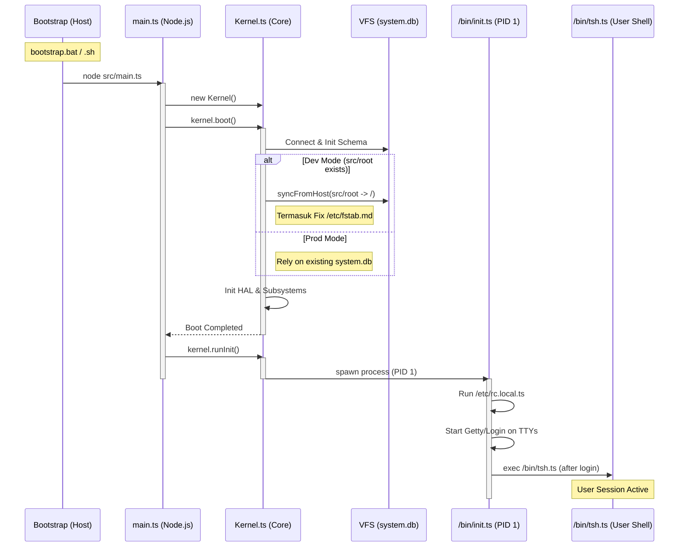

# TSIX Boot Sequence Diagram

Berikut adalah visualisasi urutan proses booting pada platform TSIX, mulai dari skrip bootstrap host hingga munculnya shell user. Sekali lagi, urutan ini terinspirasi dari **boot sequence UNIX/Linux** yang telah teruji selama puluhan tahun.

## Penjelasan Tahapan:
1.  **Bootstrap**: Skrip pembungkus di host (Windows/Linux) yang memastikan Node.js berjalan dan menangani reboot otomatis.
2.  **Main**: Titik masuk TypeScript, menginisialisasi konfigurasi dan memulai siklus hidup Kernel.
3.  **Kernel Boot**:
    *   **BKFS**: Menghubungkan database SQLite sebagai filesystem.
    *   **Sync**: Jika di mode pengembangan, menyalin file dari folder fisik ke database.
    *   **HAL**: Menyiapkan driver hardware virtual (TTY, Keyboard, dsb).
4.  **Init (PID 1)**: Proses pertama di User-land. Ia yang mengatur jalannya sistem, eksekusi script startup, dan menyediakan prompt login.
5.  **Shell**: Antarmuka akhir tempat user berinteraksi dengan sistem.
