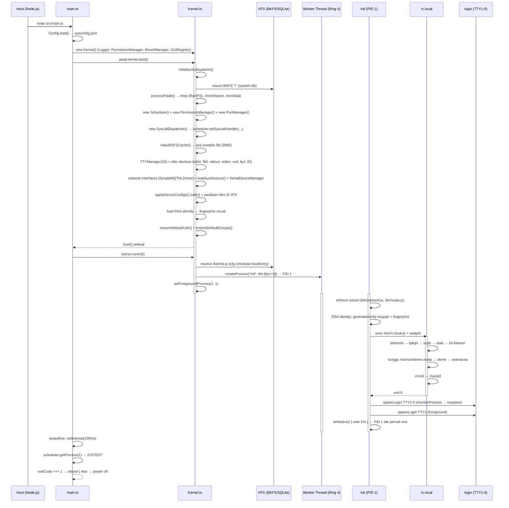

# Boot Sequence

**RFC-TSIX-EDU-002** | Modul ketiga kurikulum TSIX. Menelusuri urutan boot dari `main.ts` → `kernel.boot()` → PID 1 (`init`) → login, sampai keep-alive 100ms di host.

> Boot TSIX meniru boot UNIX/Linux: dari bootstrap host → kernel init subsistem → init (PID 1) → rc.local → getty/login per TTY. Yang menentukan sistem "hidup atau mati" adalah **keep-alive 100ms** di `main.ts`.

---

## Tujuan Pembelajaran

- [ ] Menjelaskan peran `main.ts` dan keep-alive 100ms
- [ ] Menyebutkan urutan `initializeSubsystems()` di kernel
- [ ] Menjelaskan isi dan peran `init` (PID 1)
- [ ] Menjelaskan urutan daemon di `rc.local`
- [ ] Menjelaskan apa arti exit code 1 saat PID 1 mati (reboot)

---

## Alur / Cara Kerja

Boot TSIX mengikuti pola UNIX/Linux klasik: bootstrap host → kernel init subsistem → `init` (PID 1) di Worker → `rc.local` → getty/login per TTY → keep-alive host. Diagram di bawah merangkum seluruh urutan, dari detik pertama host dijalankan sampai sistem "hidup".



> [!NOTE] Versi mermaid ini lebih lengkap daripada `wiki/boot_sequence.md` dan mengikuti kode terkini (`Kernel.ts`, `init.ts`, `rc.local.ts`).

### Alur ringkas (ASCII)

```
main.ts
  Config.load()                    → baca sysconfig.json
  new Kernel()                     → Logger, PermissionManager, MountManager, GUIRegistry
  kernel.boot()
    initializeSubsystems()
      mount BKFS("/")              → SQLite system.db (root filesystem)
      processFstab()               → /tmp (RamFS), /mnt/shared (HostVFS), /mnt/sbak (BKFS)
      new Scheduler()
      new PermissionManager()
      new PortManager()
      new SyscallDispatcher()      → scheduler.setSyscallHandler(...)
      rebuildVFSCache()            → pre-compile /lib ke memori (DME)
    new TTYManager(32) + TTYDevice tty1..32
    devices{}                      → stdin, fb0, stdout, stderr, null
    init network interfaces        → SimpleMQTNLDriver per config
    loadAuxDevices()               → plugin driver (random, mysql, mcp23017)
    SerialDeviceManager            → auto-detect ttyUSB*
    applyDeviceConfigs()           → "udev": mode/uid/gid dari sysconfig
    pastikan /dev ada di VFS
    load RSA identity              → fingerprint visual di TTY
    ensureDefaultAuth()            → seed /etc/passwd + /etc/shadow (root)
    ensureDefaultGroups()          → seed users (100) + sudo (27)
    wire keyboard + TTY callbacks  → Ctrl+C → SIGINT fg; Alt+F1-6 → switch
  kernel.runInit()
    resolve /bin/init.js
    createProcess("init", fds:[tty1×3])   → PID 1
    setForegroundProcess(1, 1)
  [init.ts di Worker]
    enforce setuid (passwd, sudo)
    generate/verify RSA identity
    exec /etc/rc.local.js + waitpid
    spawn login TTY2..6 (monitorProcess → respawn)
    spawn login TTY1 (foreground) → loop forever
  keepAlive (100ms di main.ts)
    jika PID 1 EXITED → process.exit(exitCode)  (1 = reboot)
```

### Urutan `initializeSubsystems()` (dari `Kernel.ts`)

```ts
this.bootLogStart("VFS: Mounting root filesystem (BKFS/SQLite)");
this.bkfs = new BKFS(cfg.kernel.database);
this.mountManager.mount("/", this.bkfs, "bkfs", cfg.kernel.database, false);
this.bootLogEnd(true);

await this.processFstab();                    // /tmp (RamFS), /mnt/* (HostVFS/BKFS)

this.scheduler = new Scheduler();             // Core: Process Scheduler
this.satpam = new PermissionManager();        // Security: Permission Manager
this.portManager = new PortManager();         // Network: Port Manager
this.syscall = new SyscallDispatcher(
  this.bkfs, this.mountManager, this.scheduler, this, this.satpam,
);
this.scheduler.setSyscallHandler(async (req) => {
  return await this.syscall!.handleRequest(req);
});
this.rebuildVFSCache();                       // VFS: pre-compile /lib (DME)
this.scheduler.setVFSCacheProvider(() => this.vfsCache);
```

### Urutan rc.local (daemon, dari `rc.local.ts`)

1. **SetUID** `/bin/login.js` → `0o4755`, chown root:root.
2. `airtermd` (`/sbin/airtermd.js`) — remote access.
3. `tpkgd` (`/sbin/tpkgd.js`) — package server (TPKG).
4. `scpd` (`/sbin/scpd.js`) — transfer file SCP.
5. `otad` (`/sbin/otad.js`) — OTA firmware ESP.
6. `iot-listener` (`/sbin/iot-listener.js`) — sensor MQTNL.
7. Bersihkan marker lama `/var/run/dome.ready`, lalu **tunggu DOME siap** (polling 200ms, timeout 10s).
8. `dome` (`/opt/dome/dome.js`) — display server (PixelSpace).
9. `asteracea` (`/opt/asteracea/asteracea.js`) — window manager (setelah DOME siap).
10. `crond` (`/sbin/crond.js`) — cron scheduler.
11. `mysqld` (`/opt/mysqld/mysqld.js`) — database service.

> [!WARNING] **Dokumentasi vs kode.** Sumber `rc.local.ts` memuat 11 langkah di atas. Namun file hasil compile `rc.local.js` (yang benar-benar dieksekusi) hanya memuat 3 daemon: `airtermd`, `tpkgd`, `scpd`. **Kode adalah kebenaran** — saat runtime, hanya 3 daemon pertama yang benar-benar hidup dari `rc.local`.

---

## Kode Sumber

| File | Peran |
|---|---|
| `src/main.ts` | Entry point host + keep-alive |
| `src/kernel/Kernel.ts` | `boot()` + `initializeSubsystems()` + `runInit()` |
| `src/mirror/bin/init.ts` | PID 1: setuid, identity, rc.local, spawn login |
| `src/mirror/etc/rc.local.ts` | Daftar daemon startup |
| `src/common/Config.ts` | Baca `sysconfig.json` |

---

## Snippet (level kode)

### Keep-alive di `main.ts` (host tidak boleh mati)

```ts
const keepAlive = setInterval(() => {
    const scheduler = kernel.getScheduler();
    const p1 = scheduler?.getProcess(1);
    if (!p1 || p1.state === "EXITED") {
        clearInterval(keepAlive);
        if (process.stdin.isTTY) {
            (process.stdin as any).setRawMode(false);
        }

        const exitCode = (kernel as any).wantedExitCode ?? (process.exitCode ?? 0);
        if (exitCode === 1) {
            console.log("\n[Kernel] System is rebooting...");
        } else {
            console.log("\n[Kernel] System halted. Powering off...");
        }
        process.exit(exitCode);
    }
}, 100); // 100ms biar satset responnya
```

Kunci: **selama PID 1 hidup, host tidak berhenti.** PID 1 exit dengan **code 1** → reboot; selain itu → power off. Sebelum exit, raw mode terminal dipulihkan supaya terminal host tidak "rusak".

### Log boot: `bootLogStart()` + `bootLogEnd()`

`Kernel.ts` mencetak progres boot dengan bracket `[      ]` yang di-update in-place (`\r` + ANSI `\x1b[K`). Pola pemakaiannya:

```ts
this.bootLogStart("VFS: Mounting root filesystem (BKFS/SQLite)");
this.bkfs = new BKFS(cfg.kernel.database);
this.mountManager.mount("/", this.bkfs, "bkfs", cfg.kernel.database, false);
this.bootLogEnd(true);                     // → [  OK  ] VFS: Mounting root...
```

`bootLogEnd(false, "pesan")` → `[ FAIL ]`. Keduanya no-op jika `cfg.kernel.verbose` false.

### runInit: spawn PID 1

```ts
const initPath = "/bin/" + cfg.scheduler.bootEntry;   // bootEntry = "init.js"
const res = this.mountManager.resolve(initPath);
const raw = res.vfs.read(res.relativePath);           // kontrak IVFS, bukan stat()

const initPcb = this.scheduler?.createProcess("init", {
    fds: [tty1, tty1, tty1],
    appName: "init",
    appContent: initContent,
    env: {
        PATH: cfg.scheduler.defaultPath,
        HOME: "/root",
        HOSTNAME: cfg.shell.defaultHostname,
        PROMPT_FORMAT: cfg.shell.promptFormat,
        LINES: (process.stdout.rows || cfg.shell.defaultRows).toString(),
        COLUMNS: (process.stdout.columns || cfg.shell.defaultColumns).toString(),
    },
    cwd: cfg.scheduler.defaultCwd,
    ttyId: 1,
});
if (initPcb) this.scheduler?.setForegroundProcess(initPcb.pid, 1);
```

### init: enforce setuid

```ts
// Runtime mengeksekusi sidecar .js (bukan source .ts), jadi chmod harus di .js
await lib.fs.chmod("/bin/passwd.js", 2541);   // 2541 = 0o4755 (setuid root)
await lib.std.print(`${ok} [INIT] SetUID bit applied to: /bin/passwd.js\n`);
await lib.fs.chmod("/bin/sudo.js", 2541);
await lib.std.print(`${ok} [INIT] SetUID bit applied to: /bin/sudo.js\n`);
await lib.std.print(`${ok} [INIT] System binary permissions enforced.\n`);
```

> [!NOTE] `2541` desimal = `0o4755` oktal (setuid + rwxr-xr-x). SetUID ini membuat `passwd` dan `sudo` naik privilege ke root walau dijalankan user biasa.

### init: exec rc.local + waitpid

```ts
const result = await lib.shell.exec("/etc/rc.local.js", [], undefined, undefined, undefined);
if (result) {
    const exitCode = await lib.shell.waitpid(result.pid);
    if (exitCode === 0) {
        await lib.std.print(`${ok} [INIT] Startup scripts completed successfully.\n`);
    } else {
        await lib.std.print(`Init: Warning - rc.local exited with code ${exitCode}\n`);
    }
}
```

### init: spawnLogin + monitorProcess (respawn anti-crash-loop)

```ts
const spawnLogin = async (ttyId: number) => {
    try {
        if (ttyId > 1)
            await lib.std.print(`${ok} Initializing session on TTY${ttyId}...\n`);
        const result = await lib.shell.exec("/bin/login.js", [], undefined, undefined, ttyId);
        if (result && result.pid) {
            terminals.set(ttyId, result.pid);
            await lib.std.log(`Login service spawned on TTY${ttyId} (PID ${result.pid})`, "init");
            // Kita nungguin di background (thread terpisah di Worker)
            this.monitorProcess(lib, ttyId, result.pid, spawnLogin);
        }
    } catch (e: any) {
        await lib.std.print(`Init: Error spawning login on TTY${ttyId}: ${e.message}\n`);
    }
};
for (let i = 2; i <= 6; i++) await spawnLogin(i);   // TTY2-6 di background
await spawnLogin(1);                                 // TTY1 foreground
```

`monitorProcess` menunggu `waitpid`; jika login mati, ia menunggu 1 detik lalu `respawn` — mencegah crash-loop spam:

```ts
private async monitorProcess(
    lib: UserLib, ttyId: number, pid: number, respawn: (tty: number) => Promise<void>,
) {
    const exitCode = await lib.shell.waitpid(pid);
    await lib.std.print(
        `Init: Process on TTY${ttyId} (PID ${pid}) exited with code ${exitCode}. Respawning...\n`,
    );
    await new Promise(r => setTimeout(r, 1000)); // delay anti crash-loop
    await respawn(ttyId);
}
```

### init: loop abadi (PID 1 tidak boleh exit)

```ts
// Init process must never exit
while (true) {
    await new Promise(r => setTimeout(r, 10000));
}
```

### rc.local: tunggu DOME siap (marker, bukan sleep tetap)

```ts
const DOME_READY_MARKER = "/var/run/dome.ready";
const DOME_WAIT_MS = 10000;
const DOME_POLL_MS = 200;
let domeReady = false;
const waitStart = Date.now();
while (Date.now() - waitStart < DOME_WAIT_MS) {
    try {
        if (await lib.fs.stat(DOME_READY_MARKER)) { domeReady = true; break; }
    } catch (_) { /* marker belum ada */ }
    await new Promise(r => setTimeout(r, DOME_POLL_MS));
}
```

Asteracea hanya di-start setelah marker terlihat — kalau tidak, `CREATE_WINDOW` ditolak kernel ("GUI_REQ: DOME engine is not running") dan layar blank.

### ensureDefaultAuth / ensureDefaultGroups (seeding identitas)

Di akhir `boot()`, kernel menjamin file identitas ada sebelum userland jalan:

```ts
// ensureDefaultAuth() — seed bila belum ada
const rootPasswd = "root:x:0:0:root:/root:/bin/tsh.ts\n";        // /etc/passwd
const rootShadow = "root:$2b$10$...KupG:19750:0:99999:7:::\n";   // /etc/shadow (bcrypt "root")

// ensureDefaultGroups() — group wajib
missing.push("users:x:100:");   // GID 100
missing.push("sudo:x:27:");     // GID 27 (gaya Ubuntu)
```

---

## Latihan / Praktik

1. Jalankan `npm start` — catat urutan log boot (`[  OK  ]` / `[ FAIL ]`) dan bandingkan dengan diagram mermaid di atas.
2. Hentikan proses `init` dari dalam sistem (`kill 1` sebagai root) — apa yang terjadi pada host? (keep-alive 100ms → exit code → reboot/halt).
3. Baca `src/mirror/bin/init.ts` — di mana `enforce setuid` dan RSA identity dipanggil? Berapa TTY login yang di-spawn?
4. Baca `src/mirror/etc/rc.local.ts` — cocokkan 11 langkah daemon di atas dengan kode. Bandingkan dengan `rc.local.js` (hanya 3 daemon) — mengapa berbeda?
5. Baca `src/kernel/Kernel.ts` — temukan urutan `initializeSubsystems()` dan `rebuildVFSCache()`; jelaskan peran DME (Direct Memory Execution).

---

## Referensi

- `wiki/boot_sequence.md` — diagram sequence mermaid
- `wiki/course/00-overview.md` §3 — Boot Sequence
- `src/main.ts` — entry point host + keep-alive
- `src/kernel/Kernel.ts` — boot, initializeSubsystems, runInit, ensureDefaultAuth
- `src/mirror/bin/init.ts` — PID 1 (setuid, identity, rc.local, spawn login)
- `src/mirror/etc/rc.local.ts` — daemon startup
- `src/common/Config.ts` — baca `sysconfig.json`

---

*Modul 03 — selesai. Lanjut ke [Modul 04 — Proses & Scheduler](04-processes-scheduler.md).*
