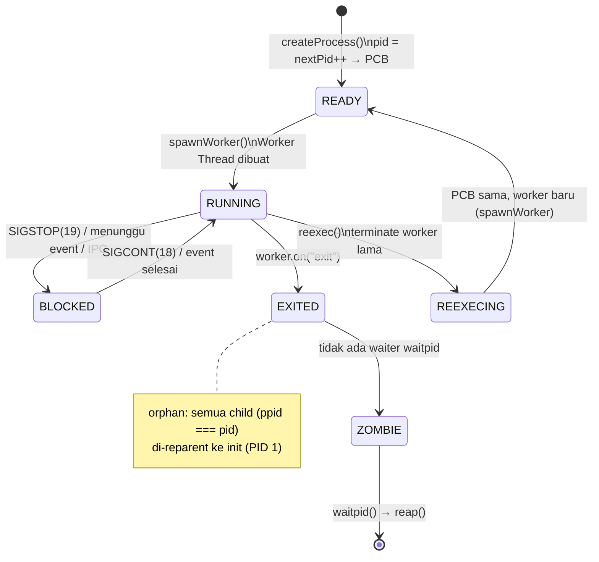

# Processes & Scheduler

**RFC-TSIX-EDU-002** | Fourth module of the TSIX curriculum. Understand the process lifecycle in TSIX: PCB, spawn → run → block → exit, zombie, orphan reparent, daemonize, and reexec.

> One worker thread = one process. TSIX multitasking is **Node.js concurrency**, not preemption — the kernel never forcibly stops a process. What the kernel manages is **the lifecycle and signals**.

---

## Learning Objectives

- [ ] State the main `PCB` fields and distinguish enum states vs transient states
- [ ] Explain the lifecycle: READY → RUNNING → BLOCKED → EXITED (including zombie, orphan, reexec)
- [ ] Explain `waitpid` + `reap` (zombie) and reparenting orphans to PID 1
- [ ] Explain `daemonize` (DETACH) and `REEXEC`
- [ ] Explain the signal model (SIGKILL, SIGINT, SIGTERM, SIGSTOP/CONT) and how it is delivered
- [ ] Trace the real flow: spawn → waitpid → exit → reap

---

## Core Concepts

### PCB (Process Control Block)

Every TSIX process is a single **worker thread**. The kernel (main thread) never runs application code — it only manages process metadata through the **PCB** (`interface PCB` in `src/kernel/Scheduler.ts`). One PCB = one process.

#### PCB Fields

| Field | Type | Meaning |
|---|---|---|
| `pid` | `number` | Unique process ID; allocated from `nextPid++` |
| `ppid?` | `number` | Parent PID — forms the process tree |
| `name` | `string` | Process name (e.g. `"Shell"`, `"init"`) |
| `state` | `ProcessState` | `READY` / `RUNNING` / `BLOCKED` / `EXITED` |
| `pc` | `number` | Program counter — address of the next instruction |
| `owner` | `string` | Name of the owning user (e.g. `"root"`) |
| `uid` | `number` | User ID (effective) |
| `gid` | `number` | Group ID (effective) |
| `ruid` | `number` | Real user ID — who actually launched it |
| `groups` | `number[]` | Supplementary groups |
| `cwd` | `string` | Current working directory |
| `worker?` | `Worker` | Worker thread — the process body (exists after `spawnWorker`) |
| `fdTable` | `(FDEntry \| null)[]` | File descriptor table; 0=stdin, 1=stdout, 2=stderr |
| `env` | `Record<string, string>` | Environment variables |
| `exitCode?` | `number` | Explicit exit code from the `EXIT` syscall |
| `ttyId?` | `number` | Virtual console (TTY) where the process runs |
| `uuid?` | `string` | Application identity — persistent across PIDs (for `SEND_MSG` by identity) |

```ts
export interface PCB {
    pid: number;                // ID Unik Proses
    ppid?: number;              // Parent PID — buat process tree
    name: string;               // Nama Proses (misal: "Shell")
    state: ProcessState;        // Status Saat Ini
    pc: number;                 // Program Counter (Alamat instruksi berikutnya)

    owner: string;              // User yang menjalankan (misal: "root")
    uid: number;                // User ID (Effective)
    gid: number;                // Group ID (Effective)
    ruid: number;               // Real User ID (Siapa yang aslinya nge-jalanin)
    groups: number[];           // Supplementary Groups
    cwd: string;                // Current Working Directory (Posisi sekarang)
    worker?: Worker;            // Raga asli proses di thread terpisah

    // FD TABLE sekarang berisi object FDEntry yang menunjuk ke Driver nyata.
    fdTable: (FDEntry | null)[];

    // Environment Variables
    env: Record<string, string>;
    exitCode?: number; // Explicit exit code set by Syscall
    ttyId?: number;    // ID Virtual Console (TTY) tempat proses ini berjalan
    uuid?: string;     // Unique Application Identity (Persistent across PID changes)
}
```

> [!NOTE]
> **State** in TSIX has only the four enum values of `ProcessState`: `READY`, `RUNNING`, `BLOCKED`, `EXITED`. There is no `NEW` state — the PCB is already fully formed when `createProcess()` returns it. `REEXECING` is **not** part of the enum; it is a transient state set via `(pcb as any).state = "REEXECING"` to prevent the cleanup hook during `reexec()`.

Each `fdTable` entry is an `FDEntry`:

```ts
export interface FDEntry {
    device: IDevice;   // Driver nyata (FileSystemDevice, TTYDevice, dll)
    context: any;      // Konteks driver (path, offset, ...)
    flags?: string;    // "r" | "w" | ...
}
```

### Lifecycle



> [!NOTE]
> `course-server.ts` does not render mermaid yet (it displays as a code block); text version: `READY → RUNNING → BLOCKED → EXITED`, where `EXITED` without a waiter becomes a **zombie** (it stays in the table until `waitpid` + `reap`).

| Event | Mechanism |
|---|---|
| **Spawn** | `createProcess()` → `nextPid++` → PCB (`READY`) → `spawnWorker()` when `appName`/`appPath` exists → state `RUNNING` |
| **Exit** | Syscall `EXIT(code)` → set `pcb.exitCode` → `cleanupProcess()` (close FDs, release ports) → `kill(pid)` → `worker "exit"` event → `EXITED` |
| **Orphan** | `worker.on("exit")` handler → all children (`ppid === pid`, not yet EXITED) are set `ppid = 1` |
| **Zombie** | Process `EXITED` without a waiter → stays in the table until `waitpid` + `reap()` |
| **waitpid** | Already `EXITED` → `reap()` + return exitCode; not yet → registered in `waitQueue` |
| **daemonize** | `DETACH` → FDs 0/1/2 redirected to `/dev/null`, resolve waiters, detach foreground TTY, clear `ttyId` |
| **REEXEC** | Set `(pcb as any).state = "REEXECING"` → terminate old worker → **same** PCB → new `spawnWorker()` |
| **REPARENT (syscall)** | `REPARENT { pid, newPpid }` → `childPcb.ppid = newPpid` (manual; verify the parent exists or is PID 1) |

### Walkthrough: spawn → waitpid → exit → reap

Follow the real flow of a `sleep 2` process launched from the shell (`tsh`):

1. **Spawn.** `tsh` (e.g. PID 3) calls the `EXEC` syscall → the kernel calls `createProcess("sleep", { appPath: "/bin/sleep.js", ppid: 3, fds: [...], ttyId: 1 })`. The PCB is created in state `READY`, then `spawnWorker()` creates a Worker Thread and sets state `RUNNING`. The process gets `pid = 42`.
2. **waitpid.** `tsh` calls `WAITPID(42)` → `waitpid(42)`. The process is not finished → `setForegroundProcess(42, 1)` (so Ctrl+C goes to `sleep`), then the resolver is registered in `waitQueue[42]`. `waitpid` returns a `Promise`.
3. **Exit.** `sleep` finishes → it sends the `EXIT(0)` syscall → the kernel sets `pcb.exitCode = 0` → `cleanupProcess(42)` closes all FDs and releases ports → `kill(42)` (default SIGKILL) → `worker.terminate()`.
4. **Reap.** Node triggers the `worker "exit"` event → state `EXITED` → `finalCode = 0` → `onProcessExitCallback` (global cleanup) → reparent orphans (none) → `waitQueue[42]` has a waiter → `resolve(0)` (the shell receives exit code 0) → `reap(42)` removes the PCB from the table. No zombie. The foreground TTY is returned to `null`/the shell.
5. **Zombie (anti-pattern).** If the shell does **not** call `waitpid`, the exit handler logs `became a ZOMBIE` and the PCB stays in the table. The PCB is removed later when `waitpid(42)` is called (reap).

---

## Signals

Signals are sent through `scheduler.kill(pid, signal)` — the only gateway. Two syscalls use it:

- `KILL(pid)` → always **SIGKILL (9)**.
- `SIGNAL({ pid, sig })` → any signal according to `sig`.

Both perform the same checks: the process exists, **PID 1 is protected**, and permission (root or process owner).

| Signal | Value | Effect |
|---|---|---|
| **SIGKILL** | 9 | Hard kill: `worker.terminate()` immediately, no event |
| **SIGINT** | 2 | Graceful: push `SIGINT` event, 100ms grace → terminate if unhandled. Default exit 130 |
| **SIGTERM** | 15 | Graceful: push event, 300ms grace → terminate. Default exit 143. Used by SHUTDOWN |
| **SIGSTOP** | 19 | Soft: `pcb.state = BLOCKED` + event |
| **SIGCONT** | 18 | Soft: `pcb.state = RUNNING` + event |
| **SIGSEGV** | — | Sent by the kernel when a process violates GUI window ownership |
| **SIGHUP (1), SIGUSR1 (10), SIGUSR2 (12), etc.** | — | Generic event push `sendEvent(pid, "signal", name)` |


*Source: [`wiki/diagram/Kernel-dan-Scheduler-3.mmd`](/wiki/diagram/Kernel-dan-Scheduler-3.mmd)*

> [!IMPORTANT]
> **PID 1 (init) is protected** — both `KILL` and `SIGNAL` refuse to target PID 1, even for root. The only way to terminate the system is the `SHUTDOWN`/`REBOOT` syscall.

**Staged `SHUTDOWN`** (root only, `args` = 0 shutdown / 1 reboot):

1. `broadcastEvent("signal", "SIGTERM")` to all processes (except itself and PID 1).
2. Wait a grace of up to 5 s (100 ms polling) — all processes `EXITED` → success.
3. Remaining processes that did not respond → `kill(pid, 9)` (SIGKILL).
4. Flush network 1 s (so the last packets like `!exit!` get sent).
5. `kill(1, 9, exitCode)` → PID 1 is terminated; `main.ts` `keepAlive` reads the exit code (1 = reboot).

---

## Source Code

| File | Role |
|---|---|
| `src/kernel/Scheduler.ts` | PCB, lifecycle, waitpid, detach, signals, reexec |
| `src/kernel/Syscalls.ts` | KILL, WAITPID, EXEC, EXIT, DETACH, REEXEC syscalls |
| `src/common/IPCTypes.ts` | Signal event contract |

---

## Snippets (code level)

All snippets below are copied from `src/kernel/Scheduler.ts` and `src/kernel/Syscalls.ts` (code is truth).

### createProcess (spawn)

```ts
public createProcess(name: string, options: SpawnOptions = {}): PCB | null {
    const pcb: PCB = {
        pid: this.nextPid++,
        name: name,
        state: ProcessState.READY,
        pc: 0,
        owner: options.owner || "root",
        uid: options.uid ?? 0,
        gid: options.gid ?? 0,
        ruid: options.ruid ?? (options.uid ?? 0),
        groups: options.groups ?? [],
        cwd: options.cwd ?? "/",
        fdTable: [],
        env: options.env ?? {},
        ttyId: options.ttyId,
        ppid: options.ppid ?? 0,
    };

    // Initialize FDs (0=stdin, 1=stdout, 2=stderr)
    if (options.fds && options.fds.length >= 3) {
        pcb.fdTable = [
            { device: options.fds[0], context: "", flags: "r" },
            { device: options.fds[1], context: "", flags: "w" },
            { device: options.fds[2], context: "", flags: "w" }
        ];
    }

    this.processes.push(pcb);

    // Worker baru hanya dibuat bila ada appName / appPath
    if (options.appName || options.appPath) {
        this.spawnWorker(pcb, options);
    }

    return pcb;
}
```

> [!NOTE]
> `createProcess` only creates the PCB (state `READY`) + (if an app exists) a Worker Thread. `pid = nextPid++`; standard FDs (0/1/2) are filled immediately when `options.fds` ≥ 3.

### State transitions (spawnWorker, SIGSTOP/CONT, exit)

```ts
// spawnWorker() — worker dibuat → RUNNING
pcb.worker = new Worker(workerPath, { workerData, execArgv });
pcb.state = ProcessState.RUNNING;

// kill(pid, 19) — SIGSTOP → BLOCKED
pcb.state = ProcessState.BLOCKED;

// kill(pid, 18) — SIGCONT → RUNNING
pcb.state = ProcessState.RUNNING;

// Handler worker.on("exit") → EXITED (kecuali sedang REEXECING)
pcb.state = ProcessState.EXITED;
```

### waitpid + reap (zombie)

```ts
public async waitpid(pid: number): Promise<number> {
    const pcb = this.getProcess(pid);

    // Jika proses sudah EXITED, langsung balikin 0 (atau simpan exit code di PCB)
    if (!pcb || pcb.state === ProcessState.EXITED) {
        const code = pcb?.exitCode ?? 0;
        // Jika proses sudah EXITED, kita reap sekalian biar gak jadi zombie
        this.reap(pid);
        return code;
    }

    // Proses yang ditunggu (foreground) berhak menerima interrupt Ctrl+C
    this.setForegroundProcess(pid, pcb.ttyId);

    return new Promise((resolve) => {
        if (!this.waitQueue.has(pid)) {
            this.waitQueue.set(pid, []);
        }
        this.waitQueue.get(pid)!.push(resolve);
    });
}
```

```ts
public reap(pid: number): void {
    const index = this.processes.findIndex(p => p.pid === pid);
    if (index !== -1) {
        const pcb = this.processes[index];
        if (pcb.state === ProcessState.EXITED) {
            this.logger.debug(`Reaping Process ${pcb.name} (PID ${pid}). Memory freed.`);

            // Remove from uuidMap if registered
            if (pcb.uuid && this.uuidMap.get(pcb.uuid) === pid) {
                this.uuidMap.delete(pcb.uuid);
                this.logger.debug(`UUID ${pcb.uuid} released from PID ${pid}`);
            }

            this.processes.splice(index, 1); // PCB dihapus dari tabel
        }
    }
}
```

> [!IMPORTANT]
> `reap()` only removes PCBs in the `EXITED` state. As long as `waitpid` has not been called, the PCB stays in the table — that is the **zombie**.

### Auto-reparent orphans + notify waiters (the `worker.on("exit")` handler)

```ts
pcb.worker.on("exit", (code) => {
    // If it was a reexec, we don't trigger the exit logic yet
    if (pcb.state === (ProcessState as any).REEXECING) return;

    pcb.state = ProcessState.EXITED;

    // Use explicit exitCode if set (from EXIT syscall), otherwise use worker exit code
    const finalCode = pcb.exitCode !== undefined ? pcb.exitCode : (code || 0);

    // Global Cleanup Hook (reset terminal, close FDs, etc)
    if (this.onProcessExitCallback) {
        this.onProcessExitCallback(pcb.pid);
    }

    // Auto-reparent orphans: semua child dari proses yang exit → init (PID 1)
    const allProcs = Array.from(this.processes.values());
    const orphans = allProcs.filter((p: PCB) => p.ppid === pcb.pid && p.state !== ProcessState.EXITED);
    for (const orphan of orphans) {
        orphan.ppid = 1;
        this.logger.info(`[REPARENT] Auto-reparent orphan PID ${orphan.pid} (${orphan.name}) to init (PID 1)`);
    }

    // Notify Wait Queue
    if (this.waitQueue.has(pcb.pid)) {
        const waiters = this.waitQueue.get(pcb.pid)!;
        waiters.forEach(resolve => resolve(finalCode));
        this.waitQueue.delete(pcb.pid);
        // Jika ada yang nunggu (waitpid), kita bisa reap sekarang
        this.reap(pcb.pid);
    } else {
        this.logger.warn(`Process [${pcb.pid}] became a ZOMBIE (Needs waitpid)`);
    }

    // Jika proses foreground yang mati, kembalikan ke NULL
    if (this.getForegroundProcess(pcb.ttyId) === pcb.pid) {
        this.setForegroundProcess(null, pcb.ttyId);
    }
});
```

### reexec (same PID, new body)

```ts
public async reexec(pid: number, appPath: string, args: string[]): Promise<boolean> {
    const pcb = this.getProcess(pid);
    if (!pcb || !pcb.worker) return false;

    // 1. Mark as Re-execing to prevent 'exit' hook cleanup
    (pcb as any).state = "REEXECING"; // Custom transient state

    // 2. Terminate current worker (Non-blocking to caller)
    pcb.worker.terminate().catch(() => { });
    pcb.worker = undefined;

    // 3. Update PCB info
    pcb.name = path.basename(appPath);
    pcb.state = ProcessState.READY;
    pcb.exitCode = undefined;

    // 4. Spawn new worker
    this.spawnWorker(pcb, { appPath, args });

    return true;
}
```

> [!TIP]
> `REEXECING` is not a member of the `ProcessState` enum — it is a transient state set via `(pcb as any).state`. Its purpose: the `worker.on("exit")` handler skips the cleanup logic because of the `return` on the first line.

### detach (daemonize)

```ts
public async detach(pid: number): Promise<boolean> {
    const pcb = this.getProcess(pid);
    if (!pcb) return false;

    // 1. Resolve Wait Queue (si Shell jadi gak nungguin lagi)
    if (this.waitQueue.has(pid)) {
        const waiters = this.waitQueue.get(pid)!;
        waiters.forEach(resolve => resolve(0)); // Kasih status sukses (0)
        this.waitQueue.delete(pid);
    }

    // 2. Lepas dari Foreground TTY (biar Ctrl+C gak masuk sini lagi)
    if (pcb.ttyId && this.ttyForegroundPids.get(pcb.ttyId) === pid) {
        this.ttyForegroundPids.delete(pcb.ttyId);
    }

    // 3. Clear TTY Association (Crucial for ps display)
    pcb.ttyId = undefined;

    return true;
}
```

> [!NOTE]
> At the syscall level, `DETACH` also redirects FDs 0/1/2 to `/dev/null` before calling `scheduler.detach()` — so the daemon does not leak logs to the original TTY.

### Signal delivery (scheduler.kill)

```ts
public async kill(pid: number, signal: number = 9, exitCode: number = 0): Promise<boolean> {
    const pcb = this.getProcess(pid);
    if (!pcb || !pcb.worker) return false;

    if (signal === 9) { // SIGKILL (Hard Kill)
        if (pcb.worker) {
            await pcb.worker.terminate().catch(() => { });
        }
        return true;
    }

    if (signal === 2) { // SIGINT (Ctrl+C)
        // Send event first to allow graceful handling
        const eventSent = this.sendEvent(pid, "signal", "SIGINT");
        // If no listener handled it, terminate after a brief delay
        // This preserves default Unix behavior: unhandled SIGINT = process exit
        setTimeout(async () => {
            const stillRunning = this.getProcess(pid);
            if (stillRunning && stillRunning.state !== ProcessState.EXITED && stillRunning.worker) {
                this.logger.debug(`PID ${pid} did not handle SIGINT, terminating...`);
                stillRunning.worker.terminate().catch(() => { });
            }
        }, 100); // 100ms grace period for handler to respond
        return eventSent;
    }

    if (signal === 19) { // SIGSTOP (Pause)
        pcb.state = ProcessState.BLOCKED;
        this.logger.info(`Process [${pid}] ${pcb.name} PAUSED (SIGSTOP)`);
        return this.sendEvent(pid, "signal", "SIGSTOP");
    }

    if (signal === 18) { // SIGCONT (Resume)
        pcb.state = ProcessState.RUNNING;
        this.logger.info(`Process [${pid}] ${pcb.name} RESUMED (SIGCONT)`);
        return this.sendEvent(pid, "signal", "SIGCONT");
    }

    if (signal === 15) { // SIGTERM (15)
        const eventSent = this.sendEvent(pid, "signal", "SIGTERM");
        setTimeout(async () => {
            const stillRunning = this.getProcess(pid);
            if (stillRunning && stillRunning.state !== ProcessState.EXITED && stillRunning.worker) {
                this.logger.debug(`PID ${pid} did not handle SIGTERM, terminating...`);
                stillRunning.worker.terminate().catch(() => { });
            }
        }, 300);
        return eventSent;
    }

    // Generic Signal Handling (HUP, USR1, etc)
    const sigNames: Record<number, string> = { 1: "SIGHUP", 10: "SIGUSR1", 12: "SIGUSR2" };
    const sigName = sigNames[signal] || `SIG${signal}`;
    return this.sendEvent(pid, "signal", sigName);
}
```

### Syscall gateway: KILL / SIGNAL / WAITPID

```ts
case SyscallCode.KILL: {
    const targetPid = args as number;
    const targetPcb = this.scheduler.getProcess(targetPid);
    if (!targetPcb)
        throw new Error(`kill: No such process (PID ${targetPid})`);
    // PID 1 (init) cannot be killed — not even by root
    if (targetPid === 1) {
        throw new Error(`kill: PID 1 (init) is protected — cannot be killed directly. Use 'shutdown' or 'reboot' instead.`);
    }
    // Permission check: root can kill anyone, non-root can only kill own processes
    if (!this.isRoot(pcb) && targetPcb.uid !== pcb.uid) {
        throw new Error(`kill: Permission denied — you do not own process ${targetPid} (owned by UID ${targetPcb.uid})`);
    }
    return await this.scheduler.kill(targetPid, 9); // SIGKILL
}

case SyscallCode.SIGNAL: {
    const { pid: targetPid, sig } = args as { pid: number; sig: number };
    // cek sama: proses ada → PID 1 diproteksi → permission →
    return await this.scheduler.kill(targetPid, sig);
}

case SyscallCode.WAITPID: {
    const targetPid = args as number;
    return await this.scheduler.waitpid(targetPid);
}
```

> [!WARNING]
> The `KILL` syscall always maps to **SIGKILL (9)** — no other signal. For other signals (SIGTERM, SIGINT, SIGSTOP, ...) use the `SIGNAL { pid, sig }` syscall. Both refuse PID 1 and check process ownership.

---

## Exercises / Practice

1. Run `ps` in the shell — identify the PID, PPID, state, and TTY of each process.
2. Run `sleep 30 &` then `ps` — find the process running in the background (state and ttyId empty).
3. Run an app, note its PID, then `kill <pid>` (SIGKILL) and `kill -15 <pid>` (SIGTERM) — observe the difference in behavior in the kernel logs.
4. Launch a foreground process (without `&`), press **Ctrl+C** — observe `SIGINT` being sent to the foreground process via `sendInterruptSignal()`.
5. Trace this module's walkthrough (spawn → waitpid → exit → reap) directly in the `Scheduler.ts` code: `createProcess()`, `waitpid()`, and the `worker.on("exit")` handler.
6. Read `src/kernel/Syscalls.ts` — compare the `KILL` case (always SIGKILL) vs `SIGNAL` (free sig) and the PID 1 protection.

---

## References

- `wiki/Kernel-dan-Scheduler.md` — process & scheduler details
- `wiki/course/00-overview.en.md` §4.1, §4.3
- `src/kernel/Scheduler.ts` — PCB, lifecycle, waitpid, detach, signals, reexec
- `src/kernel/Syscalls.ts` — KILL, SIGNAL, WAITPID, EXIT, DETACH, REEXEC, SHUTDOWN cases
- `src/kernel/Scheduler.test.ts` — behavior confirmation (A2.19–A2.21 zombie/waitpid, A2.26 detach, reexec)

---

*Module 04 — done. Continue to [Module 05 — Syscall & IPC](05-syscall-ipc.en.md).*
