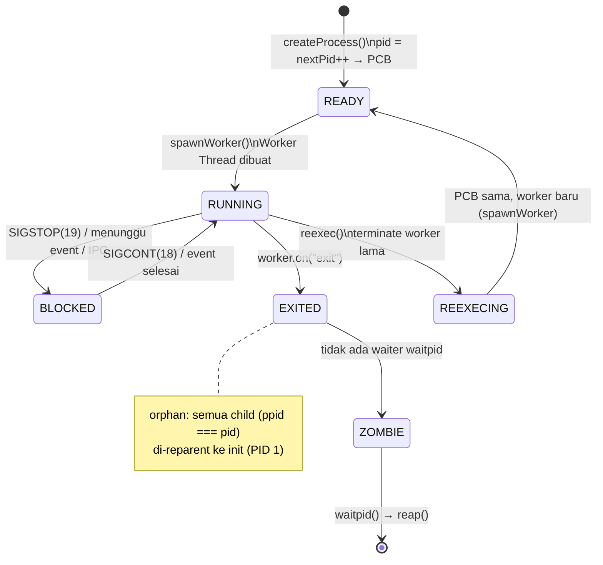

# Proses & Scheduler

**RFC-TSIX-EDU-002** | Modul keempat kurikulum TSIX. Memahami siklus hidup proses di TSIX: PCB, spawn → run → block → exit, zombie, orphan reparent, daemonize, dan reexec.

> Satu worker thread = satu proses. Multitasking TSIX adalah **concurrency Node.js**, bukan preemption — kernel tidak menghentikan proses secara paksa. Yang diatur kernel adalah **siklus hidup dan sinyal**.

---

## Tujuan Pembelajaran

- [ ] Menyebutkan field utama `PCB` dan membedakan state enum vs state transien
- [ ] Menjelaskan lifecycle: READY → RUNNING → BLOCKED → EXITED (termasuk zombie, orphan, reexec)
- [ ] Menjelaskan `waitpid` + `reap` (zombie) dan reparent orphan ke PID 1
- [ ] Menjelaskan `daemonize` (DETACH) dan `REEXEC`
- [ ] Menjelaskan model sinyal (SIGKILL, SIGINT, SIGTERM, SIGSTOP/CONT) dan cara deliver-nya
- [ ] Menelusuri alur nyata: spawn → waitpid → exit → reap

---

## Konsep Inti

### PCB (Process Control Block)

Setiap proses TSIX adalah satu **worker thread**. Kernel (main thread) tidak pernah menjalankan kode aplikasi — ia hanya mengelola metadata proses lewat **PCB** (`interface PCB` di `src/kernel/Scheduler.ts`). Satu PCB = satu proses.

#### Field PCB

| Field | Tipe | Makna |
|---|---|---|
| `pid` | `number` | ID unik proses; dialokasikan dari `nextPid++` |
| `ppid?` | `number` | Parent PID — membentuk process tree |
| `name` | `string` | Nama proses (mis. `"Shell"`, `"init"`) |
| `state` | `ProcessState` | `READY` / `RUNNING` / `BLOCKED` / `EXITED` |
| `pc` | `number` | Program counter — alamat instruksi berikutnya |
| `owner` | `string` | Nama user pemilik (mis. `"root"`) |
| `uid` | `number` | User ID (effective) |
| `gid` | `number` | Group ID (effective) |
| `ruid` | `number` | Real user ID — siapa yang menjalankan aslinya |
| `groups` | `number[]` | Supplementary groups |
| `cwd` | `string` | Current working directory |
| `worker?` | `Worker` | Worker thread — raga proses (ada setelah `spawnWorker`) |
| `fdTable` | `(FDEntry \| null)[]` | Tabel file descriptor; 0=stdin, 1=stdout, 2=stderr |
| `env` | `Record<string, string>` | Environment variables |
| `exitCode?` | `number` | Exit code eksplisit dari syscall `EXIT` |
| `ttyId?` | `number` | Virtual console (TTY) tempat proses berjalan |
| `uuid?` | `string` | Identitas aplikasi — persisten antar PID (untuk `SEND_MSG` by identity) |

```ts
export interface PCB {
    pid: number;                // ID Unik Proses
    ppid?: number;              // Parent PID — buat process tree
    name: string;               // Nama Proses (misal: "Shell")
    state: ProcessState;        // Status Saat Ini
    pc: number;                 // Program Counter (Alamat instruksi berikutnya)

    owner: string;              // User yang menjalankan (misal: "root")
    uid: number;                // User ID (Effective)
    gid: number;                // Group ID (Effective)
    ruid: number;               // Real User ID (Siapa yang aslinya nge-jalanin)
    groups: number[];           // Supplementary Groups
    cwd: string;                // Current Working Directory (Posisi sekarang)
    worker?: Worker;            // Raga asli proses di thread terpisah

    // FD TABLE sekarang berisi object FDEntry yang menunjuk ke Driver nyata.
    fdTable: (FDEntry | null)[];

    // Environment Variables
    env: Record<string, string>;
    exitCode?: number; // Explicit exit code set by Syscall
    ttyId?: number;    // ID Virtual Console (TTY) tempat proses ini berjalan
    uuid?: string;     // Unique Application Identity (Persistent across PID changes)
}
```

> [!NOTE]
> **State** di TSIX hanya empat nilai enum `ProcessState`: `READY`, `RUNNING`, `BLOCKED`, `EXITED`. Tidak ada state `NEW` — PCB sudah terbentuk penuh saat `createProcess()` mengembalikannya. Nilai `REEXECING` **bukan** bagian enum; ia state transien yang di-set lewat `(pcb as any).state = "REEXECING"` untuk mencegah hook cleanup saat `reexec()`.

Setiap entri `fdTable` adalah `FDEntry`:

```ts
export interface FDEntry {
    device: IDevice;   // Driver nyata (FileSystemDevice, TTYDevice, dll)
    context: any;      // Konteks driver (path, offset, ...)
    flags?: string;    // "r" | "w" | ...
}
```

### Lifecycle



> [!NOTE]
> `course-server.ts` belum men-render mermaid (tampil sebagai blok kode); versi teks: `READY → RUNNING → BLOCKED → EXITED`, di mana `EXITED` tanpa waiter menjadi **zombie** (tetap di tabel sampai `waitpid` + `reap`).

| Peristiwa | Mekanisme |
|---|---|
| **Spawn** | `createProcess()` → `nextPid++` → PCB (`READY`) → `spawnWorker()` bila ada `appName`/`appPath` → state `RUNNING` |
| **Exit** | Syscall `EXIT(code)` → set `pcb.exitCode` → `cleanupProcess()` (tutup FD, lepas port) → `kill(pid)` → event `worker "exit"` → `EXITED` |
| **Orphan** | Handler `worker.on("exit")` → semua child (`ppid === pid`, belum EXITED) di-set `ppid = 1` |
| **Zombie** | Proses `EXITED` tanpa waiter → tetap di tabel sampai `waitpid` + `reap()` |
| **waitpid** | Sudah `EXITED` → `reap()` + return exitCode; belum → daftar di `waitQueue` |
| **daemonize** | `DETACH` → FD 0/1/2 dialihkan ke `/dev/null`, resolve waiters, lepas foreground TTY, kosongkan `ttyId` |
| **REEXEC** | Set `(pcb as any).state = "REEXECING"` → terminate worker lama → PCB **sama** → `spawnWorker()` baru |
| **REPARENT (syscall)** | `REPARENT { pid, newPpid }` → `childPcb.ppid = newPpid` (manual; verifikasi parent ada atau PID 1) |

### Walkthrough: spawn → waitpid → exit → reap

Ikuti alur nyata satu proses `sleep 2` yang diluncurkan dari shell (`tsh`):

1. **Spawn.** `tsh` (mis. PID 3) memanggil syscall `EXEC` → kernel memanggil `createProcess("sleep", { appPath: "/bin/sleep.js", ppid: 3, fds: [...], ttyId: 1 })`. PCB dibuat state `READY`, lalu `spawnWorker()` membuat Worker Thread dan men-set state `RUNNING`. Proses mendapat `pid = 42`.
2. **waitpid.** `tsh` memanggil `WAITPID(42)` → `waitpid(42)`. Proses belum selesai → `setForegroundProcess(42, 1)` (biar Ctrl+C masuk ke `sleep`), lalu resolver didaftarkan di `waitQueue[42]`. `waitpid` mengembalikan `Promise`.
3. **Exit.** `sleep` selesai → mengirim syscall `EXIT(0)` → kernel set `pcb.exitCode = 0` → `cleanupProcess(42)` menutup semua FD & melepas port → `kill(42)` (default SIGKILL) → `worker.terminate()`.
4. **Reap.** Node memicu event `worker "exit"` → state `EXITED` → `finalCode = 0` → `onProcessExitCallback` (cleanup global) → reparent orphan (tidak ada) → `waitQueue[42]` punya waiter → `resolve(0)` (shell menerima exit code 0) → `reap(42)` menghapus PCB dari tabel. Tidak jadi zombie. Foreground TTY dikembalikan ke `null`/shell.
5. **Zombie (anti-pola).** Jika shell **tidak** memanggil `waitpid`, handler exit mencatat log `became a ZOMBIE` dan PCB tetap berada di tabel. PCB baru dihapus nanti saat `waitpid(42)` dipanggil (reap).

---

## Sinyal

Sinyal dikirim lewat `scheduler.kill(pid, signal)` — satu-satunya gerbang. Ada dua syscall yang memakainya:

- `KILL(pid)` → selalu **SIGKILL (9)**.
- `SIGNAL({ pid, sig })` → sinyal bebas sesuai `sig`.

Keduanya melakukan cek yang sama: proses ada, **PID 1 diproteksi**, dan permission (root atau pemilik proses).

| Sinyal | Nilai | Efek |
|---|---|---|
| **SIGKILL** | 9 | Hard kill: `worker.terminate()` langsung, tanpa event |
| **SIGINT** | 2 | Graceful: push event `SIGINT`, grace 100ms → terminate jika tak ditangani. Default exit 130 |
| **SIGTERM** | 15 | Graceful: push event, grace 300ms → terminate. Default exit 143. Dipakai SHUTDOWN |
| **SIGSTOP** | 19 | Soft: `pcb.state = BLOCKED` + event |
| **SIGCONT** | 18 | Soft: `pcb.state = RUNNING` + event |
| **SIGSEGV** | — | Dikirim kernel saat proses melanggar kepemilikan window GUI |
| **SIGHUP (1), SIGUSR1 (10), SIGUSR2 (12), dll** | — | Push event generik `sendEvent(pid, "signal", name)` |


*Sumber: [`wiki/diagram/Kernel-dan-Scheduler-3.mmd`](/wiki/diagram/Kernel-dan-Scheduler-3.mmd)*

> [!IMPORTANT]
> **PID 1 (init) diproteksi** — baik `KILL` maupun `SIGNAL` menolak target PID 1, bahkan untuk root. Satu-satunya jalan terminasi sistem adalah syscall `SHUTDOWN`/`REBOOT`.

**`SHUTDOWN` bertingkat** (root saja, `args` = 0 shutdown / 1 reboot):

1. `broadcastEvent("signal", "SIGTERM")` ke semua proses (kecuali diri sendiri & PID 1).
2. Tunggu grace sampai 5 s (polling 100 ms) — semua proses `EXITED` → sukses.
3. Sisa yang tidak merespons → `kill(pid, 9)` (SIGKILL).
4. Flush network 1 s (biar paket terakhir seperti `!exit!` terkirim).
5. `kill(1, 9, exitCode)` → PID 1 di-terminate; `main.ts` `keepAlive` membaca exit code (1 = reboot).

---

## Kode Sumber

| File | Peran |
|---|---|
| `src/kernel/Scheduler.ts` | PCB, lifecycle, waitpid, detach, sinyal, reexec |
| `src/kernel/Syscalls.ts` | Syscall KILL, WAITPID, EXEC, EXIT, DETACH, REEXEC |
| `src/common/IPCTypes.ts` | Kontrak event sinyal |

---

## Snippet (level kode)

Semua snippet di bawah ini disalin dari `src/kernel/Scheduler.ts` dan `src/kernel/Syscalls.ts` (kode adalah kebenaran).

### createProcess (spawn)

```ts
public createProcess(name: string, options: SpawnOptions = {}): PCB | null {
    const pcb: PCB = {
        pid: this.nextPid++,
        name: name,
        state: ProcessState.READY,
        pc: 0,
        owner: options.owner || "root",
        uid: options.uid ?? 0,
        gid: options.gid ?? 0,
        ruid: options.ruid ?? (options.uid ?? 0),
        groups: options.groups ?? [],
        cwd: options.cwd ?? "/",
        fdTable: [],
        env: options.env ?? {},
        ttyId: options.ttyId,
        ppid: options.ppid ?? 0,
    };

    // Initialize FDs (0=stdin, 1=stdout, 2=stderr)
    if (options.fds && options.fds.length >= 3) {
        pcb.fdTable = [
            { device: options.fds[0], context: "", flags: "r" },
            { device: options.fds[1], context: "", flags: "w" },
            { device: options.fds[2], context: "", flags: "w" }
        ];
    }

    this.processes.push(pcb);

    // Worker baru hanya dibuat bila ada appName / appPath
    if (options.appName || options.appPath) {
        this.spawnWorker(pcb, options);
    }

    return pcb;
}
```

> [!NOTE]
> `createProcess` hanya membuat PCB (state `READY`) + (jika ada app) Worker Thread. `pid = nextPid++`; FD standar (0/1/2) langsung terisi bila `options.fds` ≥ 3.

### Transisi state (spawnWorker, SIGSTOP/CONT, exit)

```ts
// spawnWorker() — worker dibuat → RUNNING
pcb.worker = new Worker(workerPath, { workerData, execArgv });
pcb.state = ProcessState.RUNNING;

// kill(pid, 19) — SIGSTOP → BLOCKED
pcb.state = ProcessState.BLOCKED;

// kill(pid, 18) — SIGCONT → RUNNING
pcb.state = ProcessState.RUNNING;

// Handler worker.on("exit") → EXITED (kecuali sedang REEXECING)
pcb.state = ProcessState.EXITED;
```

### waitpid + reap (zombie)

```ts
public async waitpid(pid: number): Promise<number> {
    const pcb = this.getProcess(pid);

    // Jika proses sudah EXITED, langsung balikin 0 (atau simpan exit code di PCB)
    if (!pcb || pcb.state === ProcessState.EXITED) {
        const code = pcb?.exitCode ?? 0;
        // Jika proses sudah EXITED, kita reap sekalian biar gak jadi zombie
        this.reap(pid);
        return code;
    }

    // Proses yang ditunggu (foreground) berhak menerima interrupt Ctrl+C
    this.setForegroundProcess(pid, pcb.ttyId);

    return new Promise((resolve) => {
        if (!this.waitQueue.has(pid)) {
            this.waitQueue.set(pid, []);
        }
        this.waitQueue.get(pid)!.push(resolve);
    });
}
```

```ts
public reap(pid: number): void {
    const index = this.processes.findIndex(p => p.pid === pid);
    if (index !== -1) {
        const pcb = this.processes[index];
        if (pcb.state === ProcessState.EXITED) {
            this.logger.debug(`Reaping Process ${pcb.name} (PID ${pid}). Memory freed.`);

            // Remove from uuidMap if registered
            if (pcb.uuid && this.uuidMap.get(pcb.uuid) === pid) {
                this.uuidMap.delete(pcb.uuid);
                this.logger.debug(`UUID ${pcb.uuid} released from PID ${pid}`);
            }

            this.processes.splice(index, 1); // PCB dihapus dari tabel
        }
    }
}
```

> [!IMPORTANT]
> `reap()` hanya menghapus PCB yang ber-state `EXITED`. Selama belum `waitpid`, PCB tetap di tabel — itulah **zombie**.

### Orphan auto-reparent + notifikasi waiter (handler `worker.on("exit")`)

```ts
pcb.worker.on("exit", (code) => {
    // If it was a reexec, we don't trigger the exit logic yet
    if (pcb.state === (ProcessState as any).REEXECING) return;

    pcb.state = ProcessState.EXITED;

    // Use explicit exitCode if set (from EXIT syscall), otherwise use worker exit code
    const finalCode = pcb.exitCode !== undefined ? pcb.exitCode : (code || 0);

    // Global Cleanup Hook (reset terminal, close FDs, etc)
    if (this.onProcessExitCallback) {
        this.onProcessExitCallback(pcb.pid);
    }

    // Auto-reparent orphans: semua child dari proses yang exit → init (PID 1)
    const allProcs = Array.from(this.processes.values());
    const orphans = allProcs.filter((p: PCB) => p.ppid === pcb.pid && p.state !== ProcessState.EXITED);
    for (const orphan of orphans) {
        orphan.ppid = 1;
        this.logger.info(`[REPARENT] Auto-reparent orphan PID ${orphan.pid} (${orphan.name}) to init (PID 1)`);
    }

    // Notify Wait Queue
    if (this.waitQueue.has(pcb.pid)) {
        const waiters = this.waitQueue.get(pcb.pid)!;
        waiters.forEach(resolve => resolve(finalCode));
        this.waitQueue.delete(pcb.pid);
        // Jika ada yang nunggu (waitpid), kita bisa reap sekarang
        this.reap(pcb.pid);
    } else {
        this.logger.warn(`Process [${pcb.pid}] became a ZOMBIE (Needs waitpid)`);
    }

    // Jika proses foreground yang mati, kembalikan ke NULL
    if (this.getForegroundProcess(pcb.ttyId) === pcb.pid) {
        this.setForegroundProcess(null, pcb.ttyId);
    }
});
```

### reexec (PID tetap, raga baru)

```ts
public async reexec(pid: number, appPath: string, args: string[]): Promise<boolean> {
    const pcb = this.getProcess(pid);
    if (!pcb || !pcb.worker) return false;

    // 1. Mark as Re-execing to prevent 'exit' hook cleanup
    (pcb as any).state = "REEXECING"; // Custom transient state

    // 2. Terminate current worker (Non-blocking to caller)
    pcb.worker.terminate().catch(() => { });
    pcb.worker = undefined;

    // 3. Update PCB info
    pcb.name = path.basename(appPath);
    pcb.state = ProcessState.READY;
    pcb.exitCode = undefined;

    // 4. Spawn new worker
    this.spawnWorker(pcb, { appPath, args });

    return true;
}
```

> [!TIP]
> `REEXECING` bukan anggota enum `ProcessState` — ia state transien yang di-set via `(pcb as any).state`. Tujuannya: handler `worker.on("exit")` melewatkan logika cleanup karena `return` di baris pertama.

### detach (daemonize)

```ts
public async detach(pid: number): Promise<boolean> {
    const pcb = this.getProcess(pid);
    if (!pcb) return false;

    // 1. Resolve Wait Queue (si Shell jadi gak nungguin lagi)
    if (this.waitQueue.has(pid)) {
        const waiters = this.waitQueue.get(pid)!;
        waiters.forEach(resolve => resolve(0)); // Kasih status sukses (0)
        this.waitQueue.delete(pid);
    }

    // 2. Lepas dari Foreground TTY (biar Ctrl+C gak masuk sini lagi)
    if (pcb.ttyId && this.ttyForegroundPids.get(pcb.ttyId) === pid) {
        this.ttyForegroundPids.delete(pcb.ttyId);
    }

    // 3. Clear TTY Association (Crucial for ps display)
    pcb.ttyId = undefined;

    return true;
}
```

> [!NOTE]
> Di level syscall, `DETACH` juga mengarahkan ulang FD 0/1/2 ke `/dev/null` sebelum memanggil `scheduler.detach()` — agar daemon tidak membocorkan log ke TTY awal.

### Pengiriman sinyal (scheduler.kill)

```ts
public async kill(pid: number, signal: number = 9, exitCode: number = 0): Promise<boolean> {
    const pcb = this.getProcess(pid);
    if (!pcb || !pcb.worker) return false;

    if (signal === 9) { // SIGKILL (Hard Kill)
        if (pcb.worker) {
            await pcb.worker.terminate().catch(() => { });
        }
        return true;
    }

    if (signal === 2) { // SIGINT (Ctrl+C)
        // Send event first to allow graceful handling
        const eventSent = this.sendEvent(pid, "signal", "SIGINT");
        // If no listener handled it, terminate after a brief delay
        // This preserves default Unix behavior: unhandled SIGINT = process exit
        setTimeout(async () => {
            const stillRunning = this.getProcess(pid);
            if (stillRunning && stillRunning.state !== ProcessState.EXITED && stillRunning.worker) {
                this.logger.debug(`PID ${pid} did not handle SIGINT, terminating...`);
                stillRunning.worker.terminate().catch(() => { });
            }
        }, 100); // 100ms grace period for handler to respond
        return eventSent;
    }

    if (signal === 19) { // SIGSTOP (Pause)
        pcb.state = ProcessState.BLOCKED;
        this.logger.info(`Process [${pid}] ${pcb.name} PAUSED (SIGSTOP)`);
        return this.sendEvent(pid, "signal", "SIGSTOP");
    }

    if (signal === 18) { // SIGCONT (Resume)
        pcb.state = ProcessState.RUNNING;
        this.logger.info(`Process [${pid}] ${pcb.name} RESUMED (SIGCONT)`);
        return this.sendEvent(pid, "signal", "SIGCONT");
    }

    if (signal === 15) { // SIGTERM (15)
        const eventSent = this.sendEvent(pid, "signal", "SIGTERM");
        setTimeout(async () => {
            const stillRunning = this.getProcess(pid);
            if (stillRunning && stillRunning.state !== ProcessState.EXITED && stillRunning.worker) {
                this.logger.debug(`PID ${pid} did not handle SIGTERM, terminating...`);
                stillRunning.worker.terminate().catch(() => { });
            }
        }, 300);
        return eventSent;
    }

    // Generic Signal Handling (HUP, USR1, etc)
    const sigNames: Record<number, string> = { 1: "SIGHUP", 10: "SIGUSR1", 12: "SIGUSR2" };
    const sigName = sigNames[signal] || `SIG${signal}`;
    return this.sendEvent(pid, "signal", sigName);
}
```

### Gerbang syscall: KILL / SIGNAL / WAITPID

```ts
case SyscallCode.KILL: {
    const targetPid = args as number;
    const targetPcb = this.scheduler.getProcess(targetPid);
    if (!targetPcb)
        throw new Error(`kill: No such process (PID ${targetPid})`);
    // PID 1 (init) cannot be killed — not even by root
    if (targetPid === 1) {
        throw new Error(`kill: PID 1 (init) is protected — cannot be killed directly. Use 'shutdown' or 'reboot' instead.`);
    }
    // Permission check: root can kill anyone, non-root can only kill own processes
    if (!this.isRoot(pcb) && targetPcb.uid !== pcb.uid) {
        throw new Error(`kill: Permission denied — you do not own process ${targetPid} (owned by UID ${targetPcb.uid})`);
    }
    return await this.scheduler.kill(targetPid, 9); // SIGKILL
}

case SyscallCode.SIGNAL: {
    const { pid: targetPid, sig } = args as { pid: number; sig: number };
    // cek sama: proses ada → PID 1 diproteksi → permission →
    return await this.scheduler.kill(targetPid, sig);
}

case SyscallCode.WAITPID: {
    const targetPid = args as number;
    return await this.scheduler.waitpid(targetPid);
}
```

> [!WARNING]
> Syscall `KILL` selalu memetakan ke **SIGKILL (9)** — tidak ada sinyal lain. Untuk sinyal lain (SIGTERM, SIGINT, SIGSTOP, ...) gunakan syscall `SIGNAL { pid, sig }`. Keduanya menolak PID 1 dan mengecek kepemilikan proses.

---

## Latihan / Praktik

1. Jalankan `ps` di shell — identifikasi PID, PPID, state, dan TTY setiap proses.
2. Jalankan `sleep 30 &` lalu `ps` — cari proses yang berjalan di background (state & ttyId kosong).
3. Jalankan sebuah app, catat PID-nya, lalu `kill <pid>` (SIGKILL) dan `kill -15 <pid>` (SIGTERM) — amati perbedaan perilaku di log kernel.
4. Luncurkan proses foreground (tanpa `&`), tekan **Ctrl+C** — amati `SIGINT` dikirim ke foreground process via `sendInterruptSignal()`.
5. Telusuri walkthrough modul ini (spawn → waitpid → exit → reap) langsung di kode `Scheduler.ts`: `createProcess()`, `waitpid()`, dan handler `worker.on("exit")`.
6. Baca `src/kernel/Syscalls.ts` — bandingkan case `KILL` (selalu SIGKILL) vs `SIGNAL` (sig bebas) dan proteksi PID 1.

---

## Referensi

- `wiki/Kernel-dan-Scheduler.md` — detail proses & scheduler
- `wiki/course/00-overview.md` §4.1, §4.3
- `src/kernel/Scheduler.ts` — PCB, lifecycle, waitpid, detach, sinyal, reexec
- `src/kernel/Syscalls.ts` — case KILL, SIGNAL, WAITPID, EXIT, DETACH, REEXEC, SHUTDOWN
- `src/kernel/Scheduler.test.ts` — konfirmasi perilaku (A2.19–A2.21 zombie/waitpid, A2.26 detach, reexec)

---

*Modul 04 — selesai. Lanjut ke [Modul 05 — Syscall & IPC](05-syscall-ipc.md).*
