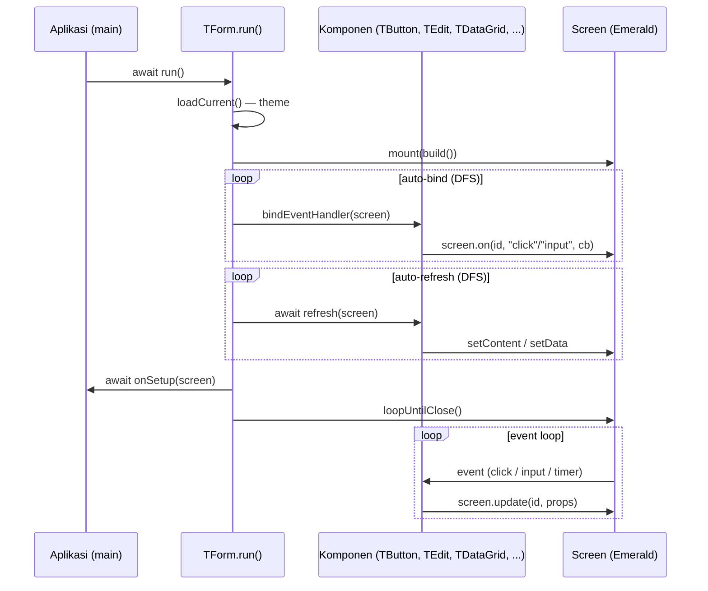

# Cashew Component Framework

**RFC-TSIX-EDU-002** | Twentieth module of the TSIX curriculum. Understand the OOP/Delphi-style layer above Emerald: `TForm`, `TButton`, `TEdit`, auto-bind lifecycle, and complex widgets.

> Cashew (`@tsix/cashew`) adopts the component pattern of **Delphi / Turbo Pascal** — components are **stateful classes** with properties & events, not nested functions. It is the VCL analogue on top of GTK.

---

## Learning Objectives

- [ ] Explain the OOP/Delphi-style philosophy of Cashew
- [ ] Explain the `TForm.run()` lifecycle (auto-bind)
- [ ] Explain the basic components: TForm, TPanel, TLabel, TButton, TEdit
- [ ] Explain why `onClickId`/`onInputId` are set at build time (mount-time)
- [ ] Name the complex widgets (TChart, TSevenSegment, TSensorCard, etc.)

---

## Core Concepts

### Philosophy

In Emerald you write UI with nested functions (`div([button(...)])`). In Cashew, you create **class objects**:

```ts
const form = new TForm("My App", 400, 300);
const btn = new TButton("btn-click");
btn.caption = "Klik";
btn.onClick = () => { count++; lblCounter.caption = "Count: " + count; };
form.add(btn);
await form.run();
```

### TForm.run() lifecycle

`run()` has an **auto-bind lifecycle**: bindEventHandler + refresh per component. After `run()`, property changes (`caption`, `text`, etc.) automatically sync to the screen.

The sequence in `TForm.run()` (`src/mirror/lib/cashew.ts`):

1. **Theme** — load the active theme before building so the CSS color variables are correct.
2. **Build & mount** — build the `IDOMNode` tree via `this.build()` then `_screen.mount(...)`.
3. **Auto-bind** — DFS traversal over all children, call `comp.bindEventHandler(screen)` (event registration).
4. **Auto-refresh** — DFS traversal over all children, call `await comp.refresh(screen)` (render dynamic data, e.g. `TListBox`, `TDataGrid`).
5. **Setup** — call `await onSetup(screen)` when set (extra binding).
6. **Event loop** — `_screen.loopUntilClose()` waits until the window is closed.



### Component Hierarchy

All components derive from the base class `TComponent` in `src/mirror/lib/cashew.ts`:

```mermaid
graph TD
    TC[TComponent] --> TForm
    TC --> TPanel
    TC --> TLabel
    TC --> TButton
    TC --> TEdit
    TC --> TMemo
    TC --> TCheckBox
    TC --> TListBox
    TC --> TRadioButton
    TC --> TComboBox
    TC --> TStatusBar
    TC --> TLineChart
    TC --> TRadialGauge
    TC --> TSevenSegment
    TC --> TIndicatorLamp
    TC --> TToggleSwitch
    TC --> TVerticalGauge
    TC --> TSensorCard
    TC --> TRelayCard
    TC --> TSlider
    TC --> TTimer
    TC --> TChart
    TC --> TDataGrid
```



> [!NOTE] **Not classes.** `TDialogs` is a **static** utility (not a `TComponent`). `HStack`, `VStack`, `Spacer`, `TScrollBox`, `TFlowPanel`, `TGridPanel`, `TSplitHorizontal`, `TSplitVertical`, `TGroupBox` are **functions** that return `TComponent` — quick layout without new subclasses. Align constants (`alTop`, `alClient`, etc.) are available for `style.position`.

### Why events are set at build time (mount-time)

`onClickId`/`onInputId` are written directly into `props` in the constructor or `build()` (example: `TButton` sets `this.props.onClickId = id`). When DOME mounts the node, the listener is attached once. Adding listeners via `app.on()` after mount risks colliding with DOME's `cloneNode` pattern, which **does not copy listeners** — see Module 19.

### Basic components

| Component | Function |
|---|---|
| `TForm` | Main window (`add()`, `alert()`, `confirm()`, `screen`, `onSetup`; options `maximizable`/`resizable`/`fullscreen`/`frameless`) |
| `TPanel` | Container (with/without style) |
| `TLabel` | Text (`caption`) |
| `TButton` | Button (`onClick`, `caption`, `enabled`) |
| `TEdit` | Text input (`onInput`, `text`, `placeholder`) |
| `TMemo`, `TCheckBox`, `TListBox`, `TStatusBar`, `TRadioButton`, `TComboBox` | Others |
| `TScrollBox`, `TFlowPanel`, `TGridPanel`, `TSplitHorizontal/Vertical`, `TGroupBox` | Layout |
| `HStack`, `VStack`, `Spacer` | Quick layout |

### Complex & IoT widgets

| Component | Function |
|---|---|
| `TDialogs` | Static dialog utility: `alert`, `confirm`, `input`, `openFile`, `saveFile` |
| `TTimer` | Delphi-style interval timer; auto-cleanup when the form closes (`onTimer`) |
| `TChart` | Real-time multi-series chart (Lightweight Charts via IPC DOME) |
| `TLineChart` | SVG line chart (spline, fill, scroll animation) |
| `TRadialGauge` | Circular speedometer-style gauge |
| `TSevenSegment` | LED 7-segment display (options `scale`, `height`) |
| `TIndicatorLamp` | ON/OFF indicator lamp with glow |
| `TToggleSwitch` | Clickable ON/OFF switch |
| `TVerticalGauge` | Vertical glass tube; value text dual-layer masking |
| `TSensorCard` | IoT sensor card with progress bar |
| `TRelayCard` | ON/OFF relay card |
| `TSlider` | Horizontal range slider |

### TDataGrid — one scroll container

`TDataGrid` wraps Emerald's `ConnectedDataGrid` (`src/mirror/lib/emerald.ts`). A 2026-08-03 change makes the grid use a **single scroll container**:

- **One scroll container** — header table + `<style>` + body table live inside one `body-scroll` (`overflow: auto`). The header is pinned via **`th` sticky** (`position: sticky; top: 0; z-index: 2`), the same pattern as the static `dataGrid()`.
- **No manual compensation** — the `thead-scroll` wrapper, relayed `scrollLeft`, `scrollbar-gutter`, and `calc(100% - scrollbarWidth)` were removed. Horizontal & vertical scrolling sync automatically; header width == body width == container width.
- **Column resize** — the resize scope is the grid wrapper `table.closest(".tsix-dgrid")` (not `table.parentElement`). The drag handle changes the width of `<col>` in **all colgroups** (header + body) at once.
- **`col_resized`** — when dragging finishes, the browser sends `col_resized` with `targetId` = **grid id** (wrapper `.tsix-dgrid`) → `ConnectedDataGrid` stores the width and re-applies it on every render (sort/refresh/setData).

> [!IMPORTANT] **Mount-time event.** Set `onClickId`/`onInputId` at build time (mount-time) — not in `app.on()` — to avoid the `cloneNode` bug (see Module 19).

---

## Flow / How It Works

1. Create a `TForm` object — two forms: sequential `new TForm(title, w, h, ...)` or object literal `new TForm({ title, ... })`.
2. Add components via `form.add(...)` — this forms a parent-child tree.
3. Set properties (`caption`, `text`, `value`) and event handlers (`onClick`, `onInput`, `onChange`, `onTimer`).
4. Call `await form.run()` — build → mount → auto-bind → auto-refresh → `onSetup` → loop.
5. Change properties at any time; bound components automatically call `screen.update(...)` to the screen.
6. Window closes → `loopUntilClose()` finishes; managed timers are cleaned up automatically.

---

## Source Code

- `src/mirror/lib/cashew.ts` — the whole framework (TComponent, TForm, TDialogs, basic components, layout, IoT widgets, TDataGrid)
- `src/mirror/lib/emerald.ts` — `ConnectedDataGrid` (grid rendering & column width state)
- `src/mirror/opt/dome/dome-client-dom.js` — DOM build, `data-col-resize`, `col_resized` event
- `wiki/cashew-in-a-nutshell.md`, `wiki/emerald-in-a-nutshell.md` — summary

---

## Snippet (code level)

### Cashew quick start

```ts
import { Program } from "@tsix/Application";
import { TForm, TLabel, TButton, TStatusBar } from "@tsix/cashew";

export const main = Program(async () => {
  const form = new TForm("My App", 400, 300);
  let count = 0;

  const lblCounter = new TLabel("counter");
  lblCounter.caption = "Count: 0";
  form.add(lblCounter);

  const btnClick = new TButton("btn-click");
  btnClick.caption = "Klik";
  btnClick.onClick = () => { count++; lblCounter.caption = "Count: " + count; };
  form.add(btnClick);

  const status = new TStatusBar("status");
  status.text = "✅ Siap";
  form.add(status);

  // Tidak perlu bind manual — TForm.run() memanggil bindEventHandler()
  // untuk setiap komponen secara otomatis (auto-bind lifecycle).
  await form.run();
});
```

### TForm.run() — auto-bind lifecycle (from cashew.ts)

```ts
async run(): Promise<void> {
  // 1. Theme — load dulu biar komponen pake warna yang benar
  try {
    const t = await ensureTheme();
    await t.loadCurrent();
    t.watch();
  } catch (_) { /* theme opsional — skip jika gagal */ }

  // 2. Build & mount ke Screen
  this._screen = new Screen(opts); // title, width, height, maximizable, ...
  await this._screen.mount(this.build());
  // (opsional) kirim WINDOW_THEME ke DOME untuk CSS variables

  // 3. Auto-bind: DFS — panggil bindEventHandler() untuk semua komponen
  const autoBind = (comp: TComponent) => {
    comp.bindEventHandler(this._screen);
    for (const child of comp.children) autoBind(child);
  };
  for (const child of this.children) autoBind(child);

  // 4. Auto-refresh: DFS — panggil refresh() (misal TListBox, TDataGrid)
  const autoRefresh = async (comp: TComponent) => {
    await comp.refresh(this._screen);
    for (const child of comp.children) await autoRefresh(child);
  };
  for (const child of this.children) await autoRefresh(child);

  // 5. Setup custom — setelah bind & refresh
  if (this.onSetup) await this.onSetup(this._screen);

  // 6. Event loop sampai window ditutup
  await this._screen.loopUntilClose();
}
```

### TComponent — bindEventHandler & refresh (base no-op)

```ts
export class TComponent {
  // Daftarkan event handler ke Screen. Otomatis dipanggil oleh TForm.run().
  bindEventHandler(screen: Screen): void {
    // Base: no-op — subclass override untuk register event
  }

  // Update tampilan setelah mount. Otomatis dipanggil oleh TForm.run().
  async refresh(screen: Screen): Promise<void> {
    // Base: no-op — subclass override untuk render dinamis
  }

  build(): IDOMNode {
    return {
      id: this.id,
      tag: this.tag,
      props: { ...this.props, style: { ...this.style } },
      children: this._children.map((c) => c.build()),
    };
  }
}
```

### Widget example — TButton & TEdit (from cashew.ts)

```ts
// TButton — bind onClick saat auto-bind
// constructor: this.tag = "button"; this.props.onClickId = id;
export class TButton extends TComponent {
  public onClick: (() => void) | null = null;
  bindEventHandler(screen: Screen): void {
    this._screen = screen;
    if (this.onClick) screen.on(this.id, "click", this.onClick);
  }
}

// TEdit — bind onInput saat auto-bind
// constructor: this.tag = "input"; this.props.onInputId = id;
export class TEdit extends TComponent {
  public onInput: ((value: string) => void) | null = null;
  bindEventHandler(screen: Screen): void {
    this._screen = screen;
    if (this.onInput) {
      screen.on(this.id, "input", (ev: any) => {
        this.onInput!(ev?.value || "");
      });
    }
  }
}
```

### Widget example — TDataGrid (from cashew.ts)

```ts
// Penggunaan di app
const grid = new TDataGrid(
  "sensor",
  [
    { key: "node_id", label: "Node", width: 140 },
    { key: "value", label: "Nilai", width: 80, align: "right" },
    { key: "timestamp", label: "Waktu", width: "40%" },
  ],
  [],
  { height: 300 },
);
form.add(grid);
grid.onSort = (key, dir) => { reloadSorted(key, dir); };
grid.onRowClick = (index, record) => { openDetail(record); }; // index = row-key stabil

// Data inkremental — hanya baris baru yang dikirim ke browser (hemat WS)
await grid.appendData(newRows);
```

```ts
// (dari cashew.ts — TDataGrid) auto-bind oleh TForm.run(): mount
// ConnectedDataGrid + daftarkan handler sort & klik row.
bindEventHandler(screen: Screen): void {
  this._screen = screen;
  void this.grid
    .mount(
      screen,
      (key, dir) => { if (this.onSort) this.onSort(key, dir); },
      (index, record) => { if (this.onRowClick) this.onRowClick(index, record); },
    )
    .catch(() => {});
}

// (dari cashew.ts — TDataGrid) auto-refresh: render data awal
async refresh(screen: Screen): Promise<void> {
  await this.grid.setData(this._data);
}
```

### TTimer — Delphi-style interval

```ts
const timer = new TTimer("tmr-update", 1000);
timer.onTimer = () => { chart.pushData(Date.now(), sensor.value); };
timer.enabled = true;
form.add(timer); // bindEventHandler auto-start saat form.run()
```

### Layout helpers

```ts
form.add(
  HStack(
    new TButton("btn-a"),
    new TButton("btn-b"),
    Spacer(),            // flex: 1 — mendorong tombol berikutnya ke kanan
    new TButton("btn-c"),
  ),
);

// Dua panel bersebelahan dengan divider yang bisa di-drag
form.add(TSplitHorizontal(leftPanel, rightPanel, "1fr"));
```

---

## Exercises / Practice

1. Read `wiki/cashew-in-a-nutshell.md` — follow the quick start and the layout components.
2. Build an app with `TForm` + `TPanel` + `TEdit` + `TListBox`: type in the TEdit, click the button, and the result goes into the TListBox.
3. Use `TDialogs.confirm()` for confirmation before deleting an item.
4. Read `src/mirror/lib/cashew.ts` — find the implementations of `TForm.run()`, `bindEventHandler()`, and `refresh()`.
5. Create a `TDataGrid` with `appendData()` for continuously growing data (log / telemetry).

---

## References

- `wiki/cashew-in-a-nutshell.md`, `wiki/emerald-in-a-nutshell.md`
- `wiki/course/00-overview.en.md` §10
- `src/mirror/lib/cashew.ts`, `src/mirror/lib/emerald.ts`
- `src/mirror/opt/dome/dome-client-dom.js`
- Changelog: `wiki/changelogs/cashew.md`, `wiki/changelogs/dome.md`

---

*Module 20 — done. Continue to [Module 21 — Asteracea & TDE](21-asteracea-tde.en.md).*
