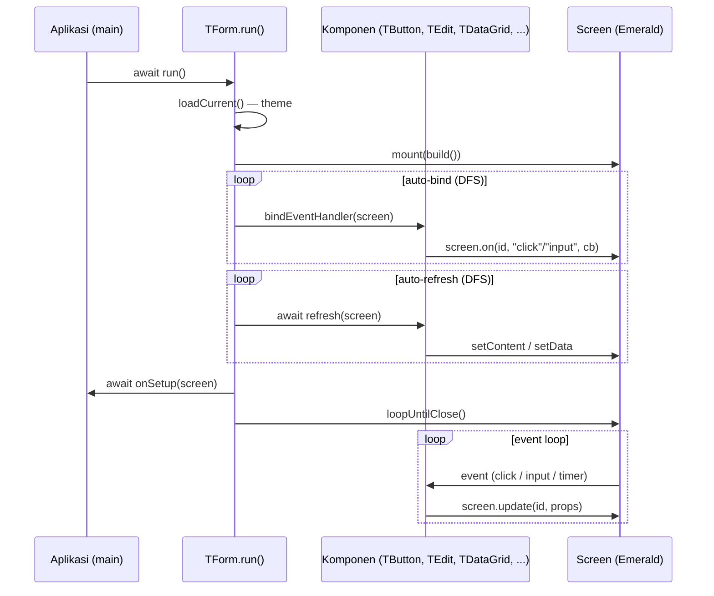

# Cashew Component Framework

**RFC-TSIX-EDU-002** | Modul kedua puluh kurikulum TSIX. Memahami layer OOP/Delphi-style di atas Emerald: `TForm`, `TButton`, `TEdit`, auto-bind lifecycle, dan widget kompleks.

> Cashew (`@tsix/cashew`) mengadopsi pola komponen ala **Delphi / Turbo Pascal** — komponen adalah **class ber-state** dengan properti & event, bukan fungsi bersarang. Ini analog VCL di atas GTK.

---

## Tujuan Pembelajaran

- [ ] Menjelaskan filosofi OOP/Delphi-style Cashew
- [ ] Menjelaskan lifecycle `TForm.run()` (auto-bind)
- [ ] Menjelaskan komponen dasar: TForm, TPanel, TLabel, TButton, TEdit
- [ ] Menjelaskan kenapa `onClickId`/`onInputId` diset saat build (mount-time)
- [ ] Menyebutkan widget kompleks (TChart, TSevenSegment, TSensorCard, dll)

---

## Konsep Inti

### Filosofi

Di Emerald kamu menulis UI dengan fungsi bersarang (`div([button(...)])`). Di Cashew, kamu membuat **objek class**:

```ts
const form = new TForm("My App", 400, 300);
const btn = new TButton("btn-click");
btn.caption = "Klik";
btn.onClick = () => { count++; lblCounter.caption = "Count: " + count; };
form.add(btn);
await form.run();
```

### Lifecycle TForm.run()

`run()` punya **auto-bind lifecycle**: bindEventHandler + refresh per komponen. Setelah `run()`, perubahan properti (`caption`, `text`, dll) otomatis sinkron ke layar.

Urutan di `TForm.run()` (`src/mirror/lib/cashew.ts`):

1. **Theme** — muat tema aktif sebelum build agar warna CSS variable benar.
2. **Build & mount** — bangun pohon `IDOMNode` via `this.build()` lalu `_screen.mount(...)`.
3. **Auto-bind** — DFS traversal semua children, panggil `comp.bindEventHandler(screen)` (registrasi event).
4. **Auto-refresh** — DFS traversal semua children, panggil `await comp.refresh(screen)` (render data dinamis, mis. `TListBox`, `TDataGrid`).
5. **Setup** — panggil `await onSetup(screen)` bila di-set (binding tambahan).
6. **Event loop** — `_screen.loopUntilClose()` menunggu sampai window ditutup.



### Hirarki Komponen

Semua komponen berpangkal dari base class `TComponent` di `src/mirror/lib/cashew.ts`:

```mermaid
graph TD
    TC[TComponent] --> TForm
    TC --> TPanel
    TC --> TLabel
    TC --> TButton
    TC --> TEdit
    TC --> TMemo
    TC --> TCheckBox
    TC --> TListBox
    TC --> TRadioButton
    TC --> TComboBox
    TC --> TStatusBar
    TC --> TLineChart
    TC --> TRadialGauge
    TC --> TSevenSegment
    TC --> TIndicatorLamp
    TC --> TToggleSwitch
    TC --> TVerticalGauge
    TC --> TSensorCard
    TC --> TRelayCard
    TC --> TSlider
    TC --> TTimer
    TC --> TChart
    TC --> TDataGrid
```



> [!NOTE] **Bukan class.** `TDialogs` adalah utility **statis** (bukan `TComponent`). `HStack`, `VStack`, `Spacer`, `TScrollBox`, `TFlowPanel`, `TGridPanel`, `TSplitHorizontal`, `TSplitVertical`, `TGroupBox` adalah **fungsi** yang mengembalikan `TComponent` — layout cepat tanpa subclass baru. Konstanta align (`alTop`, `alClient`, dst.) tersedia untuk `style.position`.

### Kenapa event diset saat build (mount-time)

`onClickId`/`onInputId` ditulis langsung ke `props` di constructor atau `build()` (contoh: `TButton` men-set `this.props.onClickId = id`). Saat DOME men-mount node, listener terpasang sekali. Menambah listener lewat `app.on()` setelah mount berisiko bentrok dengan pola `cloneNode` DOME yang **tidak menyalin listener** — lihat Modul 19.

### Komponen dasar

| Komponen | Fungsi |
|---|---|
| `TForm` | Window utama (`add()`, `alert()`, `confirm()`, `screen`, `onSetup`; opsi `maximizable`/`resizable`/`fullscreen`/`frameless`) |
| `TPanel` | Container (dengan/ tanpa style) |
| `TLabel` | Teks (`caption`) |
| `TButton` | Tombol (`onClick`, `caption`, `enabled`) |
| `TEdit` | Input teks (`onInput`, `text`, `placeholder`) |
| `TMemo`, `TCheckBox`, `TListBox`, `TStatusBar`, `TRadioButton`, `TComboBox` | Lainnya |
| `TScrollBox`, `TFlowPanel`, `TGridPanel`, `TSplitHorizontal/Vertical`, `TGroupBox` | Layout |
| `HStack`, `VStack`, `Spacer` | Layout cepat |

### Widget kompleks & IoT

| Komponen | Fungsi |
|---|---|
| `TDialogs` | Utility dialog statis: `alert`, `confirm`, `input`, `openFile`, `saveFile` |
| `TTimer` | Interval timer ala Delphi; auto-cleanup saat form ditutup (`onTimer`) |
| `TChart` | Chart real-time multi-series (Lightweight Charts via IPC DOME) |
| `TLineChart` | Line chart SVG (spline, fill, scroll animation) |
| `TRadialGauge` | Gauge melingkar ala speedometer |
| `TSevenSegment` | Display LED 7-segment (opsi `scale`, `height`) |
| `TIndicatorLamp` | Lampu indikator ON/OFF dengan glow |
| `TToggleSwitch` | Switch ON/OFF yang bisa diklik |
| `TVerticalGauge` | Tabung kaca vertikal; value text dual-layer masking |
| `TSensorCard` | Kartu sensor IoT dengan progress bar |
| `TRelayCard` | Kartu relay ON/OFF |
| `TSlider` | Slider range horizontal |

### TDataGrid — satu scroll container

`TDataGrid` membungkus `ConnectedDataGrid` Emerald (`src/mirror/lib/emerald.ts`). Perubahan 2026-08-03 membuat grid memakai **satu scroll container**:

- **Satu container scroll** — header table + `<style>` + body table berada dalam satu `body-scroll` (`overflow: auto`). Header di-pin via **`th` sticky** (`position: sticky; top: 0; z-index: 2`), pola yang sama dengan `dataGrid()` statis.
- **Tanpa kompensasi manual** — wrapper `thead-scroll`, relay `scrollLeft`, `scrollbar-gutter`, dan `calc(100% - scrollbarWidth)` dihapus. Scroll horizontal & vertikal otomatis sinkron; lebar header == body == container.
- **Resize kolom** — scope resize adalah wrapper grid `table.closest(".tsix-dgrid")` (bukan `table.parentElement`). Drag handle mengubah lebar `<col>` di **semua colgroup** (header + body) sekaligus.
- **`col_resized`** — saat drag selesai, browser mengirim `col_resized` dengan `targetId` = **id grid** (wrapper `.tsix-dgrid`) → `ConnectedDataGrid` menyimpan lebar dan re-apply di setiap render (sort/refresh/setData).

> [!IMPORTANT] **Mount-time event.** Set `onClickId`/`onInputId` saat build (mount-time) — bukan di `app.on()` — untuk menghindari bug `cloneNode` (lihat Modul 19).

---

## Alur / Cara Kerja

1. Buat objek `TForm` — dua bentuk: sequential `new TForm(title, w, h, ...)` atau object literal `new TForm({ title, ... })`.
2. Tambahkan komponen via `form.add(...)` — membentuk pohon parent-child.
3. Set properti (`caption`, `text`, `value`) dan event handler (`onClick`, `onInput`, `onChange`, `onTimer`).
4. Panggil `await form.run()` — build → mount → auto-bind → auto-refresh → `onSetup` → loop.
5. Ubah properti kapan saja; komponen yang sudah bind otomatis `screen.update(...)` ke layar.
6. Window ditutup → `loopUntilClose()` selesai; timer managed di-cleanup otomatis.

---

## Kode Sumber

- `src/mirror/lib/cashew.ts` — seluruh framework (TComponent, TForm, TDialogs, komponen dasar, layout, widget IoT, TDataGrid)
- `src/mirror/lib/emerald.ts` — `ConnectedDataGrid` (render grid & state lebar kolom)
- `src/mirror/opt/dome/dome-client-dom.js` — build DOM, `data-col-resize`, event `col_resized`
- `wiki/cashew-in-a-nutshell.md`, `wiki/emerald-in-a-nutshell.md` — ringkasan

---

## Snippet (level kode)

### Quick start Cashew

```ts
import { Program } from "@tsix/Application";
import { TForm, TLabel, TButton, TStatusBar } from "@tsix/cashew";

export const main = Program(async () => {
  const form = new TForm("My App", 400, 300);
  let count = 0;

  const lblCounter = new TLabel("counter");
  lblCounter.caption = "Count: 0";
  form.add(lblCounter);

  const btnClick = new TButton("btn-click");
  btnClick.caption = "Klik";
  btnClick.onClick = () => { count++; lblCounter.caption = "Count: " + count; };
  form.add(btnClick);

  const status = new TStatusBar("status");
  status.text = "✅ Siap";
  form.add(status);

  // Tidak perlu bind manual — TForm.run() memanggil bindEventHandler()
  // untuk setiap komponen secara otomatis (auto-bind lifecycle).
  await form.run();
});
```

### TForm.run() — auto-bind lifecycle (dari cashew.ts)

```ts
async run(): Promise<void> {
  // 1. Theme — load dulu biar komponen pake warna yang benar
  try {
    const t = await ensureTheme();
    await t.loadCurrent();
    t.watch();
  } catch (_) { /* theme opsional — skip jika gagal */ }

  // 2. Build & mount ke Screen
  this._screen = new Screen(opts); // title, width, height, maximizable, ...
  await this._screen.mount(this.build());
  // (opsional) kirim WINDOW_THEME ke DOME untuk CSS variables

  // 3. Auto-bind: DFS — panggil bindEventHandler() untuk semua komponen
  const autoBind = (comp: TComponent) => {
    comp.bindEventHandler(this._screen);
    for (const child of comp.children) autoBind(child);
  };
  for (const child of this.children) autoBind(child);

  // 4. Auto-refresh: DFS — panggil refresh() (misal TListBox, TDataGrid)
  const autoRefresh = async (comp: TComponent) => {
    await comp.refresh(this._screen);
    for (const child of comp.children) await autoRefresh(child);
  };
  for (const child of this.children) await autoRefresh(child);

  // 5. Setup custom — setelah bind & refresh
  if (this.onSetup) await this.onSetup(this._screen);

  // 6. Event loop sampai window ditutup
  await this._screen.loopUntilClose();
}
```

### TComponent — bindEventHandler & refresh (base no-op)

```ts
export class TComponent {
  // Daftarkan event handler ke Screen. Otomatis dipanggil oleh TForm.run().
  bindEventHandler(screen: Screen): void {
    // Base: no-op — subclass override untuk register event
  }

  // Update tampilan setelah mount. Otomatis dipanggil oleh TForm.run().
  async refresh(screen: Screen): Promise<void> {
    // Base: no-op — subclass override untuk render dinamis
  }

  build(): IDOMNode {
    return {
      id: this.id,
      tag: this.tag,
      props: { ...this.props, style: { ...this.style } },
      children: this._children.map((c) => c.build()),
    };
  }
}
```

### Contoh widget — TButton & TEdit (dari cashew.ts)

```ts
// TButton — bind onClick saat auto-bind
// constructor: this.tag = "button"; this.props.onClickId = id;
export class TButton extends TComponent {
  public onClick: (() => void) | null = null;
  bindEventHandler(screen: Screen): void {
    this._screen = screen;
    if (this.onClick) screen.on(this.id, "click", this.onClick);
  }
}

// TEdit — bind onInput saat auto-bind
// constructor: this.tag = "input"; this.props.onInputId = id;
export class TEdit extends TComponent {
  public onInput: ((value: string) => void) | null = null;
  bindEventHandler(screen: Screen): void {
    this._screen = screen;
    if (this.onInput) {
      screen.on(this.id, "input", (ev: any) => {
        this.onInput!(ev?.value || "");
      });
    }
  }
}
```

### Contoh widget — TDataGrid (dari cashew.ts)

```ts
// Penggunaan di app
const grid = new TDataGrid(
  "sensor",
  [
    { key: "node_id", label: "Node", width: 140 },
    { key: "value", label: "Nilai", width: 80, align: "right" },
    { key: "timestamp", label: "Waktu", width: "40%" },
  ],
  [],
  { height: 300 },
);
form.add(grid);
grid.onSort = (key, dir) => { reloadSorted(key, dir); };
grid.onRowClick = (index, record) => { openDetail(record); }; // index = row-key stabil

// Data inkremental — hanya baris baru yang dikirim ke browser (hemat WS)
await grid.appendData(newRows);
```

```ts
// (dari cashew.ts — TDataGrid) auto-bind oleh TForm.run(): mount
// ConnectedDataGrid + daftarkan handler sort & klik row.
bindEventHandler(screen: Screen): void {
  this._screen = screen;
  void this.grid
    .mount(
      screen,
      (key, dir) => { if (this.onSort) this.onSort(key, dir); },
      (index, record) => { if (this.onRowClick) this.onRowClick(index, record); },
    )
    .catch(() => {});
}

// (dari cashew.ts — TDataGrid) auto-refresh: render data awal
async refresh(screen: Screen): Promise<void> {
  await this.grid.setData(this._data);
}
```

### TTimer — interval ala Delphi

```ts
const timer = new TTimer("tmr-update", 1000);
timer.onTimer = () => { chart.pushData(Date.now(), sensor.value); };
timer.enabled = true;
form.add(timer); // bindEventHandler auto-start saat form.run()
```

### Layout helpers

```ts
form.add(
  HStack(
    new TButton("btn-a"),
    new TButton("btn-b"),
    Spacer(),            // flex: 1 — mendorong tombol berikutnya ke kanan
    new TButton("btn-c"),
  ),
);

// Dua panel bersebelahan dengan divider yang bisa di-drag
form.add(TSplitHorizontal(leftPanel, rightPanel, "1fr"));
```

---

## Latihan / Praktik

1. Baca `wiki/cashew-in-a-nutshell.md` — ikuti quick start dan komponen layout.
2. Bangun app dengan `TForm` + `TPanel` + `TEdit` + `TListBox`: ketik di TEdit, klik tombol, hasilnya masuk ke TListBox.
3. Gunakan `TDialogs.confirm()` untuk konfirmasi sebelum menghapus item.
4. Baca `src/mirror/lib/cashew.ts` — cari implementasi `TForm.run()`, `bindEventHandler()`, dan `refresh()`.
5. Buat `TDataGrid` dengan `appendData()` untuk data yang terus bertambah (log / telemetry).

---

## Referensi

- `wiki/cashew-in-a-nutshell.md`, `wiki/emerald-in-a-nutshell.md`
- `wiki/course/00-overview.md` §10
- `src/mirror/lib/cashew.ts`, `src/mirror/lib/emerald.ts`
- `src/mirror/opt/dome/dome-client-dom.js`
- Changelog: `wiki/changelogs/cashew.md`, `wiki/changelogs/dome.md`

---

*Modul 20 — selesai. Lanjut ke [Modul 21 — Asteracea & TDE](21-asteracea-tde.md).*
