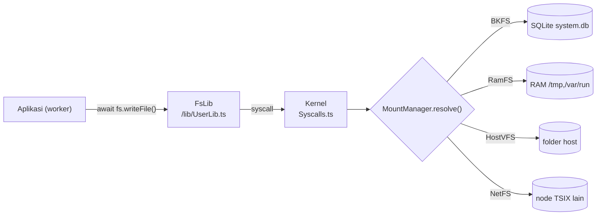

# Operasi File di TSIX

> **TL;DR** — Semua operasi file dari aplikasi TSIX lewat `fs` (`FsLib`, Ring 4) yang
> meneruskan syscall ke driver VFS aktif (BKFS/RamFS/HostVFS/NetFS). Ada tiga gaya:
> **path-based** (`readFile`/`writeFile`), **FD-based** (`open`/`read`/`write`/`close`),
> dan **chunk-based** (`readChunk`/`writeChunk` untuk file besar & progress).
> Contoh lengkap & bisa dijalankan: **`/opt/test/file-operation`** (`--demo` = self-test).

---

## 1. Peta tiga gaya



| Gaya            | API                                                              | Cocok untuk                                                 | Jumlah round-trip                 |
| --------------- | ---------------------------------------------------------------- | ----------------------------------------------------------- | --------------------------------- |
| **Path-based**  | `readFile()`, `writeFile()`                                      | 90% kasus: file kecil–sedang                                | 3 syscall (open+read/write+close) |
| **FD-based**    | `open()`, `read()`, `write()`, `close()`                         | butuh kontrol: banyak tulis, append, tahu kapan file dibuka | manual (Anda yang atur)           |
| **Chunk-based** | `readChunk()`, `writeChunk()`, `getSize()`, `copyWithProgress()` | file besar, progress bar, edit in-place                     | 1 syscall per potongan            |

Semua method `fs` **async** — selalu `await`. Di baliknya, method IVFS bertipe
`MaybePromise` supaya backend sinkron (BKFS/RamFS/HostVFS) tidak membayar biaya
async, sementara NetFS tetap bisa bolak-balik jaringan.

---

## 2. Daftar API `fs` (FsLib)

| Method                        | Signature ringkas                                                     | Nilai balik                             | Kalau gagal                                    |
| ----------------------------- | --------------------------------------------------------------------- | --------------------------------------- | ---------------------------------------------- |
| `readFile`                    | `(path)`                                                              | isi file (`string`)                     | **lempar** `File not found: <path>`            |
| `writeFile`                   | `(path, content)`                                                     | `true`                                  | `false` (fd gagal dibuka)                      |
| `open`                        | `(path, flags = "r")`                                                 | fd (`number`)                           | **lempar** (ENOENT / izin / `Not a directory`) |
| `read`                        | `(fd)`                                                                | isi file                                | `null`                                         |
| `write`                       | `(fd, content)`                                                       | `true`                                  | `false`                                        |
| `close`                       | `(fd)`                                                                | `true`                                  | `false`                                        |
| `stat`                        | `(path)`                                                              | objek metadata                          | **`null`** (tidak lempar)                      |
| `ls`                          | `(path = "/")`                                                        | array entri                             | `[]`                                           |
| `getSize`                     | `(path)`                                                              | jumlah karakter                         | **lempar** kalau tidak ada                     |
| `readChunk`                   | `(path, offset, length)`                                              | potongan (`string`)                     | **`null`** kalau offset di luar isi            |
| `writeChunk`                  | `(path, chunk, offset)`                                               | `true`                                  | `false`                                        |
| `copyWithProgress`            | `(src, dst, onProgress, chunkSize = 126976, reportIntervalMs = 200)`  | `true`                                  | **lempar** kalau src tidak ada                 |
| `mkdir`                       | `(path)`                                                              | `true`                                  | `false`                                        |
| `rmdir`                       | `(path)`                                                              | `true`                                  | `false` (tidak kosong / bukan direktori)       |
| `unlink`                      | `(path)`                                                              | `true`                                  | `false` (tidak ada)                            |
| `chmod`                       | `(path, mode)`                                                        | `true`                                  | `false` (bukan pemilik & bukan root)           |
| `chown`                       | `(path, uid, gid)`                                                    | `true`                                  | `false` (butuh root)                           |
| `getUsage`                    | `(path = "/")`                                                        | `{ size, files, dirs, diskSize? }`      | —                                              |
| `getMounts`                   | `()`                                                                  | `[{ vfsPath, type, source, readOnly }]` | —                                              |
| `mount` / `umount`            | `(vfsPath, hostPath, ro?, type?, uid?, gid?, options?)` / `(vfsPath)` | `true`                                  | `false`                                        |
| `syncToHost` / `syncFromHost` | `(vfsPath, hostPath)` / `(hostPath, vfsPath)`                         | `true`                                  | `false`                                        |

> [!IMPORTANT]
> **Kontrak nilai balik TIDAK seragam** dan itu disengaja (mengikuti semangat syscall):
> `stat()` memakai `null`, `readChunk()` memakai `null`, sementara `readFile()`/`getSize()`/`open()`
> **melempar**. Pola aman: bungkus dengan helper kecil (lihat §3.1) supaya aplikasi
> tidak penuh try/catch.

### 2.1 Apa yang BELUM ada

Belum ada (pakai resep pengganti di §3): `exists()`, `rename()`, `append()` (di userland),
`symlink()`, `truncate()`, `statfs()` per-path, dan juru kunci file (`flock`) — lihat
[§10 Belum ada](#10-belum-ada-kandidat-lanjutan).

---

## 3. Resep siap pakai

### 3.1 Helper anti-try/catch (salin apa adanya)

```typescript
import { Program, std, fs } from "@tsix/Application";

/** stat() aman — null kalau tidak ada. Inilah "file exists" di TSIX. */
async function statOf(path: string) {
    try {
        return await fs.stat(path);
    } catch {
        return null;
    }
}

/** Cek keberadaan tanpa lempar. */
async function existsOf(path: string): Promise<boolean> {
    return (await statOf(path)) !== null;
}

/** getSize() aman: -1 kalau tidak ada. */
async function sizeOf(path: string): Promise<number> {
    try {
        return await fs.getSize(path);
    } catch {
        return -1;
    }
}

/** readFile() aman: null kalau tidak ada. */
async function readWhole(path: string): Promise<string | null> {
    try {
        return await fs.readFile(path);
    } catch {
        return null;
    }
}
```

> [!TIP]
> Pola `stat() !== null` ini juga dipakai perintah sistem — lihat `src/mirror/bin/ls.ts`
> (baris `const info = await fs.stat(t); if (!info) ls: cannot access ...`).

### 3.2 Tulis & baca

```typescript
await fs.writeFile("/tmp/a.txt", "hello\n"); // buat/overwrite (mode 644)
const isi = await fs.readFile("/tmp/a.txt"); // lempar kalau tidak ada, jadi:
const aman = await readWhole("/tmp/a.txt"); // null kalau tidak ada
```

`writeFile()` = `open(path,"w")` → `write` → `close`. Karena `open` dengan flag `"w"`
men-truncate dulu, hasilnya selalu **replace**, bukan tambah.

### 3.3 Tulis lewat FD (kontrol penuh)

```typescript
const fd = await fs.open("/tmp/log.txt", "w");
try {
    await fs.write(fd, "baris 1\n");
    await fs.write(fd, "baris 2\n");
} finally {
    await fs.close(fd); // WAJIB — FD bocor menahan resource sampai proses mati
}
```

Arti flag `open` (dipetakan kernel ke perilaku device file):

| Flag   | Perilaku `write()`                                   | Catatan                                                           |
| ------ | ---------------------------------------------------- | ----------------------------------------------------------------- |
| `"r"`  | ditolak: `Bad File Descriptor: Not open for writing` | file harus ada, kalau tidak → **lempar**                          |
| `"w"`  | append ke file yang sudah di-truncate ⇒ **replace**  | buat file baru bila belum ada (mode 644)                          |
| `"a"`  | **append** ke akhir isi                              | file dibuat saat `write()` pertama (tidak lempar walau belum ada) |
| `"r+"` | **append juga** (tanpa truncate)                     | butuh izin WRITE; jarang dipakai                                  |

> [!NOTE]
> Kernel memetakan `"w"`, `"a"`, dan `"r+"` ke `VFS.append()` — bedanya hanya apakah
> file di-truncate dulu saat `open` (`"w"` ya, `"a"`/`"r+"` tidak). Karena itu
> **tidak ada flag “tulis di offset 0”**: untuk menimpa sebagian isi, pakai
> `writeChunk()` (§3.5).

### 3.4 Append (dua cara)

```typescript
// A. Gaya POSIX — paling murah, isi lama tidak dibaca:
const fd = await fs.open("/tmp/a.txt", "a");
await fs.write(fd, "baris baru\n");
await fs.close(fd);

// B. Gaya chunk — backend-agnostic, jalan sama di mount lokal maupun NetFS:
const size = await sizeOf("/tmp/a.txt");
await fs.writeChunk("/tmp/a.txt", "baris baru\n", size < 0 ? 0 : size);
```

### 3.5 Baca/tulis potongan (chunked I/O)

```typescript
const size = await fs.getSize("/data/besar.bin"); // lempar kalau tidak ada
// 126976 = batas chunk protokol NetFS (124 KB = 4 fragmen MQTNL). Lebih besar
// dari ini DITOLAK ETOOBIG saat path-nya ada di mount NetFS. Di jalur jaringan
// satu panggilan chunk = satu round-trip, jadi potongan besar jauh lebih cepat.
const potongan = await fs.readChunk("/data/besar.bin", 0, 126976);

// Baca berurutan sampai habis:
for (let off = 0; off < size; off += 126976) {
    const chunk = await fs.readChunk("/data/besar.bin", off, 126976);
    if (chunk === null) break; // null = offset di luar isi (EOF)
    proses(chunk);
}

// Edit in-place (MENGGANTI, bukan menyisipkan):
await fs.writeChunk("/tmp/a.txt", "HALO", 0); // 4 karakter pertama → "HALO"
```

> [!WARNING]
> Dua jebakan `writeChunk()`:
>
> 1. `offset > panjang isi` → sisa ruang **diisi spasi**, bukan nol:
>    `"abc"` + `writeChunk("z", 6)` ⇒ `"abc   z"`.
> 2. `offset & length` dihitung dalam **karakter (kode unit JS)**, bukan byte UTF-8.
>    Untuk data biner pakai string latin1 (`String.fromCharCode(byte)`), karena
>    backend (BKFS/HostVFS) menyimpan konten sebagai string.

### 3.6 Salin file besar dengan progress bar

```typescript
const ok = await fs.copyWithProgress(
    "/mnt/host/image.iso",
    "/data/image.iso",
    (pct) => void std.print(`\r${pct}%`),
    126976, // ukuran chunk (default 124 KB — plafon batas chunk NetFS)
    200, // throttle laporan progress (ms)
);
await std.println("");
```

- File kosong tetap menghasilkan file tujuan + `onProgress(100)`.
- `src` tidak ada → **lempar**; `dst` gagal dibuka → `false`.
- `chunkSize` otomatis di-clamp ke **126976** (batas chunk protokol NetFS, 124 KB)
  supaya tetap jalan di mount NetFS. Dua mount yang RTT-nya besar lebih cepat
  dengan potongan besar: `throughput ≈ chunkSize / RTT`.

### 3.7 Metadata, ukuran, daftar isi

```typescript
const node = await fs.stat("/tmp/a.txt");
// { name, type: "FILE"|"DIRECTORY", size, uid, gid, mode, createdAt, modifiedAt }
// null kalau tidak ada

const ukuran = await fs.getSize("/tmp/a.txt"); // jumlah KARAKTER (bukan byte UTF-8)
const items = await fs.ls("/tmp"); // [{ name, type, size, mode, uid, gid, createdAt, modified_at }]
const usage = await fs.getUsage("/"); // { size, files, dirs, diskSize? }
```

> [!NOTE]
> Inkonsistensi kecil yang perlu diingat: `stat()` mengembalikan `modifiedAt`,
> sedangkan `ls()` mengembalikan `modified_at`. Selain itu `getUsage(path)`
> melaporkan **seluruh filesystem** yang menaungi path itu (mount-nya),
> bukan hanya subdirektori tersebut.

### 3.8 Direktori

```typescript
await fs.mkdir("/var/lib/nya/bekas"); // REKURSIF: induk ikut dibuat
await fs.mkdir("/var/lib/nya/bekas"); // tetap true (idempotent)
await fs.rmdir("/var/lib/nya/bekas"); // false kalau masih berisi
```

> [!TIP]
> **`mkdir()` TSIX = `mkdir -p`**: semua segmen path dibuat dan pemanggilan ulang
> tetap `true`. Tidak ada perintah `mkdir -p` terpisah — berlaku di semua backend
> (VFS/RamFS/BKFS membuat segmen satu per satu, HostVFS memakai
> `fs.mkdirSync(..., { recursive: true })`).
> `rmdir()` tetap POSIX: hanya direktori **kosong**, jadi hapus dari yang terdalam.

### 3.9 Hapus, permission, mount

```typescript
await fs.unlink("/tmp/a.txt"); // false kalau tidak ada
await fs.chmod("/sbin/app", 0o755); // pemilik atau root
await fs.chown("/data/berkas", 1000, 1000); // root saja

const mounts = await fs.getMounts(); // [{ vfsPath, type, source, readOnly }]
await fs.mount("/mnt/usb", "/home/me/usb", false, "host"); // folder host → VFS
await fs.umount("/mnt/usb");
await fs.syncToHost("/root/out.txt", "/home/me/out.txt"); // VFS → host (HostVFS)
```

### 3.10 Aplikasi lengkap (kerangka minimal)

```typescript
import { Program, std, fs, shell } from "@tsix/Application";

export const main = Program(async (args: string[]) => {
    const path = args[0];
    if (!path) {
        await std.print("usage: myapp <file>\n");
        await shell.exit(64); // EX_USAGE
        return;
    }
    try {
        const node = await fs.stat(path);
        if (!node) {
            await std.println(`${path}: not found`);
            await shell.exit(1);
            return;
        }
        await std.println(node.type === "DIRECTORY" ? `directory (${node.mode.toString(8)})` : await fs.readFile(path));
    } catch (err: any) {
        await std.println(`error: ${err.message}`);
        await shell.exit(1);
    }
});
```

---

## 4. Dari shell (tanpa menulis aplikasi)

| Kebutuhan        | Perintah TSIX                                  | Catatan                                        |
| ---------------- | ---------------------------------------------- | ---------------------------------------------- |
| lihat isi        | `cat f` · `head -5 f` · `tail -5 f` · `less f` | `less`/`more` interaktif                       |
| daftar isi       | `ls dir`                                       | `ls -l`-style ada di `ls`                      |
| buat direktori   | `mkdir a/b/c`                                  | sudah rekursif (lihat §3.8)                    |
| buat file kosong | `echo -n > f`                                  | belum ada perintah `touch`                     |
| hapus            | `rm f` · `rm -r dir`                           | `rm -f` diam kalau tidak ada                   |
| salin / pindah   | `cp src dst` · `mv src dst`                    | `mv` juga untuk rename                         |
| permission       | `chmod 755 f` · `chown u:g f`                  | `chgrp` juga ada                               |
| lihat biner      | `xxd f`                                        | hexdump + offset                               |
| hitung           | `wc f` · `sort f` · `grep pola f` · `awk ...`  | pipeline `\|` & redirection `>` didukung `tsh` |
| cari file        | `find / -name "*.txt"`                         |                                                |
| ruang & mount    | `df` · `lsblk` · `mount`/`umount`              | `lsblk` menampilkan `,stale` untuk NetFS       |
| editor           | `atto f`                                       | editor full-screen                             |

Belum ada perintah shell: `touch`, `stat`, `rename`, `du`, `ln`. Untuk `touch`:
`echo -n > f`; untuk `stat`: pakai `ls -l` atau aplikasi/demo di §6.

---

## 5. Path mana yang persisten?

| Path                     | Driver                     | Persisten?              | Catatan                                         |
| ------------------------ | -------------------------- | ----------------------- | ----------------------------------------------- |
| `/` (kecuali mount lain) | **BKFS** (`system.db`)     | ✅ boot berikutnya      | file sistem & `/etc`, `/bin`, `/opt`            |
| `/tmp`                   | **RamFS**                  | ❌ hilang saat reboot   | mode `1777` (world-writable)                    |
| `/var/run`               | **RamFS** (dijamin kernel) | ❌ hilang saat reboot   | state runtime; lihat [RC_LOCAL.md](RC_LOCAL.md) |
| `/mnt/host-*`            | **HostVFS**                | ✅ folder nyata di host | `mount`, `syncToHost`/`syncFromHost`            |
| `/mnt/<node>`            | **NetFS**                  | ✅ (milik node lain)    | lewat MQTNL, lihat [netfs.md](netfs.md)         |

Konsekuensinya untuk penulisan file:

- **Jangan** simpan data penting di `/tmp` — ramfs hilang saat reboot.
- Untuk file sementara yang besar, RamFS justru menguntungkan (RAM, cepat) tapi
  memakan memori node.
- Tulis ke NetFS = latensi jaringan: pakai `writeChunk`/`copyWithProgress` dengan
  chunk ≤ 124 KB, dan siapkan `ETIMEDOUT`/`stale` sebagai kondisi normal.
  Satu panggilan = satu round-trip, jadi ukuran chunk menentukan throughput
  (`≈ chunk / RTT`), bukan bandwidth.

---

## 6. Demo: `/opt/test/file-operation`

Sumber: `src/mirror/opt/test/file-operation.ts` — ikut terpasang ke VFS oleh
`npm run install` (direktori `/opt` otomatis diberi bit eksekusi).

```bash
# dari tsh di TSIX
/opt/test/file-operation --help
/opt/test/file-operation --demo                     # uji SEMUA operasi (self-test)

/opt/test/file-operation --write  /tmp/notes.txt hello world
/opt/test/file-operation --read   /tmp/notes.txt
/opt/test/file-operation --append /tmp/notes.txt " second line"
/opt/test/file-operation --chunk  /tmp/notes.txt 0 5
/opt/test/file-operation --info   /tmp/notes.txt
/opt/test/file-operation --exists /tmp/notes.txt   # exit 1 kalau tidak ada
/opt/test/file-operation --mkdir  /tmp/nested/deep  # rekursif, tanpa -p
/opt/test/file-operation --copy   /tmp/big.bin --chunk-size 126976
```

Daftar perintah (semuanya menerima bentuk `--nama` atau `nama`):

| Kelompok               | Perintah                                                                 |
| ---------------------- | ------------------------------------------------------------------------ |
| Tulis                  | `--write`, `--write-fd`, `--append`, `--append-fd`, `--patch`, `--touch` |
| Baca                   | `--read`, `--chunk`, `--size`, `--wc`                                    |
| Salin & metadata       | `--copy`, `--info` (`--stat`), `--exists`, `--ls`, `--usage`, `--mounts` |
| Direktori & permission | `--mkdir`, `--rmdir`, `--rm`, `--chmod`, `--chown`                       |
| Uji mandiri            | `--demo`                                                                 |

`--demo` menjalankan semuanya ke `/tmp/file-op-demo/` dan melaporkan hasil.
Keluaran aslinya (dijalankan 2026-09-19, 44 pemeriksaan — semuanya lulus):

```
FILE OPERATION DEMO — /tmp/file-op-demo
✓ writeFile() = true
✓ readFile() = "line one\nline two\n"
✓ getSize() = 18
✓ open("r") returns fd = "number"
✓ read(fd) = "line one\nline two\n"
✓ close(fd) = true
✓ readChunk(0, 10) = "line one\nl"
✓ readChunk(9, 9) = "line two\n"
✓ readChunk(far offset) → null (EOF) = null
✓ writeChunk(0, "LINE") = true
✓ content after patch = "LINE one\nline two\n"
✓ append (writeChunk at end) = true
✓ size after append = 29
✓ open("a") then write() = true
✓ content = old + appended = "LINE one\nline two\nline three\nline four\n"
✓ writeChunk(offset 6) → space padding = "abc   z"
✓ getSize() large file = 200633
✓ copy reached 100% = 100
✓ copy content identical = true
✓ stat() missing path → null = null
✓ ls() lists files & subdir = ["big.txt","copy.txt","notes.txt","padding.txt","sub"]
✓ mkdir("a/b/c") recursive = true
✓ mkdir() again → still true (idempotent) = true
✓ rmdir() on non-empty dir → false = false
✓ mode after chmod = "755"
✓ rmdir() a/b/c → true = true
✓ getUsage() reports >= 2 files = true

ALL CHECKS PASSED — 44 checks.
```

Exit code: `0` sukses · `1` operasi gagal (`--demo` juga 1 bila ada check gagal) ·
`64` salah pemakaian. Karena itu ia bisa dipakai di skrip:

```sh
#!/bin/tsh
if /opt/test/file-operation --exists /etc/fstab.json; then
  echo "fstab ada"
else
  echo "fstab belum dibuat"
fi
```

---

## 7. Gotcha & troubleshooting

| Gejala                                         | Penyebab                                                          | Solusi                                                        |
| ---------------------------------------------- | ----------------------------------------------------------------- | ------------------------------------------------------------- |
| `File not found: /x`                           | `readFile()`/`getSize()`/`open("r")` **melempar** kalau tidak ada | cek dulu dengan `stat()` (§3.1), atau bungkus try/catch       |
| `Permission Denied: Cannot open ...`           | mode file menolak (`SATPAM`)                                      | `chmod`, atau jalankan sebagai pemilik/root                   |
| `Permission Denied: Cannot create file in ...` | direktori induk tidak writable                                    | `chmod` induk, atau buat di direktori lain                    |
| `Bad File Descriptor: Not open for writing`    | `write()` ke fd yang dibuka `"r"`                                 | buka dengan `"w"`/`"a"`/`"r+"`                                |
| Isi file aneh (`abc   z`)                      | `writeChunk()` di offset > panjang isi → padding spasi            | pastikan `offset <= panjang isi`                              |
| Ukuran ≠ ukuran byte di host                   | `size`/offset = **karakter**, bukan byte UTF-8                    | pakai string latin1 untuk data biner                          |
| File hilang setelah reboot                     | ditulis ke `/tmp` atau `/var/run` (ramfs)                         | tulis ke `/` (BKFS) atau HostVFS                              |
| Operasi menggantung di `/mnt/<node>`           | peer NetFS mati                                                   | `netfs status`, `lsblk` (`stale`), lihat [netfs.md](netfs.md) |
| `EROFS` saat menulis                           | mount read-only (`--ro`)                                          | remount rw, atau tulis ke path lain                           |
| FD bocor (`open` tanpa `close`)                | `pcb.fdTable` tumbuh; resource ditahan sampai proses mati         | selalu `close()` di blok `finally`                            |

---

## 8. Diagnosa cepat

```bash
df                                  # ruang per mount (NET = netfs, STALE = peer mati)
lsblk                               # daftar mount + opsi (rw,stale)
/opt/test/file-operation --mounts   # mount dari sudut pandang aplikasi
/opt/test/file-operation --usage /  # jumlah file/dir + ukuran per filesystem
xxd /tmp/a.txt                      # verifikasi isi byte-per-byte
cat /logs/boot.log                  # kegagalan mount saat boot
```

---

## 9. Test otomatis

```bash
npx vitest run src/vfs src/kernel/Syscalls.test.ts
```

- Unit test backend VFS langsung (tanpa kernel) lewat `RamFS`/`BKFS`.
- Untuk app di worker, pakai harness loader:
  `node scripts/test/worker-dme-smoke.mjs src/mirror/opt/test/file-operation.ts -- --help`
  (membuktikan graf modul + entry point bisa dimuat runtime).

> [!NOTE]
> Semua semantik di halaman ini (nilai balik, padding chunk, `mkdir` rekursif,
> pengecualian ENOENT) **diverifikasi terhadap backend VFS asli**, bukan dari
> dokumentasi kode saja — dan `file-operation --demo` adalah cara mengulang
> verifikasi itu di node mana pun.

---

## 10. Belum ada (kandidat lanjutan)

| Fitur                   | Dampak                            | Alternatif sekarang                                  |
| ----------------------- | --------------------------------- | ---------------------------------------------------- |
| `exists()` di FsLib     | nyaman                            | `stat() !== null`                                    |
| `rename()` / pindah     | belum bisa atomic rename          | `cp` + `rm`, atau `mv` (shell)                       |
| `append()` di FsLib     | belum terekspos ke userland       | `open("a")` + `write`, atau `getSize` + `writeChunk` |
| `truncate(path, size)`  | memotong file tanpa menulis ulang | `readChunk` + `writeFile`                            |
| `flock` (advisory lock) | race antar-daemon                 | buat file penanda + `waitfile`                       |
| `symlink`/`link`        | tidak ada                         | mount/path langsung                                  |
| `statfs` per path       | `getUsage()` masih per-filesystem | `getUsage()`                                         |

---

**Halaman terkait:**
[💾 Virtual File System](Virtual-File-System.md) ·
[🌐 NetFS](netfs.md) ·
[📖 Panduan Developer](Panduan-Developer.md) ·
[🧾 Perintah Sistem](Perintah-Sistem.md) ·
[RC_LOCAL.md](RC_LOCAL.md)
