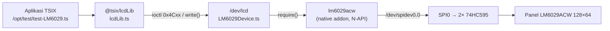

# LCD LM6029ACW — Driver `/dev/lcd` + `@tsix/lcdLib`

> LCD monokrom **128×64** (controller **LM6029ACW**) yang dikendalikan lewat
> **SPI0 + 2× 74HC595**, dirender memakai port **Adafruit_GFX**.
> Dari sisi aplikasi, layar ini hanyalah sebuah file: **`/dev/lcd`**.

Dokumen ini mencakup tiga lapisan: driver kernel, library userland, dan native
addon yang menyentuh hardware.

---

## 1. Rantai lengkap



| Lapisan | File | Tanggung jawab |
| --- | --- | --- |
| Aplikasi | `src/mirror/opt/**` | memakai `lcd.*` — tidak pernah menyentuh ioctl/hardware |
| Library | `src/mirror/lib/lcdLib.ts` | bungkus FD + ioctl jadi API ala Adafruit_GFX |
| Driver (HAL) | `src/kernel/devices/aux-devices/LM6029Device.ts` | kontrak `IDevice`, terjemahan ioctl, refcount FD, hotplug |
| Native addon | paket npm **`lm6029acw`** | bit-shifting 74HC595, urutan command, algoritma gambar, font |

> **Aturan HAL:** driver `/dev/lcd` hanya jembatan. Semua kerja hardware ada di
> addon. Kalau addon tidak terpasang, TSIX tetap boot normal — node `/dev/lcd`
> saja yang tidak muncul.

---

## 2. Instalasi

### 2.1 Aktifkan SPI

```bash
ls /dev/spidev0.0        # kalau tidak ada:
sudo raspi-config        # Interface Options → SPI → Enable → reboot
```

### 2.2 Native addon `lm6029acw`

Addon ini **native** (dibuild saat install), Linux-only, tanpa dependensi
bcm2835 — jadi jalan di SBC Linux apa pun yang punya `spidev`.

```bash
# dibutuhkan sekali di mesin target:
sudo apt install build-essential python3

npm install lm6029acw
```

Di TSIX, addon sudah dideklarasikan sebagai **optionalDependency**, jadi
`npm install` di repo tsix akan mengambilnya otomatis.

**Urutan pencarian addon** oleh driver (berhenti di yang pertama cocok):

1. opsi `addonPath` (eksplisit, untuk dev)
2. env `TSIX_LCD_ADDON_PATH`
3. `require("lm6029acw")` → `node_modules/` ← jalur produksi
4. `require("raspi-lcd-addon")` → **alias nama lama**, masih didukung
5. `~/lm6029acw` lalu `~/raspi-lcd-addon` (sibling repo saat development)
6. `../../../../../lm6029acw` (relatif ke folder `aux-devices`)

### 2.3 Kalau addon tidak ada

Perilaku degradasi yang disengaja:

```
open() gagal → initialized = false
             → present() = false   → `/dev/lcd` otomatis HILANG dari `ls /dev`
             → alasan dicatat di syslog
```

Tidak ada crash, tidak ada node "setengah hidup".

---

## 3. Pemakaian dari aplikasi (`@tsix/lcdLib`)

```typescript
import { lcd, LcdFont } from "@tsix/lcdLib";

if (await lcd.isAvailable()) {
  await lcd.setContrast(40);
  await lcd.clear();
  await lcd.setFont(LcdFont.FREE_SANS_BOLD_12);
  await lcd.printText("Halo TSIX", 0, 20, 1);
  await lcd.drawRect(0, 0, 128, 64);
  await lcd.flush();               // kirim buffer ke panel
}
```

### 3.1 Grafis

| Method | Keterangan |
| --- | --- |
| `drawPixel(x, y, color?)` | 1 piksel (`color` 1 = nyala, 0 = mati) |
| `fillScreen(color?)` | seluruh layar |
| `drawLine(x0, y0, x1, y1, color?)` | garis |
| `drawRect` / `fillRect(x, y, w, h, color?)` | kotak outline / terisi |
| `drawCircle` / `fillCircle(x, y, r, color?)` | lingkaran |
| `drawTriangle` / `fillTriangle(x0,y0,x1,y1,x2,y2, color?)` | segitiga |
| `drawRoundRect` / `fillRoundRect(x, y, w, h, r, color?)` | sudut membulat |
| `drawBitmap(x, y, data, w, h, color?)` | bitmap 1 bpp MSB-first |

### 3.2 Teks

| Method | Keterangan |
| --- | --- |
| `setFont(id)` | `LcdFont.DEFAULT`(5×7) / `FREE_SANS_9` / `FREE_SANS_BOLD_12` / `FREE_MONO_9` |
| `setTextColor(color, bg?)` | isi `bg` → mode opaque |
| `setTextSize(n)` | perbesaran (1 = normal) |
| `setTextWrap(bool)` | word-wrap otomatis |
| `setCursor(x, y)` | posisi kursor |
| `print(text)` | cetak di kursor |
| `printText(text, x, y, size?)` | cetak sekali di posisi tertentu |
| `printCentered(text, y, size?)` | rata tengah (estimasi lebar font default) |

### 3.3 Kontrol tampilan & lifecycle

| Method | Keterangan |
| --- | --- |
| `clear()` / `flush()` / `display()` / `reset()` | buffer & panel |
| `setAutoFlush(bool)` | bila ON, `print()`/`blit()` langsung tampil |
| `setContrast(0..63)` / `getContrast()` | EVR — default 31, nyaman 28–38 |
| `setBacklight(bool)` / `getBacklight()` | pin LED di 74HC595 |
| `setInvert(bool)` / `getInvert()` | tukar piksel nyala ⇄ mati |
| `setDisplayOn(bool)` / `isDisplayOn()` | isi buffer aman saat OFF |
| `setSpiSpeed(hz)` / `getSpiSpeed()` | clock SPI aktual |
| `setRotation(0..3)` | rotasi tampilan |
| `getInfo()` / `isAvailable()` / `close()` | status & FD |

---

## 4. Framebuffer 1 bpp (paling cepat)

Untuk animasi penuh-layar, menggambar di memori lalu mengirim 1024 byte
sekali jauh lebih hemat daripada ratusan ioctl:

```typescript
const fb = lcd.framebuffer();     // LcdFramebuffer, 1024 byte
fb.clear();
fb.line(0, 0, 127, 63);
fb.fillCircle(64, 32, 20);
fb.setPixel(10, 10, 1);
await lcd.blit(fb);               // blit penuh + auto-flush
```

**Layout byte** — raster scanline 1 bpp, MSB-first (format `drawBitmap`
Adafruit_GFX), jadi bisa langsung di-`dd` ke `/dev/lcd`:

```
byteIndex = y * (width / 8) + (x >> 3)
bit       = 0x80 >> (x & 7)        // bit MSB = piksel paling kiri
```

`LcdFramebuffer` juga menyediakan `clear`, `setPixel`, `getPixel`,
`togglePixel`, `hLine`, `vLine`, `line`, `rect`, `fillRect`, `circle`,
`fillCircle`, `invert`.

> Bedakan dengan `FrameBuffer` di `@tsix/framebuffer` — itu RGBA berwarna untuk
> DDC/browser. Yang ini khusus panel monokrom.

---

## 5. Tulis langsung ke `/dev/lcd`

Driver menerima tiga bentuk data:

| Data | Efek |
| --- | --- |
| `Buffer`/`Uint8Array` **1024 byte** | blit framebuffer penuh (auto-flush) |
| `Buffer` pendek / `string` | dicetak sebagai teks di kursor |
| `{ op: "fillRect", args: [1,1,2,2,1] }` | panggil primitive GFX |

Buffer yang melewati syscall/IPC (ternormalisasi jadi
`{ type: "Buffer", data: [...] }`) tetap dikenali.

---

## 6. ioctl (namespace `0x4C` = `'L'`)

Kalau perlu kontrol di bawah `lcdLib` — mis. dari bahasa lain atau shell —
namespace-nya sudah dipesan agar tidak bentrok dengan driver lain
(joystick `0x4A`, httpd `0x51`, wsd `0x52`, MCP23017 `0x30`).

| Grup | Range | Isi |
| --- | --- | --- |
| Lifecycle | `0x4C01`–`0x4C04` | BEGIN, RESET, CLEAR, DISPLAY |
| Grafis | `0x4C10`–`0x4C1B` | DRAW_PIXEL … DRAW_BITMAP |
| Teks | `0x4C20`–`0x4C27` | SET_FONT … SET_ROTATION |
| Kontrol tampilan | `0x4C30`–`0x4C39` | kontras, backlight, inversi, SPI |
| Info & tuning | `0x4C40`–`0x4C44` | GET_INFO, ukuran, auto-flush |

Argumennya fleksibel: objek bernama (`{ x, y, w, h, color }`) **atau** array
posisional (`[x, y, w, h, color]`). Definisi lengkap ada di enum `LCDIOCTL`.

Driver juga menangani ioctl refcount FD (`10/11/20/21`) yang dipanggil kernel
saat `open`/`close` — sama seperti `PipeDevice`.

---

## 7. CLI: `test-LM6029`

Utilitas di `/opt/test/test-LM6029.ts` — sekaligus contoh pemakaian `lcdLib`.

| Perintah | Fungsi |
| --- | --- |
| `test-LM6029` | suite visual 7 scene (bentuk, font, inversi, font kustom, grafik, bar, framebuffer) |
| `test-LM6029 --fast` | suite dengan jeda lebih singkat |
| `test-LM6029 info` | status lengkap driver |
| `test-LM6029 text "Halo"` | cetak teks |
| `test-LM6029 graph` | plot gelombang sinus |
| `test-LM6029 fb` | kirim framebuffer 1024 byte |
| `test-LM6029 contrast [0-63]` | set / sweep kontras |
| `test-LM6029 backlight on\|off` | backlight |
| `test-LM6029 invert on\|off` | inversi |
| `test-LM6029 display on\|off` | display on/off |
| `test-LM6029 speed [hz]` | set / sweep clock SPI + pola integritas |
| `test-LM6029 fps [detik]` | benchmark 4 fase (render / flush / full / blit) |

---

## 8. Troubleshooting

**`/dev/lcd` tidak muncul di `ls /dev`**
Bukan error. Driver memanggil `present()` → `false` saat panel belum siap.
Cek berurutan: (1) `/dev/spidev0.0` ada? (2) `npm ls lm6029acw` terpasang?
(3) syslog kernel mencatat alasan pastinya.

**Tulisan pudar / ada baris hilang**
Naikkan kontras. Di bawah EVR ~20 tulisan 1 px mulai hilang; di atas ~55
gradasi dithering menyatu jadi putih semua.

**Clock SPI "tidak sesuai permintaan"**
Di Raspberry Pi, clock SPI = core clock / 2^CDIV dan CDIV harus pangkat dua.
Minta **32 MHz**, bukan 25 MHz, untuk dapat ~31.25 MHz. Cek core clock:
`vcgencmd measure_clock core`.

**Animasi terasa lambat**
Bottleneck-nya biasanya overhead syscall, bukan SPI. Pakai `blit()` framebuffer
(1 kali kirim 1024 byte) daripada ratusan ioctl gambar. Bandingkan angkanya
dengan `test-LM6029 fps`.

**Gagal `npm install lm6029acw`**
Pastikan `build-essential` + `python3` terpasang. Di non-Linux npm akan
melewatinya (addon ini `os: ["linux"]`).

---

## 9. Referensi

| Apa | Di mana |
| --- | --- |
| Driver | `src/kernel/devices/aux-devices/LM6029Device.ts` |
| Library | `src/mirror/lib/lcdLib.ts` |
| Demo / CLI | `src/mirror/opt/test/test-LM6029.ts` |
| Unit test | `LM6029Device.test.ts`, `lcdLib.test.ts` |
| Native addon (source) | <https://github.com/codeforged/lm6029acw> |
| Native addon (npm) | <https://www.npmjs.com/package/lm6029acw> |

Lihat juga: [`DEVELOPER_GUIDE_DEVICES.md`](DEVELOPER_GUIDE_DEVICES.md) untuk pola
umum membuat driver, dan [`mcp23017-registration.md`](mcp23017-registration.md)
sebagai contoh driver I2C.

Changelog: [`changelogs/lcd.md`](changelogs/lcd.md)
