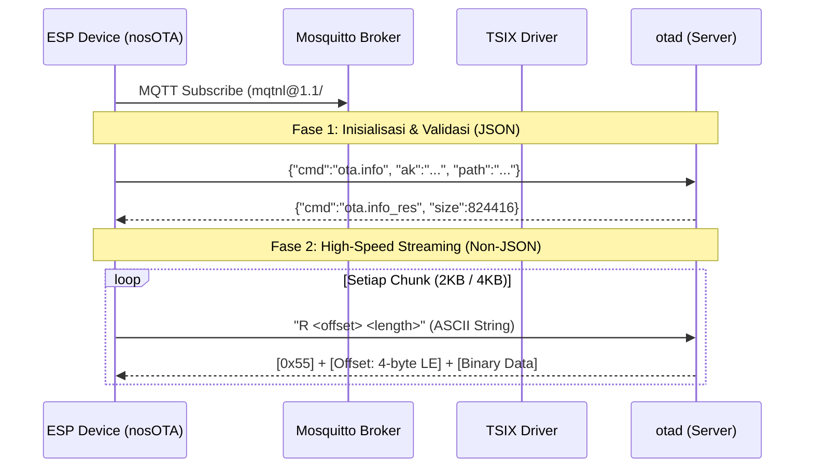

# MQTNL v1.1 Turbo Binary OTA

Dokumen ini menjelaskan arsitektur dan spesifikasi teknis dari implementasi **High-Speed Binary OTA** menggunakan protokol MQTNL v1.1 pada ekosistem TSIX. Implementasi ini berhasil mempercepat proses OTA firmware ESP8266 & ESP32 secara drastis (±800KB dalam ~100 detik, 300KB dalam ~20 detik) dengan memanfaatkan mode Plain UDP-Like, bypass enkripsi, dan chunk data yang presisi terhadap memori Flash.

---

## 1. Topologi Komunikasi

---

## 2. Struktur Paket MQTNL v1.1 (Base Wrapper)

Setiap paket yang dikirim baik oleh ESP maupun Server dibungkus oleh **MQTNL v1.1 Header** murni sebelum diserahkan ke Mosquitto (MQTT payload).

| Ukuran (Byte) | Field | Deskripsi |
|---|---|---|
| 2 | `Magic Byte & Ver`| Selalu bernilai `0x42` (Huruf 'B') dan `0x01` (v1.1) |
| 1 | `Src Addr Len` | Panjang karakter ID pengirim (misal: "OTA-DEVICE" = 10) |
| N | `Src Addr` | ID pengirim dalam bentuk ASCII String |
| 2 | `Src Port` | Port pengirim (Little-Endian) |
| 1 | `Dst Addr Len` | Panjang karakter ID tujuan (misal: "antigonon" = 9) |
| N | `Dst Addr` | ID target dalam bentuk ASCII String |
| 2 | `Dst Port` | Port target (Little-Endian) |
| 2 | `Packet Count`| Jumlah fragmen pesen (untuk OTA mode Turbo ini selalu `0x01 0x00` alias 1 paket statis) |
| 2 | `Packet Index`| Urutan indeks (selalu `0x00 0x00`) |
| 4 | `Data Size` | Panjang Payload sesungguhnya (Little-Endian) |
| 1 | `Flag` | Penanda tipe paket (Data umum = `0x0A`) |
| 1 | `Forwarded` | Sistem routing inter-node (Biasa diset `0x00`) |
| X | **`Payload`** | *Lihat bagian "Spesifikasi Payload" di bawah* |

---

## 3. Spesifikasi Payload (Interaksi OTA)

Selama proses OTA berlangsung, terdapat bypass pengamanan (Enkripsi Dinonaktifkan alias *Mode PLAIN*) secara khusus untuk lalu-lintas biner agar tidak dihinggapi *overhead security* (Nonce + Tag = 28 byte) yang merusak ukuran (alignment) memori Buffer Flash ESP.

### A. Permintaan Chunk File (Dari ESP ke Server)
Meminta bongkahan firmware dilakukan menggunakan format **Mini-ASCII Request**.
Alasan menggunakan ASCII murni adalah untuk menghindari efek mutilasi string / bad-encoding (`\uFFFD`) saat melewati pipa sandi-sandi IPC milik TSIX untuk _byte-byte_ berbahaya (di atas 127/0x7F seperti `32768 = 0x8000`).

- **Format:** `R <offset> <length>`
- **Contoh Payload:** `"R 2048 2048"` atau `"R 32768 4096"`

_Pada server binaan `otad.ts`, terdapat filter khusus "_ASCII Request Detection_" yang merespons string awalan `"R "` secara berkecepatan tinggi tanpa masuk ke JSON parser._

### B. Balasan Chunk (Dari Server ke ESP)
Server membalas dengan paket Firmware Mentah (*Raw Binary*) memotong `Buffer` langsung dari RAM (Virtual Buffer tanpa _disk I/O_), sehingga respon jauh di bawah milidetik.

| Posisi | Ukuran | Nilai | Tujuan |
|---|---|---|---|
| `[0]` | 1 Byte | `0x55` | *Magic Indicator* bahwa ini adalah Balasan Chunk OTA Biner |
| `[1 - 4]` | 4 Byte | `Offset` | Posisi offset memori dikirim balik (Little Endian) |
| `[5 - X]` | X Byte | `Data` | Potongan byte _Firmware.bin_ (*4096* / *2048* byte) |

Ketika diterima di perangkat (`nosOTA.cpp`), logika akan melakukan loncatan `data = payload + 5` untuk menggali data murni sebelum mengeksekusinya menggunakan `Update.write()`.

---

## 4. Troubleshooting & Kernel Traps di TSIX
Perhatian jika membuat daemon sejenis di area kernel TSIX:
1. **Buffer IPC Degradation:** 
   Native Node.js `Buffer` akan diubah menjadi JSON `{"type": "Buffer", "data": [...] }` ketika melompat keluar dari Kernel `SimpleMQTNLDriver.ts` masuk ke Userland Process (`otad.ts`). Perlu prosedur "_Resurrect IPC Buffers_" yakni `Buffer.from(payload.data)`.
2. **JSON Cleaner Trap:** 
   Jangan menginjeksi karakter Non-printable ASCII (misal `\x00 - \x1F`) jika driver akan mengubahnya menjadi `string`. Rutinitas disinfeksi input (`.replace(/[\x00-\x1F\x7F]/g, '')`) akan merusak Request Binary anda menjadi debu. Gunakan transmisi ASCII bersih seperti implementasi request `"R 32768 2048"`.
3. **Fragmentation Hazard:** 
   Jangan membuat konfigurasi `chunkSize` OTA melampaui `MTU` Reassembly di MQTT layer (`4096`). Paket melebihi kapasitas tanpa reassembly ESP akan hang, sehingga buffer standar yang dipatok adalah **2048 atau 4096 byte** untuk keamanan transmisi.

> **Dokumen disusun untuk Referensi Internal Sistem NosOTA TSIX.**
> *Pencapaian: Real-world stress test memproses OTA ROM 824KB dalam ~100 detik. (ESP32-C3)*
