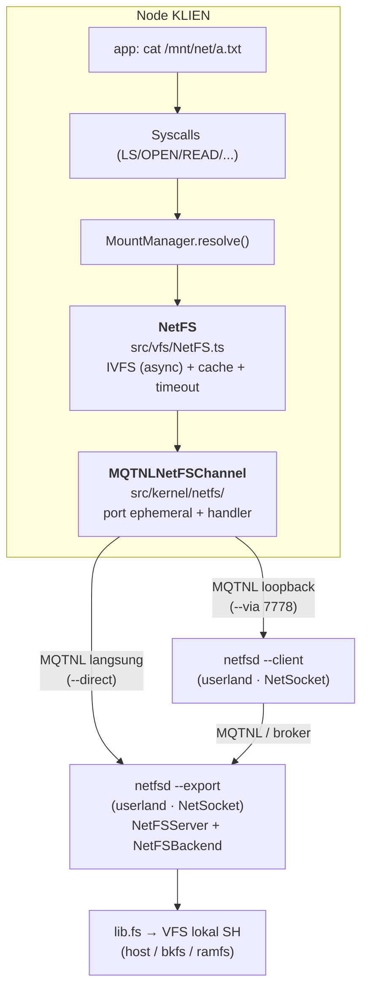
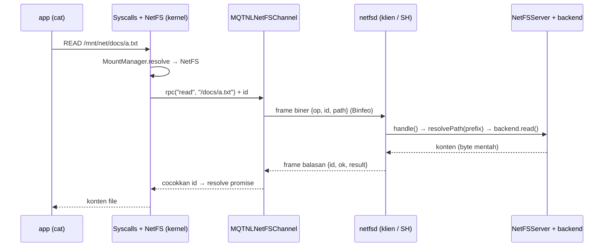

# 🌐 NetFS — Filesystem Antar-Node lewat MQTNL

> **NetFS** membuat filesystem milik node TSIX lain tampil sebagai mount point
> biasa: `cat /mnt/net/docs/a.txt` — padahal isinya diambil dari node lain.
> Transport-nya **MQTNL** (broker MQTT), jadi **tidak butuh IP publik** dan
> tidak perlu sewa VPS: cukup kedua node berada di broker yang sama.
>
> Analogi: NetFS itu "NFS versi TSIX", tapi server-nya (`netfsd --export`)
> dan klien-nya memakai **NetSocket**, dan driver VFS di kernel tetap tipis.

**Status:** driver VFS (kernel) + SL & daemon klien (userland) sudah jalan, 45 test hijau.

---

## 1. Kenapa MQTNL, bukan TCP/IP?

| Alasan                                              | Konsekuensi desain                                                |
| --------------------------------------------------- | ----------------------------------------------------------------- |
| MQTNL adalah medium network andalan TSIX            | tidak perlu IP publik / port forwarding / VPS                     |
| Routing lewat broker yang sudah ada                 | node baru cukup "numpang" di broker yang sama                     |
| Sudah punya fragmentasi + reassembly                | payload besar dipecah per 32 KB (MQTNL), tidak terlihat pemanggil |
| Sudah punya security agent per-port                 | `--key <64 hex>` → ChaCha20-Poly1305 / AES-GCM                    |
| Punya protocol **Binfeo** (biner + bisa dienkripsi) | konten file lewat byte mentah — tanpa JSON/base64                 |

Konsekuensi yang diterima: 1 operasi = 1 round-trip, jadi latensi lebih tinggi
daripada filesystem lokal. File besar ditangani `readChunk`/`writeChunk` per
124 KB (otomatis di driver), dan tersedia `--cache <ms>` untuk meredam `ls`/
`stat` yang berulang.

---

## 2. Peta komponen



| Lapisan            | File                                    | Land     | Tanggung jawab                                                        |
| ------------------ | --------------------------------------- | -------- | --------------------------------------------------------------------- |
| Driver VFS         | `src/vfs/NetFS.ts`                      | kernel   | implementasi `IVFS`: korelasi `id`, timeout, cache, kode error        |
| Protokol           | `src/common/netfs/NetFSProtocol.ts`     | shared   | op, codec **frame biner v2** (tag nilai + blob), parsing `addr:port`  |
| Inti SL            | `src/common/netfs/NetFSServer.ts`       | shared   | eksekusi op ke backend, prefix export, pagar read-only, mapping error |
| Transport kernel   | `src/kernel/netfs/MQTNLNetFSChannel.ts` | kernel   | "socket" kernel: alokasi port MQTNL + register handler + send         |
| Transport userland | `src/mirror/sbin/netfsd.ts`             | userland | SL (`--export`) & jembatan klien (`--client`), pakai **NetSocket**    |
| Adapter userland   | `src/mirror/lib/NetFSBackend.ts`        | userland | `IVFS` → `lib.fs` (syscall), termasuk efek root-squash                |
| Alat diagnosa      | `src/mirror/bin/netfs.ts`               | userland | `netfs info/ls/cat/status` (via NetSocket, tanpa mount)               |

Kenapa dibelah dua begitu? Karena `IVFS` hidup di kernel, sedangkan NetSocket
adalah komponen **userland**. Maka kernel tetap memakai driver MQTNL (lapisan
socket yang sama dengan yang dipakai NetSocket), dan seluruh logika jaringan
yang "kaya" (handshake, enkripsi, proxy) ada di userland.

---

## 3. Alur satu operasi



---

## 4. Cara pakai

### 4.1 Di node storage host (SH)

```bash
# /mnt/shared = export read-only, terenkripsi
netfsd --export /mnt/shared --label shared --port 7777 --ro --key <64-hex>

# sudut pandang kernel SH
root@tsix_2# lsblk
MOUNTPOINT           TYPE       SOURCE                    OPTS
/mnt/shared          host       shared                    rw
/mnt/sbak            bkfs       systembak.db              rw
```

### 4.2 Di node klien

```bash
# A. lewat daemon klien (disarankan: urusan jaringan tetap di userland)
netfsd --client --to tsix_2:7777 --port 7778 --key <64-hex>
mount /mnt/net tsix_2:7777 --netfs --via 7778 --key <64-hex> --cache 500

# B. langsung ke SL (tanpa daemon klien)
mount /mnt/net tsix_2:7777 --netfs --direct --key <64-hex>

root@tsix# lsblk
MOUNTPOINT           TYPE       SOURCE                    OPTS
/mnt/net              netfs      tsix://tsix_2:7777        rw
root@tsix# cat /mnt/net/docs/a.txt      # dibaca dari node lain
```

Cek dulu sebelum mount (tanpa mount, murni NetSocket):

```bash
netfs info tsix_2:7777          # label, prefix, read-only, ops, RTT
netfs ls   tsix_2:7777 /docs
netfs cat  tsix_2:7777 /docs/a.txt
netfs status                    # mount netfs aktif + status stale
```

### 4.3 Otomatis saat boot (`/etc/fstab.json`)

```json
[
    {
        "vfsPath": "/mnt/net",
        "hostPath": "tsix_2:7777",
        "type": "netfs",
        "readOnly": true,
        "active": true,
        "via": 7778,
        "timeoutMs": 5000
    }
]
```

Saat boot, `processFstab()` membuat mount point lalu handshake. **Kalau peer
mati, boot tidak digagalkan** — baris itu dicatat gagal di boot log dan mount
bisa dilakukan manual setelah peer hidup.

Kalau daemon klien ingin selalu siap: jalankan dari `/etc/rc.local.ts`
(pola yang sama dengan `scpd`/`tsshd`):

```ts
await lib.shell.exec("/sbin/netfsd.js", ["--client", "--to", "tsix_2:7777", "--port", "7778"]);
```

### 4.4 Opsi `mount --netfs`

| Opsi             | Arti                                                      |
| ---------------- | --------------------------------------------------------- |
| `--via <port>`   | lewat daemon klien di `localhost:<port>`                  |
| `--direct`       | kernel bicara langsung ke SL node tujuan                  |
| `--key <64 hex>` | aktifkan enkripsi (harus sama dengan `netfsd --key`)      |
| `--agent <nama>` | agent enkripsi: `chacha20` (default) atau `aes-gcm`       |
| `--timeout <ms>` | timeout satu operasi (default 5000)                       |
| `--cache <ms>`   | TTL cache `ls`/`stat` (default 0 = mati)                  |
| `--iface <nama>` | interface MQTNL lokal (default: interface default kernel) |

---

## 4.5 Simpan perintah panjang jadi skrip

Perintah `netfsd` yang panjang cukup ditulis sekali di file skrip:

```bash
# /mnt/sbak/start-netfs.sh
#!/bin/tsh
netfsd --export /mnt/sbak/ --label databank --port 7777 \
  --key c50f67b70e2f0dcf5246ccde04cb1297742ea20a51355eb61807137e003b5c65
```

```bash
chmod +x /mnt/sbak/start-netfs.sh   # wajib — skrip tanpa bit x ditolak (126)
./start-netfs.sh                    # jalankan dari mana saja
tsh start-netfs.sh                  # non-interaktif (cron / rc.local)
./start-netfs.sh &                  # background (subshell tsh terpisah)
```

Di dalam skrip tersedia `$0`, `$1..$9`, `$@`, `$#`; komentar `#`; dan `\` untuk
sambung baris. Detail + batasan: [`changelogs/tsh.md`](changelogs/tsh.md).

Skrip yang sama bisa dipakai sebagai **startup boot**: salin ke `/etc/rc.local`,
`chmod +x`, dan init akan menjalankannya saat TSIX start (lihat
[RC_LOCAL.md](RC_LOCAL.md)) — jadi node SH bisa otomatis meng-export storage
setiap kali hidup.

---

## 5. Protokol (NetFS v2 — biner, transport Binfeo)

Satu request = satu **frame biner**, satu balasan = satu frame. Tidak ada JSON
dan tidak ada base64: konten file dikirim sebagai byte mentah.

```
offset  size  REQUEST                          RESPONSE
0       1     magic 0x4E ('N')                 magic 0x4E
1       1     versi (2)                        versi
2       1     tipe 0 (request)                 tipe 1 (response)
3       1     kode op                          flag (bit0 = ok)
4       4     id (uint32 BE)                   id (uint32 BE)
8       ...   u16 pathLen + path(utf8)         u8 errCode + u16 errLen + err(utf8)
              nilai(args)  ← array              u16 pathLen + path(utf8)
                                                nilai(result)
```

- `id` **selalu di offset 4** di kedua tipe frame — relay `netfsd --client`
  cukup menambal 4 byte itu untuk multi-mount, tanpa men-decode payload
  (v1 dulu `JSON.parse` + `JSON.stringify` setiap request).
- Nilai punya tag 1 byte: `null`, `false`, `true`, `num` (i64 BE), `str`
  (UTF-8 — metadata seperti path/label), `blob` (byte mentah — konten file),
  `arr`, `obj`. Konten WAJIB lewat `blob()` supaya byte ≥ 0x80 tidak dirusak
  konversi UTF-8.

| Op                         | Argumen                                      | Balasan                     |
| -------------------------- | -------------------------------------------- | --------------------------- |
| `info`                     | —                                            | metadata export (handshake) |
| `ls`                       | `path`                                       | daftar entri                |
| `mkdir`                    | `path`, `[uid,gid,mode]`                     | boolean                     |
| `read`                     | `path`                                       | konten (blob)               |
| `touch`                    | `path`, `[content,uid,gid,mode]`             | boolean                     |
| `stat`                     | `path`                                       | metadata node               |
| `chmod` / `chown`          | `path`, argumen                              | boolean                     |
| `unlink` / `rmdir`         | `path`                                       | boolean                     |
| `exists`                   | `path`, `[type]`                             | boolean                     |
| `append`                   | `path`, `[content]`                          | boolean                     |
| `getUsage`                 | —                                            | `{size,files,dirs}`         |
| `readChunk` / `writeChunk` | `path`, `[offset,length]` / `[chunk,offset]` | konten (blob) / boolean     |
| `getSize`                  | `path`                                       | byte atau `-1`              |

Aturan penting:

- **Konten = byte mentah (`blob`)**, bukan base64. Jadi byte 0–255 round-trip
  utuh **dan** tidak ada pembengkakan ukuran: v1 menggelembung 4/3x karena
  base64, lalu **2x lagi** saat pakai `--key` (enkripsi payload string
  menghasilkan hex). v2: satu chunk 124 KB ≈ 128 KB di wire (4 fragmen).
- **Konten besar dipecah otomatis di sisi klien.** `readChunk`/`writeChunk`
  dibatasi `NETFS_MAX_CHUNK_BYTES` (124 KB) dan frame request di atas
  `NETFS_MAX_REQUEST_BYTES` (256 KB) ditolak `ETOOBIG`. Driver `NetFS` (kernel)
  memecah sendiri `touch()`/`append()` yang lebih besar dari 124 KB menjadi
  `writeChunk` per potongan — jadi `cp`, `writeFile()`, dan redirect shell file
  besar tetap jalan tanpa pemanggil perlu tahu batas wire. **124 KB = 4 fragmen
  MQTNL** (bukan 1) karena biaya dominan adalah **round-trip**, bukan byte:
  jalur tulis sekuensial, jadi throughput mentok di `chunk / RTT`. Dengan RTT
  broker ~180 ms: 31 KB → ~124 KB/s, sedangkan 124 KB → ~500 KB/s **dengan
  jumlah publish MQTNL yang sama** (MQTNL toh memecah per 32 KB); yang berkurang
  hanya jumlah balasan. Pemanggil yang butuh progress bar tetap bisa memakai
  `readChunk`/`writeChunk`/`copyWithProgress()` langsung.
- **Hanya satu versi.** v1 (JSON + base64) sudah dibuang; peer lama dijawab
  `EBADREQ` dengan pesan yang menyebut Binfeo — bukan mount hang.
- Kode error: `ENOENT`, `EACCES`, `EPERM`, `EROFS`, `ENOTEMPTY`, `EINVAL`,
  `EBADREQ`, `EBADOP`, `ETOOBIG`, `ETIMEDOUT`, `ESTALE`, `EIO`.

---

## 6. Keamanan (berlapis)

| Lapisan      | Mekanisme                                                               |
| ------------ | ----------------------------------------------------------------------- |
| Transport    | `--key` → ChaCha20-Poly1305 / AES-GCM per-port (MQTNL security agent)   |
| Identitas    | hak akses remote = uid proses `netfsd` di SH (**efek root-squash NFS**) |
| Filter klien | `--allow tsix,tsix_2` — hanya alamat MQTNL itu yang dilayani            |
| Pagar tulis  | `--ro` **dipaksa di SH**, klien tidak bisa "memaksa" rw                 |
| Isolasi path | `..` dinormalisasi → klien tidak mungkin keluar dari root export        |
| Pagar ukuran | frame request > 256 KB ditolak `ETOOBIG`; potongan > 124 KB ditolak     |

Catatan: `uid`/`gid` yang dikirim klien **tidak** dipakai sebagai identitas
(userland `lib.fs` tidak menerimanya) — SATPAM di SH tetap memutuskan
berdasarkan identitas `netfsd`. Jadi klien tidak bisa memalsukan kepemilikan.

---

## 7. Perilaku & batasan

**Yang sudah ditangani:**

- `IVFS` kini `MaybePromise` → driver jaringan tidak memblokir kernel; worker
  yang memanggil FS jaringan **disuspend** (bukan menahan seluruh kernel),
  jadi TTY lain tetap responsif.
- Timeout → error `ETIMEDOUT` + mount ditandai **stale** (terlihat di
  `lsblk` sebagai `rw,stale` dan di `df` sebagai `STALE`). Mount **pulih
  sendiri** begitu peer hidup lagi (soft mount, tidak hang).
- `umount` menutup channel: port MQTNL dilepas + session key dibersihkan.
- Cache `ls`/`stat` (opsional) dibersihkan otomatis setiap operasi tulis.

**Batasan yang perlu diketahui:**

- Tidak ada `rename`, hardlink, file lock, atau `mmap` — `IVFS` memang tidak
  punya, jadi NetFS juga tidak.
- `df` melaporkan ukuran export di SH, bukan kapasitas disk fisik SH.
- Di backend userland, `append` = read + write (2 syscall) karena `lib.fs`
  belum punya append native. Untuk file besar, `NetFS` memakai `writeChunk`
  per potongan (otomatis) — tidak perlu penanganan khusus di pemanggil.
- `read()` satu file besar tetap satu op: balasannya satu frame besar yang
  dipecah MQTNL (reassembly tanpa plafon), jadi RAM klien & SL menahan seluruh
  isi. Untuk file sangat besar, pakai `readChunk()`.
- Throughput dibatasi broker MQTT — untuk transfer besar berulang, jalur TCP
  langsung (mis. `/dev/httpd`) masih lebih cepat.

### 7.1 Kenapa transfer bisa terasa pelan (penting untuk ekspektasi)

**Data lapangan (2026-09-22, 70 MB dari `/mnt/shared` ke mount NetFS, SH `jatitsix`):**

| Build                                    | Waktu           | Rata-rata | Terukur                                                          |
| ---------------------------------------- | --------------- | --------- | ---------------------------------------------------------------- |
| chunk 31 KB                              | ~40 menit       | ~29 KB/s  | 1 chunk = 1 round-trip; backend bkfs menulis ulang seluruh baris |
| chunk 124 KB                             | **12 mnt 44 s** | ~92 KB/s  | `cp` → `Time execution: 763938ms` (~3,1×)                        |
| chunk 124 KB + export `host` (perkiraan) | ~2,4–3 menit    | ~490 KB/s | sisa ~80% waktu hilang di bkfs                                   |

- **Round-trip adalah biaya dominan.** RTT broker publik sering 150–250 ms, dan
  jalur tulis NetFS sekuensial (1 chunk = 1 round-trip). Ukur dulu dengan
  `netfs info <addr>` (mencetak RTT) sebelum menyalahkan bandwidth:
  `throughput ≈ NETFS_MAX_CHUNK_BYTES / RTT`.
- Karena itu chunk dibuat **kelipatan 4 fragmen MQTNL** — menaikkan chunk tidak
  menambah byte/publish, hanya memangkas jumlah balasan.
- **Rantai hop ikut menambah latensi**: `mount --via` menambah hop relay userland
  dan batas syscall di node klien; `--direct` melewatinya. Kalau kedua node di LAN
  yang sama, menaruh broker **di LAN** adalah satu-satunya cara menghilangkan
  latensi jaringan tanpa mengubah protokol.
- **Target export juga berpengaruh.** `netfsd --export` menulis lewat
  `lib.fs.writeChunk` di SH:
    - `host` (HostVFS) → `pwrite` di offset = **O(1) per chunk**, ini yang ideal;
    - `bkfs` → isi file disimpan di SATU kolom, jadi setiap append menjalankan
      `content = content || ?` yang **menulis ulang seluruh baris** = **O(n) per
      chunk / O(n²) per file**. Untuk file ratusan MB, export-kan direktori `host`
      (mis. `netfsd --export /mnt/host/data`), bukan mount `bkfs`.
    - `ramfs` → `VFS.writeChunk` menyambung string di memori, juga O(n) per chunk.

    Kenapa chunk besar juga membantu di sini: total kerja backend ≈
    `N² / (2 × chunk)` — chunk 4× lebih besar juga memotong kerja rewrite bkfs 4×
    (77 GB → 19 GB untuk file 70 MB), bukan cuma jumlah round-trip.

---

## 8. Diagnosa

```bash
netfs status                 # mount netfs + stale?
netfs info tsix_2:7777       # peer hidup? label/prefix/ro? RTT berapa?
lsblk                        # OPTS menampilkan ",stale" kalau peer mati
df                           # kolom Disk = NET / STALE
cat /logs/boot.log           # kegagalan mount netfs saat boot
```

Gejala umum:

| Gejala                                                                               | Penyebab yang paling sering                                                                                                                                                                                                                             |
| ------------------------------------------------------------------------------------ | ------------------------------------------------------------------------------------------------------------------------------------------------------------------------------------------------------------------------------------------------------- |
| mount gagal "tidak merespons"                                                        | `netfsd --export` tidak jalan di SH, atau `--client` belum jalan di klien (pakai `--direct`)                                                                                                                                                            |
| timeout terus / `stale`                                                              | alamat/port salah, node beda broker, **key tidak sama**, atau **`--iface` berbeda** antara daemon klien dan mount                                                                                                                                       |
| mount normal, lalu **mendadak** timeout begitu `tssh`/`scanif`/OTA jalan di node itu | framing protocol per-port (lihat di bawah) — sudah diperbaiki: port channel NetFS di-pin `Binfeo` (`NETFS_WIRE_PROTOCOL`)                                                                                                                               |
| `EBADREQ` yang menyebut "BINER"/"Binfeo"                                             | peer masih memakai **NetFS v1** (JSON + base64). v2 hanya menerima frame biner; samakan versi di kedua node                                                                                                                                             |
| `EROFS` saat menulis                                                                 | `netfsd --export --ro`, atau mount dipasang `--ro`                                                                                                                                                                                                      |
| `EACCES`                                                                             | uid `netfsd` tidak punya hak di folder export                                                                                                                                                                                                           |
| `ETOOBIG` — `"request N byte melebihi batas ..."` saat `cp` file besar               | konten dikirim inline dalam satu frame, bukan per potongan. Sudah ditangani: driver `NetFS` memecah `touch()`/`append()` besar otomatis (124 KB per `writeChunk`). Kalau masih muncul, pastikan sisi klien memakai build terbaru (driver ada di kernel) |

> **Kenapa protocol wajib di-pin eksplisit?** MQTNL memilih **framing per-port**
> (Binfeo v1.2 / JSON v1.0 / OTA v1.1) dan penerima tidak mengontrol pilihan
> pengirim. Port yang tidak di-pin akan mewarisi protocol "terakhir dipakai"
> (`protocolRegistry`) atau default global — jadi aplikasi di node yang sama
> bisa saling mengubah framing. Aturan praktisnya, untuk tiap socket baru:
>
> 1. **Pengirim:** sebutkan `protocol: NETFS_WIRE_PROTOCOL` (`"Binfeo"`).
>    `NetSocket` mem-pin-nya sendiri saat `open()`; port buatan kernel wajib
>    `ioctl 0x1002` sendiri (`MQTNLNetFSChannel.open()` sudah melakukannya).
> 2. **Penerima:** jangan menebak bentuk payload — normalkan dengan
>    `toNetFSBuffer()` lalu decode lewat `decodeNetFSRequest()` /
>    `decodeNetFSResponse()`. Bentuk yang tiba bisa Buffer (kernel), Uint8Array
>    (lewat IPC userland), atau string (Binfeo tanpa key yang isinya valid
>    UTF-8); menebak-nebak di sini adalah penyebab klasik request yang dibuang
>    diam-diam.

---

## 9. Test

```bash
npx vitest run src/common/netfs src/vfs/NetFS.test.ts \
                src/kernel/netfs src/mirror/lib/NetFSBackend.test.ts
```

| Suite                            | Cakupan                                                                                                                                                                  |
| -------------------------------- | ------------------------------------------------------------------------------------------------------------------------------------------------------------------------ |
| `NetFSServer.test.ts` (N1/N3)    | op, prefix, read-only, allow, `..` escape, codec blob, parsing spec, payload biner, pagar ukuran frame vs chunk 124 KB                                                   |
| `NetFS.test.ts` (N2)             | driver klien lewat channel loopback in-memory: op, chunk I/O, **pemecahan otomatis `touch`/`append` besar**, konten biner 0..255, timeout→stale, pemulihan, cache, close |
| `MQTNLNetFSChannel.test.ts` (N4) | alokasi port kernel, registrasi handler, srcPort, pelepasan resource, key→ioctl, pin protocol Binfeo                                                                     |
| `NetFSProtocol.test.ts` (N6)     | codec frame biner: round-trip request/response, blob byte 0..255, header + tambal `id` untuk relay, normalisasi payload transport, frame rusak/versi lama                |
| `NetFSBackend.test.ts` (N5)      | adapter userland: mode, error mapping, append, getUsage root                                                                                                             |

Isolasi protocol diuji terpisah di `src/kernel/devices/SimpleMQTNLDriver.protocol.test.ts`
(N7): gema paket sendiri, registry peer, pin per-port, pembersihan pin.

Tidak ada broker MQTT yang dibutuhkan untuk test — transport diganti channel
loopback / spy.

---

## 10. Belum ada (kandidat lanjutan)

- NFS-style **hard mount** (tahan retry) sebagai opsi untuk batch job.
- **Locking** & `rename` (perlu tambahan di `IVFS` dulu).
- **Multi-export per daemon** (saat ini satu `netfsd --export` = satu export).
- **Auto-spawn daemon klien** dari `mount --netfs` (sekarang: jalankan
  `netfsd --client` dulu, atau pakai `--direct`).
- `netfs df` (kapasitas disk fisik SH) & `netfs stat` yang lebih detail.

---

Changelog: [`changelogs/netfs.md`](changelogs/netfs.md) (2026-09-22).
